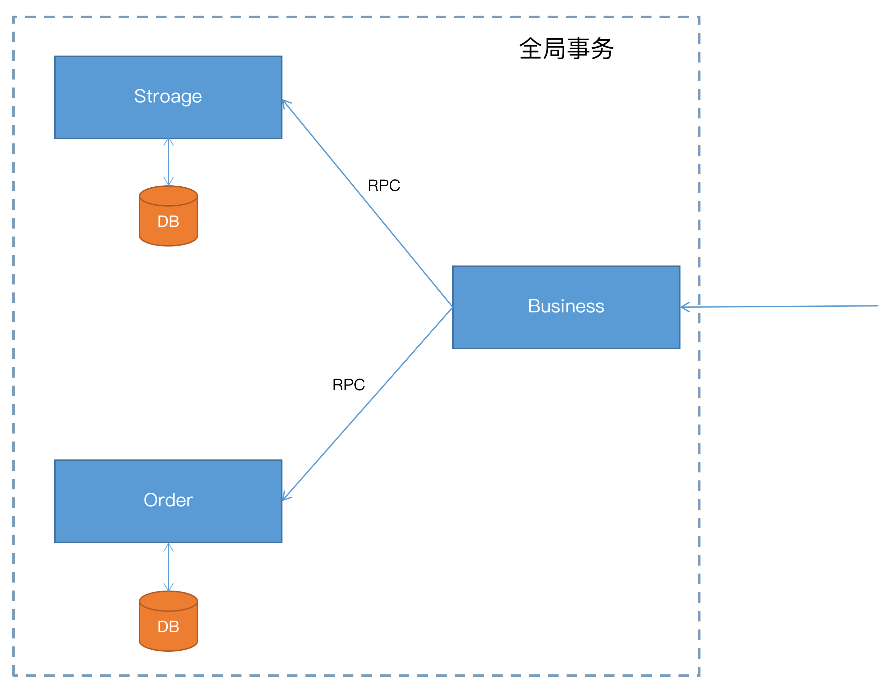
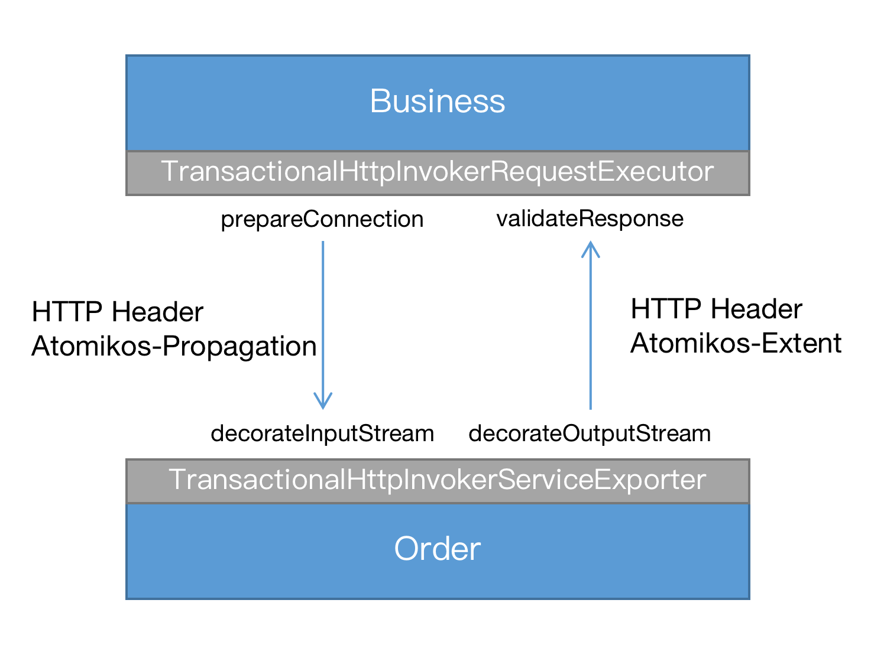
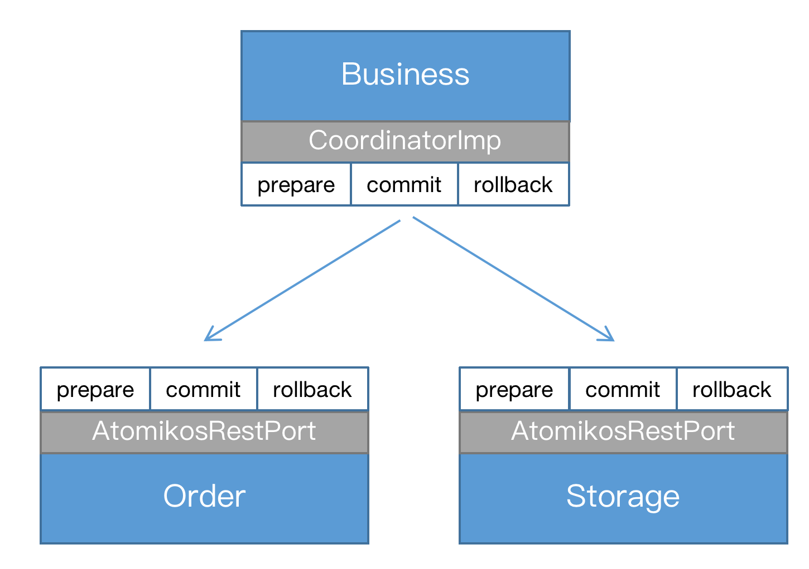

# Atomikos在微服务场景下的使用

[Atomikos](https://github.com/atomikos/transactions-essentials)是一个轻量级的分布式事务管理器，实现了[Java Transaction API (JTA)](https://jcp.org/en/jsr/detail?id=907)规范，可以很方便的和[Spring Boot](https://spring.io/projects/spring-boot)集成，支持微服务场景下跨节点的全局事务。

本文为一个微服务的示例应用，通过引入`Atomikos`增加全局事务能力。

示例代码可以在[这里](https://github.com/mz1999/atomkos-sample)查看。



用户访问`Business`服务，它通过`RPC`调用分别调用`Order`和`Storage`创建订单和减库存。三个服务需要加入到一个全局事务中，要么全部成功，任何一个服务失败，都会造成事务回滚，数据的状态始终保持一致性。

蚂蚁金服开源的[Seata](http://seata.io/)就是为了解决这类问题，在微服务架构下提供分布式事务服务。传统的应用服务器通过`JTA/JTS`也能解决分布式场景下的事务问题，但需要和`EJB`绑定在一起才能使用。`Atomikos`是一个独立的分布式事务管理器，原先是为`Spring`和`Tomcat`提供事务服务，让用户不必只为了事务服务而引入应用服务器。

现在`Atomikos`也能为微服务提供分布式事务服务，这时主要需要两个问题：

1. 事务上下文如何通过RPC在服务间传播
2. 微服务如何参与进两阶段提交协议的过程

后面会结合示例应用介绍`Atomikos`是如何解决这两个问题。示例应用`atomkos-sample`的结构如下：

1. **api**：定义了服务接口`OrderService`和`StorageService`
2. **order-service**：`OrderService`的具体实现
3. **storage-service**：`StorageService`的具体实现
4. **business-service**：用户访问入口

## 事务上下文的传播

在项目主工程的pom文件中引入`Atomikos`依赖，注意要包括`transactions-remoting`，正是它才能让事务上下文在`RPC`调用时传递。

```
<dependency>
    <groupId>com.atomikos</groupId>
    <artifactId>transactions-remoting</artifactId>
    <version>5.0.6</version>
</dependency>
```

`transactions-remoting`支持`jaxrs`，`Spring Remoting`和`Spring rest`等几种`RPC`方式，我们使用的是`Spring Remoting`。

以**order-service**为例，通过`TransactionalHttpInvokerServiceExporter`将`OrderService`[发布为远程服务](https://github.com/mz1999/atomkos-sample/blob/690d6c0026a8f0874de63828023f26ef9210d0dd/order-service/src/main/java/com/apusic/samples/config/ServiceConfig.java#L12)：

```
@Bean(name = "/services/order")
TransactionalHttpInvokerServiceExporter orderService(OrderServiceImpl orderService) {
    TransactionalHttpInvokerServiceExporter exporter = new TransactionalHttpInvokerServiceExporter();
    exporter.setService(orderService);
    exporter.setServiceInterface(OrderService.class);
    return exporter;
}
```

`OrderService`的调用者**business-service**使用`HttpInvokerProxyFactoryBean`[引入远程服务](https://github.com/mz1999/atomkos-sample/blob/690d6c0026a8f0874de63828023f26ef9210d0dd/business-service/src/main/java/com/apusic/samples/config/ServiceConfig.java#L14)：

```
@Bean
public HttpInvokerProxyFactoryBean orderService() {
    HttpInvokerProxyFactoryBean orderService = new HttpInvokerProxyFactoryBean();
    orderService.setHttpInvokerRequestExecutor(httpInvokerRequestExecutor());
    orderService.setServiceUrl("http://localhost:8082/services/order");
    orderService.setServiceInterface(OrderService.class);
    return orderService;
}

@Bean
public TransactionalHttpInvokerRequestExecutor httpInvokerRequestExecutor() {
    TransactionalHttpInvokerRequestExecutor httpInvokerRequestExecutor = new TransactionalHttpInvokerRequestExecutor();
    return httpInvokerRequestExecutor;
}
```

**business-service**负责发起全局事务，它使用`Spring`标准的`@Transactional`标记方法[开启事务](https://github.com/mz1999/atomkos-sample/blob/690d6c0026a8f0874de63828023f26ef9210d0dd/business-service/src/main/java/com/apusic/samples/service/BusinessService.java#L19)：

```
@Transactional
public void createOrder(String userId, String commodityCode, Integer count) {
    orderService.create(userId, commodityCode, count);
    storageService.deduct(commodityCode, count);
}
```

`Atomikos`提供了`TransactionalHttpInvokerRequestExecutor`和`TransactionalHttpInvokerServiceExporter`拦截请求和响应，利用`HTTP header`传递事务上下文。



**business-service**在调用远程服务`OrderService`时，请求发送前会经过[TransactionalHttpInvokerRequestExecutor.prepareConnection](https://github.com/atomikos/transactions-essentials/blob/4332faaf7de551e126ab60c6151e66cee2b854ed/public/transactions-remoting/src/main/java/com/atomikos/remoting/spring/httpinvoker/TransactionalHttpInvokerRequestExecutor.java#L30)处理，增加`HTTP header`，携带事务上下文：

```
@Override
protected void prepareConnection(HttpURLConnection con, int contentLength)
		throws IOException {
	String propagation = template.onOutgoingRequest();
	con.setRequestProperty(HeaderNames.PROPAGATION_HEADER_NAME, propagation);
	super.prepareConnection(con, contentLength);
}
```

`OrderService`会使用[TransactionalHttpInvokerServiceExporter.decorateInputStream](https://github.com/atomikos/transactions-essentials/blob/4332faaf7de551e126ab60c6151e66cee2b854ed/public/transactions-remoting/src/main/java/com/atomikos/remoting/spring/httpinvoker/TransactionalHttpInvokerServiceExporter.java#L33)进行请求拦截，能从`HTTP header`中解析出事务上下文：


```
@Override
protected InputStream decorateInputStream(HttpServletRequest request, InputStream is) throws IOException {
	
	try {
		String propagation = request.getHeader(HeaderNames.PROPAGATION_HEADER_NAME);
		template.onIncomingRequest(propagation);
	} catch (IllegalArgumentException e) {
		...
	}
	return super.decorateInputStream(request, is);
}
```

`OrderService`处理完成[返回响应时](https://github.com/atomikos/transactions-essentials/blob/4332faaf7de551e126ab60c6151e66cee2b854ed/public/transactions-remoting/src/main/java/com/atomikos/remoting/spring/httpinvoker/TransactionalHttpInvokerServiceExporter.java#L48)，会将该节点加入全局事务包装成`Event`，放入`HTTP header`返回给**business-service**：

```
@Override
	protected OutputStream decorateOutputStream(HttpServletRequest request, HttpServletResponse response,
			OutputStream os) throws IOException {

		...

		response.addHeader(HeaderNames.EXTENT_HEADER_NAME, extent);
        
        ...
		
		return super.decorateOutputStream(request, response, os);
	}
```
**business-service**接收到响应，利用[TransactionalHttpInvokerRequestExecutor.validateResponse](https://github.com/atomikos/transactions-essentials/blob/4332faaf7de551e126ab60c6151e66cee2b854ed/public/transactions-remoting/src/main/java/com/atomikos/remoting/spring/httpinvoker/TransactionalHttpInvokerRequestExecutor.java#L39)解析出`Event`，注册进事务管理器，这样在全局事务提交时，可以让该分支参与到两阶段提交协议：

```
@Override
protected void validateResponse(HttpInvokerClientConfiguration config,
		HttpURLConnection con) throws IOException {
	super.validateResponse(config, con);
	String extent = con.getHeaderField(HeaderNames.EXTENT_HEADER_NAME);
	template.onIncomingResponse(extent);
}
```

## 两阶段提交过程

在处理`RPC`调用的响应时，`Atomikos`会将参与到全局事务的远程节点注册为`Participants`([Extent.addRemoteParticipants](https://github.com/atomikos/transactions-essentials/blob/4332faaf7de551e126ab60c6151e66cee2b854ed/public/transactions-api/src/main/java/com/atomikos/icatch/Extent.java#L64))，在事务提交时，所有的`Participants`都会[参与到两阶段提交](https://github.com/atomikos/transactions-essentials/blob/4332faaf7de551e126ab60c6151e66cee2b854ed/public/transactions/src/main/java/com/atomikos/icatch/imp/CoordinatorImp.java#L673)：


```
synchronized ( fsm_ ) {
if ( commit ) {
	if ( participants_.size () <= 1 ) {
		commit ( true );
	} else {
		int prepareResult = prepare ();
		// make sure to only do commit if NOT read only
		if ( prepareResult != Participant.READ_ONLY )
			commit ( false );
	}
} else {
	rollback ();
}
```

可以看出，如果`Participants`大于1，会走`prepare`和`commit`两阶段提交的完整过程。那么`OrderService`和`StorageService`如何参与进两阶段提交呢？

`Atomikos`提供了`REST`入口[com.atomikos.remoting.twopc.AtomikosRestPort](https://github.com/atomikos/transactions-essentials/blob/master/public/transactions-remoting/src/main/java/com/atomikos/remoting/twopc/AtomikosRestPort.java)，你可以将`AtomikosRestPort`注册到`JAX-RS`，例如本示例选择的是[Apache CFX](https://cxf.apache.org/)，在`application.properties`进行配置：

```
cxf.path=/api
cxf.jaxrs.classes-scan=true
cxf.jaxrs.classes-scan-packages=com.atomikos.remoting.twopc
```

**business-service**在进行全局事务提交时，会访问所有`Participants`相应的`REST`接口进行两阶段提交：



**business-service**是怎么知道`AtomikosRestPort`的访问地址的呢？上面提到了，**business-service**在访问`OrderService`时，返回的响应`header`中包含了`Event`，地址就随着`Event`返回给了调用者。`AtomikosRestPort`的访问地址配置在`jta.properties`中：

```
com.atomikos.icatch.rest_port_url=http://localhost:8082/api/atomikos
```

至此，我们解释清楚了`Atomikos`如何为微服务提供分布式事务服务的，主要解决了两个问题：事务上下文如何通过RPC在服务间传播，以及微服务如何参与进两阶段提交协议的过程。

下一步我准备为`Atomikos`增加[dubbo](https://dubbo.apache.org)的支持，即事务上下文可以通过`dubbo`进行传播。