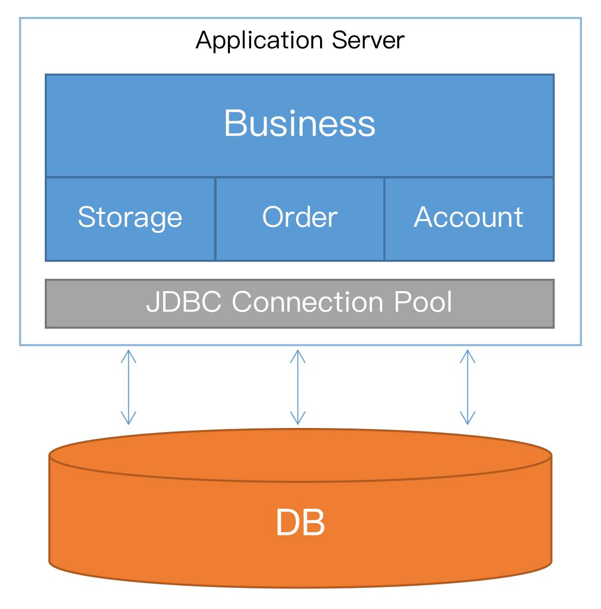
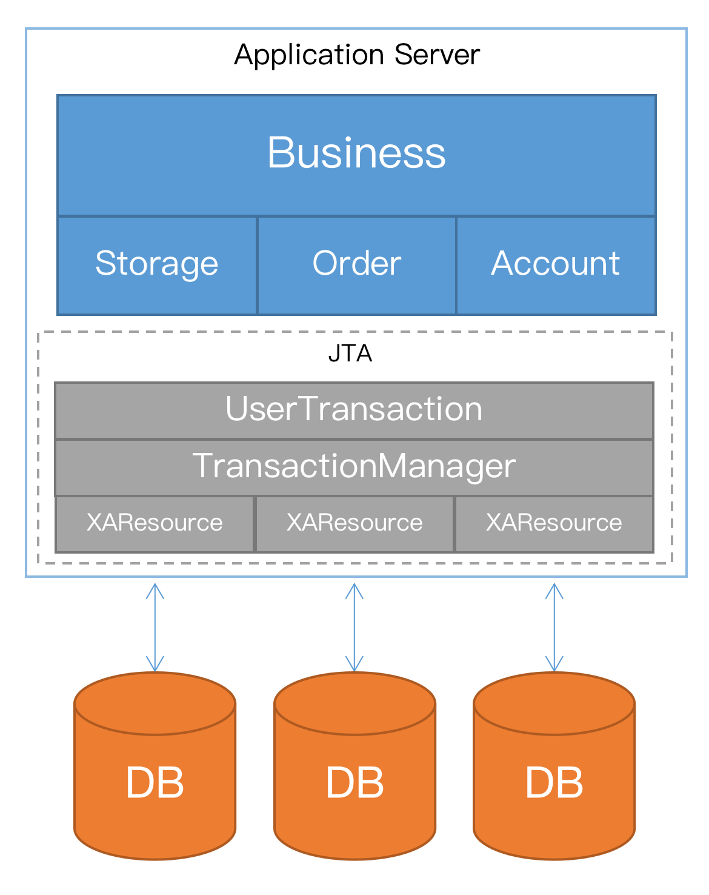
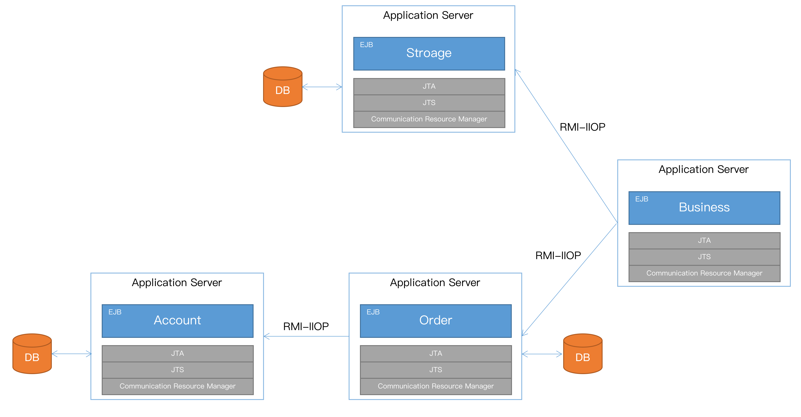
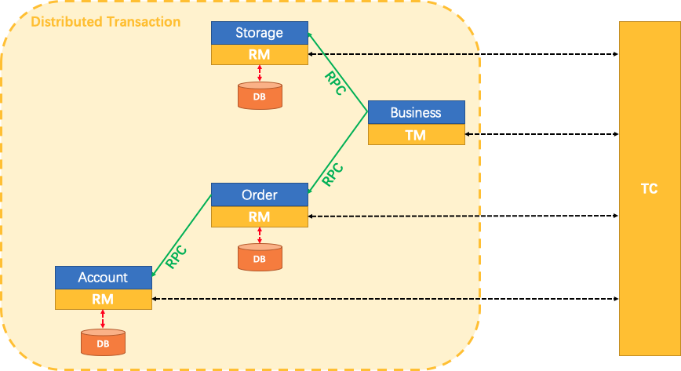
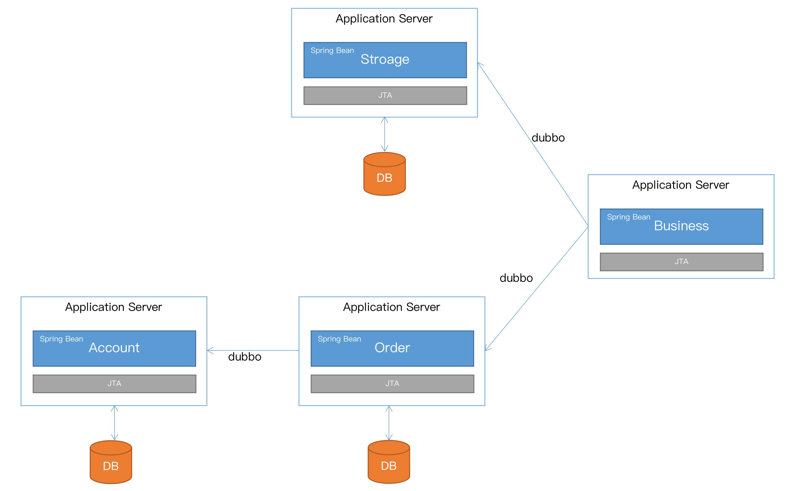

# 应用服务器的分布式事务支持和Seata的对比分析

## 应用服务器的分布式事务支持

我们先看一下分布式事务的需求是如何产生的，以及应用服务器是如何支持分布式事务管理的。

* **单体应用**

首先看单体应用，所有的模块部署在一个应用服务器上，业务数据都保存在单个数据库中，这种场景本地事务就可以满足需求。

 

* **数据库水平拆分**

如果数据库按照业务模块进行水平拆分，完成一个业务请求会涉及到跨库的资源访问和更新，这时候就需要使用应用服务器的`JTA`进行两阶段提交，保证跨库操作的事务完整性。

 

* **应用模块拆分**

应用按照业务模块进一步拆分，每一个模块都作为`EJB`，部署在独立的应用服务器中。完成一个业务请求会跨越多个应用服务器节点和资源，如何在这种场景保证业务操作的事务呢？当访问入口`EJB`时`JTA`会自动开启全局事务，**事务上下文**随着`EJB`的远程调用在应用服务器之间传播，让被调用的`EJB`也加入到全局事务中。

这就是应用因拆分而遇到分布式事务的问题，以及应用服务器是如何解决这个问题的。

## 分布式事务中间件

微服务时代，没人再使用沉重的`EJB`，都是将`Spring Bean`直接暴露为远程服务。完成一个业务请求需要跨越多个微服务，同样需要面对分布式事务的问题。这时就需要引入**分布式事务中间件**。我们以蚂蚁金服开源的[Seata](https://github.com/seata/seata)为例，看看它是怎么解决微服务场景下的分布式事务问题。

将上一小节跑在应用服务器上的业务，使用微服务 + `Seata`的重构后，部署架构如下：

上图中黄色方框（`RM`，`TM`，`TC`）是`Seata`的核心组件，它们配合完成对微服务的分布式事务支持。可以看出，和应用服务器的`EJB`方案架构上类似，只是多了一个独立运行的`TC`组件。

我们再看看`Seata`各组件的具体作用。

### `Seata`的架构

`Seata`由三个组件构成：

* **Transaction Coordinator (TC)**： 事务协调器，维护全局事务的运行状态，负责协调并驱动全局事务的提交或回滚。
* **Transaction Manager (TM)**： 控制全局事务的边界，负责开启一个全局事务，并最终发起全局提交或全局回滚的决议。
* **Resource Manager (RM)**： 控制分支事务，负责分支注册、状态汇报，并接收事务协调器的指令，驱动分支（本地）事务的提交和回滚。

## `Seata` vs. 应用服务器

`Seata`和应用服务器的分布式事务支持主要有以下四个差异：

1. `Seata`和应用服务器都可以实现**业务无侵入**分布式事务支持。但应用服务器的`XA`方案实现的是**实时一致性**，而`Seata`的`AT 模式`实现的是**最终一致性**。
2. `Seata`引入了独立运行的`Transaction Coordinator`，维护全局事务的运行状态。而应用服务器的访问入口节点承担了维护全局事务状态的职责。
3. `Seata`自己实现了`Resource Manager`，不需要依赖数据库的**XA driver**。这样就有可能将没有实现**XA**接口的资源加入的分布式事务中，例如`NoSQL`。同时，**RM**的实现要比`JTA`中的**XAResource**复杂很多。**RM**需要拦截并解析`SQL`，生成回滚语句，在事务`rollback`时自动进行数据还原。**XAResource**是对**XA driver**的包装，资源参与分布式事务的能力，都是由数据库提供的。
4. **事务上下文**的传播机制不同。应用服务器使用标准的`RMI-IIOP`协议进行**事务上下文**的跨节点传播。`Seata`是对各种`RPC`框架提供了插件，拦截请求和响应，**事务上下文**随着`RPC`调用进行跨节点传播。目前`Seata`已经支持了[dubbo](https://dubbo.apache.org/zh-cn/)、[gRPC](https://grpc.io/)、[Motan](https://github.com/weibocom/motan)和[sofa-rpc](https://github.com/sofastack/sofa-rpc)等多种`RPC`框架。

`Seata`和应用服务器都支持在分布式场景下的全局事务，都可以做到对业务无侵入。`Seata`实现的是**最终一致性**，因此性能比应用服务器的`XA`方案好很多，具备海量并发处理能力，这也是互联网公司选择它的原因。由于`Seata`不依赖数据库的**XA driver**，只使用数据库的本地事务，就完成了对分布式事务的支持，相当于承担了部分数据库的职责，因此`Seata`的实现难度要比应用服务器的`JTA`大。

## 应用服务器进入微服务时代

那么应用服务器的分布式事务支持在微服务时代还有用吗？或者说我们应该怎样改进，才能让应用服务器进入微服务时代？

首先我们要看到`JTA/XA`的优势：支持数据的实时一致性，对业务开发更加友好。客户对原有的系统进行微服务改造时，如果把业务模型假定成数据最终一致性，客户就不得不做出很大的妥协和变更。特别是有些金融客户对一致性的要求会比较高。

我们可以学习`Seata`的架构，抛弃掉沉重的`EJB/RMI-IIOP`，让`Spring Bean`通过`dubbo`等`RPC`框架直接对外暴露服务，同时**事务上下文**可以在`RPC`调用时进行传递：

我们甚至可以将`JTA`独立出来，和`Tomcat`这样的Web容器整合，为微服务架构提供分布式事务支持。相信通过这样的改造，应用服务器的分布式事务能力在微服务时代又能焕发第二春。