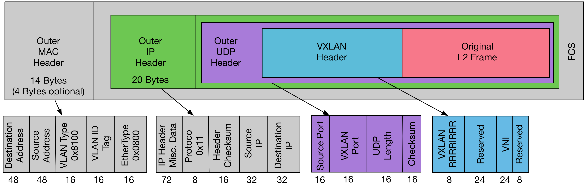

# Docker跨主机Overlay网络动手实验

[上一篇文章](./docker-network-bridge.md)我演示了`docker bridge`网络模型的实验，这次我将展示如何利用`Overlay 网络`实现跨主机容器的通信。


两个容器`docker1`和`docker2`分别位于节点`Node-1`和`Node-2`，如何实现容器的跨主机通信呢？一般来说有两种实现方式：

* 封包模式：利用`Overlay`网络协议在节点间建立“隧道”，容器之间的网络包被封装在外层的网络协议包中进行传输。
* 路由模式：容器间的网络包传输全部用三层网络的路由转发来实现。

本文主要介绍封包模式。`Overlay`网络主要有两种方式，一种是使用UDP在用户态封装，一种是利用`VXLAN` 在内核态封装。由于减少了用户态到内核态的切换，封包解包逻辑都在内核态进行，`VXLAN` 的性能更好，成为了容器网络的主流方案。

关于路由模式，会在[下一篇文章](./docker-route-networks.md)介绍。

## VXLAN

`VXLAN`（Virtual Extensible LAN）是一种网络虚拟化技术，它将链路层的以太网包封装到UDP包中进行传输。`VXLAN`最初是由VMware、Cisco开发，主要解决云环境下多租户的二层网络隔离。我们常听到公有云厂商宣称支持`VPC`（virtual private cloud），实际底层就是使用`VXLAN`实现的。

`VXLAN` packet的结构：



我们可以看到，最内部是原始的二层网络包，外面加上一个`VXLAN header`，其中最重要的是`VNI`（VXLAN network identifier)字段，它用来唯一标识一个`VXLAN`。也就是说，使用不同的`VNI`来区分不同的虚拟二层网络。`VNI`有24位，基本够公用云厂商使用了。要知道原先用来网络隔离的虚拟局域网VLAN只支持4096个虚拟网络。

在 `VXLAN header`外面封装了正常的UDP包。`VXLAN`在UDP之上，实现了一个虚拟的二层网络，连接在这个虚拟二层网络上的主机，就像连接在普通的局域网上一样，可以互相通信。

介绍完背景知识，我们可以开始动手实验了。

## 实现方案一

参照[Flannel](https://github.com/coreos/flannel)的实现方案：


* **配置内核参数，允许IP forwarding**

分别在`Node-1`、`Node-2`上执行：

```
sudo sysctl net.ipv4.conf.all.forwarding=1
```

* **创建“容器”**

在`Node-1`上执行：

```
sudo ip netns add docker1
```

在`Node-2`上执行：

```
sudo ip netns add docker2
```

为什么创建个`Namesapce`就说是“容器”？请参考[上一篇文章](./docker-network-bridge.md)。

* **创建Veth pairs**

分别在`Node-1`、`Node-2`上执行：

```
sudo ip link add veth0 type veth peer name veth1
```

* **将Veth的一端放入“容器”**

在`Node-1`上执行：

```
sudo ip link set veth0 netns docker1
```

在`Node-2`上执行：

```
sudo ip link set veth0 netns docker2
```

* **创建bridge**

分别在`Node-1`、`Node-2`上创建bridge `br0`：

```
sudo brctl addbr br0
```

* **将Veth的另一端接入bridge**

分别在`Node-1`、`Node-2`上执行：

```
sudo brctl addif br0 veth1
```

* **为"容器“内的网卡分配IP地址，并激活上线**

在`Node-1`上执行：

```
sudo ip netns exec docker1 ip addr add 172.18.10.2/24 dev veth0
sudo ip netns exec docker1 ip link set veth0 up
```

在`Node-2`上执行：

```
sudo ip netns exec docker2 ip addr add 172.18.20.2/24 dev veth0
sudo ip netns exec docker2 ip link set veth0 up
```

* **Veth另一端的网卡激活上线**

分别在`Node-1`、`Node-2`上执行：

```
sudo ip link set veth1 up
```

* **为bridge分配IP地址，激活上线**

在`Node-1`上执行：

```
sudo ip addr add 172.18.10.1/24 dev br0
sudo ip link set br0 up
```

在`Node-2`上执行：

```
sudo ip addr add 172.18.20.1/24 dev br0
sudo ip link set br0 up
```

* **将bridge设置为“容器”的缺省网关**

在`Node-1`上执行：

```
sudo ip netns exec docker1 route add default gw 172.18.10.1 veth0
```

在`Node-2`上执行：

```
sudo ip netns exec docker2 route add default gw 172.18.20.1 veth0
```

* **创建VXLAN虚拟网卡**

`VXLAN`需要在宿主机上创建一个虚拟网络设备对 `VXLAN` 的包进行封装和解封装，实现这个功能的设备称为 `VTEP`（VXLAN Tunnel Endpoint）。宿主机之间通过`VTEP`建立“隧道”，在其中传输虚拟二层网络包。

在`Node-1`创建`vxlan100`：

```
sudo ip link add vxlan100 type vxlan \
    id 100 \
    local 192.168.31.183 \
    dev enp0s3 \
    dstport 4789 \
    nolearning
```

为`vxlan100`分配IP地址，然后激活：

```
sudo ip addr add 172.18.10.0/32 dev vxlan100
sudo ip link set vxlan100 up
```

为了让`Node-1`上访问`172.18.20.0/24`网段的数据包能进入“隧道”，我们需要增加如下的路由规则：

```
sudo ip route add 172.18.20.0/24 dev vxlan100
```

在`Node-2`上执行相应的命令：

```
sudo ip link add vxlan100 type vxlan \
    id 100 \
    local 192.168.31.192 \
    dev enp0s3 \
    dstport 4789 \
    nolearning
sudo ip addr add 172.18.20.0/32 dev vxlan100
sudo ip link set vxlan100 up
sudo ip route add 172.18.10.0/24 dev vxlan100 scope global
```

* **手动更新ARP和FDB**

虚拟设备`vxlan100`会用`ARP`和`FDB` (forwarding database) 数据库中记录的信息，填充网络协议包，建立节点间转发虚拟网络数据包的“隧道”。

我们知道，在二层网络上传输IP包，需要先根据目的IP地址查询到目的MAC地址，这就是`ARP`（Address Resolution Protocol）协议的作用。我们应该可以通过ARP查询到其他节点上容器IP地址对应的MAC地址，然后填充在`VXLAN`内层的网络包中。

`FDB`是记录网桥设备转发数据包的规则。虚拟网络数据包根据上面定义的路由规则，从`br0`进入了本机的`vxlan100`“隧道”入口，应该可以在`FDB`中查询到“隧道”出口的MAC地址应该如何到达，这样，两个`VTEP`就能完成”隧道“的建立。

`vxlan`为了建立节点间的“隧道”，需要一种机制，能让一个节点的加入、退出信息通知到其他节点，可以采用`multicast`的方式进行节点的自动发现，也有很多`Unicast`的方案，这篇文章[<VXLAN & Linux>](https://vincent.bernat.ch/en/blog/2017-vxlan-linux)有很详细的介绍。总之就是要找到一种方式，能够更新每个节点的`ARP`和`FDB`数据库。

如果是使用[Flannel](https://github.com/coreos/flannel)，它在节点启动的时候会采用某种机制自动更新其他节点的ARP和FDB数据库。现在我们的实验只能在两个节点上手动更新`ARP`和`FDB`。

首先在两个节点上查询到设备`vxlan100`的MAC地址，例如在我当前的环境：

`Node-1`上`vxlan100`的MAC地址是`3a:8d:b8:69:10:3e`
`Node-2`上`vxlan100`的MAC地址是`0e:e6:e6:5d:c2:da`

然后在`Node-1`上增加ARP和FDB的记录：

```
sudo ip neighbor add 172.18.20.2 lladdr 0e:e6:e6:5d:c2:da dev vxlan100
sudo bridge fdb append 0e:e6:e6:5d:c2:da dev vxlan100 dst 192.168.31.192
```

我们可以确认下执行结果：


`ARP`中已经记录了`Node-2`上容器IP对应的MAC地址。再看看`FDB`的情况：


根据最后一条新增规则，我们可以知道如何到达`Node-2`上“隧道”的出口`vxlan100`。“隧道”两端是使用UDP进行传输，即容器间通讯的二层网络包是靠UDP在宿主机之间通信。

类似的，在`Node-2`上执行下面的命令：

```
sudo ip neighbor add 172.18.10.2 lladdr 3a:8d:b8:69:10:3e dev vxlan100
sudo bridge fdb append 3a:8d:b8:69:10:3e dev vxlan100 dst 192.168.31.183
```

* **测试容器的跨节点通信**

现在，容器`docker1`和`docker1`之间就可以相互访问了。

我们从`docker1`访问`docker2`，在`Node-1`上执行：

```
sudo ip netns exec docker1 ping -c 3 172.18.20.2
```

同样可以从`docker2`访问`docker1`，在`Node-2`上执行：

```
sudo ip netns exec docker2 ping -c 3 172.18.10.2
```

在测试过程中如果需要troubleshooting，可以使用`tcpdump`在`veth1`、`br0`、`vxlan100`等虚拟设备上抓包，确认网络包是按照预定路线在转发：

```
sudo tcpdump -i vxlan100 -n
```

* **测试环境恢复**

在两个节点上删除我们创建的虚拟设备：

```
sudo ip link set br0 down
sudo brctl delbr br0
sudo ip link  del veth1
sudo ip link del vxlan100
```

## 实现方案二

Docker原生的[overlay driver](https://docs.docker.com/network/overlay/)底层也是使用`VXLAN`技术，但实现方案和[Flannel](https://github.com/coreos/flannel)略有不同：


我们可以看到，`vxlan100`被“插”在了虚拟交换机`br0`上，虚拟网络数据包从`br0`到`vxlan100`不是通过本机路由，而是`vxlan100`根据`FDB`直接进行了转发。

执行的命令略有差异，我不再赘述过程，直接提供了命令，大家自己实验吧：

```
# 在Node-1上执行
sudo sysctl net.ipv4.conf.all.forwarding=1

sudo ip netns add docker1

sudo ip link add veth0 type veth peer name veth1

sudo ip link set veth0 netns docker1

sudo brctl addbr br0

sudo brctl addif br0 veth1

sudo ip netns exec docker1 ip addr add 172.18.10.2/24 dev veth0
sudo ip netns exec docker1 ip link set veth0 up
sudo ip link set veth1 up

sudo ip link set br0 up

sudo ip netns exec docker1 route add default veth0

sudo ip link add vxlan100 type vxlan \
    id 100 \
    local 192.168.31.183 \
    dev enp0s5 \
    dstport 4789 \
    nolearning \
    proxy

sudo ip link set vxlan100 up

sudo brctl addif br0 vxlan100


sudo ip neigh add 172.18.20.2 lladdr [docker2的MAC地址] dev vxlan100
sudo bridge fdb append [docker2的MAC地址]  dev vxlan100 dst 192.168.31.192

# 在Node-2上执行
sudo sysctl net.ipv4.conf.all.forwarding=1

sudo ip netns add docker2

sudo ip link add veth0 type veth peer name veth1

sudo ip link set veth0 netns docker2

sudo brctl addbr br0

sudo brctl addif br0 veth1

sudo ip netns exec docker2 ip addr add 172.18.20.2/24 dev veth0
sudo ip netns exec docker2 ip link set veth0 up
sudo ip link set veth1 up

sudo ip link set br0 up

sudo ip netns exec docker2 route add default veth0

sudo ip link add vxlan100 type vxlan \
    id 100 \
    local 192.168.31.192 \
    dev enp0s5 \
    dstport 4789 \
    nolearning \
    proxy

sudo ip link set vxlan100 up

sudo brctl addif br0 vxlan100


sudo ip neigh add 172.18.10.2 lladdr [docker1的MAC地址] dev vxlan100
sudo bridge fdb append [docker1的MAC地址]  dev vxlan100 dst 192.168.31.183
```

相信通过亲自动手实验，容器网络对你来说不再神秘。希望本文对你理解容器网络有所帮助。

下一篇我将动手实验容器跨主机通信的[路由模式](./docker-route-networks.md)。


