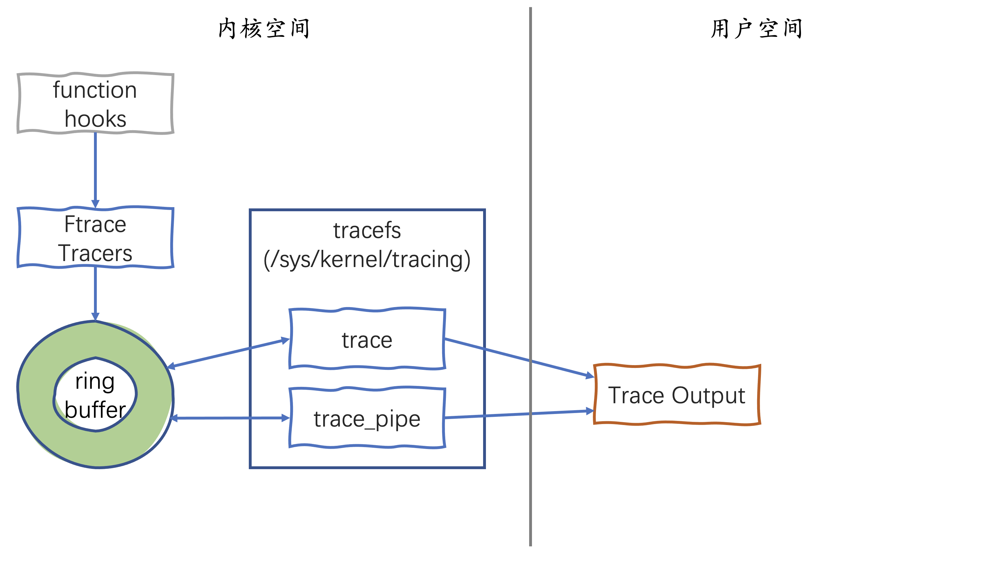

# 从Ftrace开始内核探索之旅

操作系统内核对应用开发工程师来说就像一个黑盒，似乎很难窥探到其内部的运行机制。其实Linux内核很早就内置了一个强大的tracing工具：[Ftrace](https://www.kernel.org/doc/html/latest/trace/ftrace.html)，它几乎可以跟踪内核的所有函数，不仅可以用于调试和分析，还可以用于观察学习Linux内核的内部运行。虽然`Ftrace`在[2008年就加入了内核](https://git.kernel.org/pub/scm/linux/kernel/git/torvalds/linux.git/commit/?id=16444a8a40d4c7b4f6de34af0cae1f76a4f6c901)，但很多应用开发工程师仍然不知道它的存在。本文就给你介绍一下`Ftrace`的基本使用。

## Ftrace初体验 ##

先用一个例子体验一下`Ftrace`的使用简单，且功能强大。使用 root 用户进入`/sys/kernel/debug/tracing`目录，执行 `echo` 和 `cat` 命令：

<pre><code>
# <b>echo _do_fork > set_graph_function</b>
# <b>echo function_graph > current_tracer</b>
# <b>cat trace | head -20</b>
# tracer: function_graph
#
# CPU  DURATION                  FUNCTION CALLS
# |     |   |                     |   |   |   |
 3)               |  _do_fork() {
 3)               |    copy_process() {
 3)   0.895 us    |      _raw_spin_lock_irq();
 3)               |      recalc_sigpending() {
 3)   0.740 us    |        recalc_sigpending_tsk();
 3)   2.248 us    |      }
 3)               |      dup_task_struct() {
 3)   0.775 us    |        tsk_fork_get_node();
 3)               |        kmem_cache_alloc_node() {
 3)               |          _cond_resched() {
 3)   0.740 us    |            rcu_all_qs();
 3)   2.117 us    |          }
 3)   0.701 us    |          should_failslab();
 3)   2.023 us    |          memcg_kmem_get_cache();
 3)   0.889 us    |          memcg_kmem_put_cache();
 3) + 12.206 us   |        }
</code></pre>

我们使用`Ftrace`的`function_graph`功能显示了内核函数 `_do_fork()` 所有子函数调用。左边的第一列是执行函数的 CPU，第二列 `DURATION` 显示在相应函数中花费的时间。我们注意到最后一行的耗时之前有个 `+` 号，提示用户注意延迟高的函数。`+` 代表耗时大于 `10 μs`。如果耗时大于 `100 μs`，则显示 `!` 号。

我们知道，`fork` 是建立父进程的一个完整副本，然后作为子进程执行。那么`_do_fork()`的第一件大事就是调用 `copy_process()` 复制父进程的数据结构，从上面输出的调用链信息也验证了这一点。

使用完后执行下面的命令关闭`function_graph`：

```
# echo nop > current_tracer
# echo > set_graph_function
```

使用 `Ftrace` 的 `function_graph` 功能，可以查看内核函数的子函数调用链，帮助我们理解复杂的代码流程，而这只是 `Ftrace` 的功能之一。这么强大的功能，我们不必安装额外的用户空间工具，只要使用 `echo` 和 `cat` 命令访问特定的文件就能实现。`Ftrace` 对用户的使用接口正是**tracefs**文件系统。

## tracefs 文件系统

用户通过**tracefs**文件系统使用`Ftrace`，这很符合一切皆文件的Linux哲学。**tracefs**文件系统一般挂载在`/sys/kernel/tracing`目录。由于`Ftrace`最初是`debugfs`文件系统的一部分，后来才被拆分为自己的`tracefs`。所以如果系统已经挂载了`debugfs`，那么仍然会保留原来的目录结构，将`tracefs`挂载到`debugfs`的子目录下。我们可以使用 `mount` 命令查看当前系统`debugfs`和`tracefs`挂载点：

```
# mount -t debugfs,tracefs
debugfs on /sys/kernel/debug type debugfs (rw,nosuid,nodev,noexec,relatime)
tracefs on /sys/kernel/tracing type tracefs (rw,nosuid,nodev,noexec,relatime)
tracefs on /sys/kernel/debug/tracing type tracefs (rw,nosuid,nodev,noexec,relatime)
```

我使用的系统是`Ubuntu 20.04.2 LTS`，可以看到，为了保持兼容，`tracefs`同时挂载到了`/sys/kernel/tracing`和`/sys/kernel/debug/tracing`。

`tracefs`下的文件主要分两类：控制文件和输出文件。这些文件的名字都很直观，像前面例子通过 `current_tracer` 设置当前要使用的 tracer，然后从 `trace`中读取结果。还有像 `available_tracers` 包含了当前内核可用的 tracer，可以设置 `trace_options` 自定义输出。

<pre><code>
# <b>ls -F /sys/kernel/tracing/</b>
available_events            max_graph_depth         stack_max_size
available_filter_functions  options/                stack_trace
available_tracers           per_cpu/                stack_trace_filter
buffer_percent              printk_formats          synthetic_events
buffer_size_kb              README                  timestamp_mode
buffer_total_size_kb        saved_cmdlines          trace
current_tracer              saved_cmdlines_size     trace_clock
dynamic_events              saved_tgids             trace_marker
dyn_ftrace_total_info       set_event               trace_marker_raw
enabled_functions           set_event_notrace_pid   trace_options
error_log                   set_event_pid           trace_pipe
events/                     set_ftrace_filter       trace_stat/
free_buffer                 set_ftrace_notrace      tracing_cpumask
function_profile_enabled    set_ftrace_notrace_pid  tracing_max_latency
hwlat_detector/             set_ftrace_pid          tracing_on
instances/                  set_graph_function      tracing_thresh
kprobe_events               set_graph_notrace       uprobe_events
kprobe_profile              snapshot                uprobe_profile
</code></pre>

本文后面的示例假定你已经处在了`/sys/kernel/tracing`或`/sys/kernel/debug/tracing`目录下。

## 函数跟踪

`Ftrace` 实际上代表的就是`function trace`（函数跟踪），因此函数追踪是`Ftrace`最初的一个主要功能。

`Ftrace` 可以跟踪几乎所有内核函数调用的详细信息，这是怎么做到的呢？简单来说，在编译内核的时候使用了 `gcc` 的 `-pg` 选项，编译器会在每个内核函数的入口处调用一个特殊的汇编函数“**mcount**” 或 “**\_\_fentry\_\_**”，如果跟踪功能被打开，`mcount/fentry` 会调用当前设置的 `tracer`，`tracer`将不同的数据写入**ring buffer**。



从上图可以看出，`Ftrace` 提供的 `function hooks` 机制在内核函数入口处埋点，根据配置调用特定的 `tracer`， `tracer`将数据写入**ring buffer**。`Ftrace`实现了一个无锁的[ring buffer](https://www.kernel.org/doc/html/latest/trace/ring-buffer-design.html)，所有的跟踪信息都存储在**ring buffer**中。用户通过 `tracefs` 文件系统接口访问函数跟踪的输出结果。

你可能已经意识到，如果每个内核函数入口都加入跟踪代码，必然会非常影响内核的性能，幸好`Ftrace`支持动态跟踪功能。如果启用了**CONFIG_DYNAMIC_FTRACE**选项，编译内核时所有的`mcount/fentry`调用点都会被收集记录。在内核的初始化启动过程中，会根据编译期记录的列表，将`mcount/fentry`调用点替换为**NOP**指令。**NOP**就是 `no-operation`，不做任何事，直接转到下一条指令。因此在没有开启跟踪功能的情况下，`Ftrace`不会对内核性能产生任何影响。在开启追踪功能时，`Ftrace`才会将**NOP**指令替换为`mcount/fentry`。

启用函数追踪功能，只需要将 `current_tracer` 文件的内容设置为 "function"：

<pre><code>
# <b>echo function > current_tracer</b>
# <b>cat trace | head -20</b>
# tracer: function
#
# entries-in-buffer/entries-written: 204981/2728851   #P:4
#
#                                _-----=> irqs-off
#                               / _----=> need-resched
#                              | / _---=> hardirq/softirq
#                              || / _--=> preempt-depth
#                              ||| /     delay
#           TASK-PID     CPU#  ||||   TIMESTAMP  FUNCTION
#              | |         |   ||||      |         |
            sshd-1388    [000] .... 44388.890787: _cond_resched <-__flush_work
            curl-7231    [001] .... 44389.399226: PageHuge <-find_get_entry
            curl-7231    [001] .... 44389.399227: fsnotify_parent <-vfs_read
            curl-7231    [001] .... 44389.399227: _cond_resched <-copy_page_to_iter
            curl-7231    [001] .... 44389.399227: rcu_all_qs <-_cond_resched
            curl-7231    [001] .... 44389.399228: vmacache_find <-find_vma
            curl-7231    [001] .... 44389.399228: atime_needs_update <-touch_atime
            curl-7231    [001] .... 44389.399228: current_time <-atime_needs_update

# <b> echo nop > current_tracer </b>
</code></pre>

文件头已经很好的解释了每一列的含义。前两项是被追踪的任务名称和 PID，大括号内是执行跟踪的CPU。`TIMESTAMP` 是启动后的时间，后面是被追踪的函数，它的调用者在 `<-` 之后。

我们可以设置 `set_ftrace_filter` 选择想要跟踪的函数：

<pre><code>
# <b>echo '*sleep' > set_ftrace_filter</b>
# <b>echo function > current_tracer</b>
# <b>cat trace_pipe</b>

sleep-9445    [001] .... 45978.125872: common_nsleep <-__x64_sys_clock_nanosleep
sleep-9445    [001] .... 45978.125873: hrtimer_nanosleep <-common_nsleep
sleep-9445    [001] .... 45978.125873: do_nanosleep <-hrtimer_nanosleep
 cron-568     [002] .... 45978.504262: __x64_sys_clock_nanosleep <-do_syscall_64
 cron-568     [002] .... 45978.504264: common_nsleep <-__x64_sys_clock_nanosleep
 cron-568     [002] .... 45978.504264: hrtimer_nanosleep <-common_nsleep
 cron-568     [002] .... 45978.504264: do_nanosleep <-hrtimer_nanosleep
sleep-9448    [001] .... 45978.885085: __x64_sys_clock_nanosleep <-do_syscall_64
sleep-9448    [001] .... 45978.885087: common_nsleep <-__x64_sys_clock_nanosleep
sleep-9448    [001] .... 45978.885087: hrtimer_nanosleep <-common_nsleep

# <b>echo nop > current_tracer</b>
# <b>echo > set_ftrace_filter</b>
</code></pre>

`trace_pipe` 包含了与 `trace` 相同的输出，从这个文件的读取会返回一个无尽的事件流，它也会消耗事件，所以在读取一次后，它们就不再在跟踪缓冲区中了。

也许你只想跟踪一个特定的进程，可以通过设置 `set_ftrace_pid` 内容为PID指定想追踪的特定进程。让 tracer 只追踪PID列在这个文件中的线程：

<pre><code>
# <b>echo [PID] > set_ftrace_pid</b>
# <b>echo function > current_tracer</b>
</code></pre>

如果设置了 `function-fork` 选项，那么当一个 PID 被列在 `set_ftrace_pid` 这个文件中时，其子任务的 PID 将被自动添加到这个文件中，并且子任务也将被 tracer 追踪。

<pre><code>
# <b>echo function-fork > trace_options</b>
</code></pre>

取消`function-fork` 选项：
<pre><code>
# <b>echo nofunction-fork > trace_options</b>
# <b>cat trace_options</b>
...
noevent-fork
nopause-on-trace
function-trace
<b>nofunction-fork</b>
nodisplay-graph
nostacktrace
...
</code></pre>

取消 `set_ftrace_pid` 的设置：
<pre><code>
# <b>echo > set_ftrace_pid</b>
</code></pre>


## Ftrace function_graph

文章开始例子已经展示过，`function_graph` 可以打印出函数的调用图，揭示代码的流程。`function_graph` 不仅跟踪函数的输入，而且跟踪函数的返回，这使得 tracer 能够知道被调用的函数的深度。`function_graph` 可以让人更容易跟踪内核的执行流程。

我们再看一个例子：

<pre><code>
# <b>echo try_to_wake_up > set_graph_function</b>
# <b>echo function_graph > current_tracer</b>
# <b>cat trace | head -20</b>
# tracer: function_graph
#
# CPU  DURATION                  FUNCTION CALLS
# |     |   |                     |   |   |   |
 0)               |  try_to_wake_up() {
 0)   1.083 us    |    ttwu_queue_wakelist();
 0)   0.622 us    |    update_rq_clock();
 0)               |    ttwu_do_activate() {
 0)               |      enqueue_task_fair() {
 0)               |        enqueue_entity() {
 0)   0.616 us    |          update_curr();
 0)   0.602 us    |          update_cfs_group();
 0)   0.662 us    |          account_entity_enqueue();
 0)   0.652 us    |          place_entity();
 0)   0.697 us    |          __enqueue_entity();
 0) + 12.890 us   |        }
 0)   0.672 us    |        hrtick_update();
 0) + 17.781 us   |      }
 0)               |      ttwu_do_wakeup() {
 0)               |        check_preempt_curr() {

# <b>echo nop > current_tracer</b>
# <b>echo > set_graph_function</b>
</code></pre>

前面提到过，函数耗时大于 10 μs，前面会有 + 号提醒用户注意，其他的符号还有：

* **$** ：延迟大于1秒
* **@** ：延迟大于 100 ms
* **\*** ：延迟大于 10 ms
* **#** ：延迟大于 1 ms
* **!** ：延迟大于 100 μs
* **+** ：延迟大于 10 μs

## 函数Profiler

函数Profiler提供了内核函数调用的统计数据，可以观察哪些内核函数正在被使用，并能发现哪些函数的执行耗时最长。

<pre><code>
# echo nop > current_tracer
# echo 1 > function_profile_enabled
# echo 0 > function_profile_enabled
# echo > set_ftrace_filter
</code></pre>

这里有一个要注意的地方，确保使用的是 `0 >`，而不是 `0>`。这两者的含义不一样，`0>`是对文件描述符 `0` 的重定向。同样要避免使用 `1>`，因为这是对文件描述符 `1` 的重定向。

现在可以从 `trace_stat` 目录中读取 profile 的统计数据。在这个目录中，profile 数据按照 CPU 保存在名为 function[n] 文件中。我使用的4核CPU，看一下profile 结果：

<pre><code>
# <b>ls  trace_stat/</b>
function0  function1  function2  function3
# <b>head trace_stat/function*</b>
==> trace_stat/function0 <==
  Function                               Hit    Time            Avg             s^2
  --------                               ---    ----            ---             ---
  tcp_sendmsg                            202    3791.163 us     18.768 us       659.733 us  
  tcp_sendmsg_locked                     202    3521.863 us     17.434 us       638.307 us  
  tcp_recvmsg                            125    2238.773 us     17.910 us       1062.699 us 
  tcp_push                               202    2168.569 us     10.735 us       467.879 us  
  tcp_write_xmit                          47    2107.768 us     44.846 us       414.934 us  
  tcp_v4_do_rcv                           49    871.318 us      17.782 us       126.562 us  
  tcp_send_ack                            50    849.091 us      16.981 us       164.986 us  
  tcp_rcv_established                     49    827.212 us      16.881 us       117.427 us  

==> trace_stat/function1 <==
  Function                               Hit    Time            Avg             s^2
  --------                               ---    ----            ---             ---
  tcp_recvmsg                            312    3110.497 us     9.969 us        281.015 us  
  tcp_sendmsg                             86    1412.005 us     16.418 us       370.310 us  
  tcp_sendmsg_locked                      86    1313.847 us     15.277 us       362.495 us  
  tcp_send_ack                            47    863.222 us      18.366 us       121.567 us  
  tcp_v4_do_rcv                           60    825.359 us      13.755 us       102.550 us  
  tcp_write_xmit                          28    807.609 us      28.843 us       336.106 us  
  tcp_push                                86    805.776 us      9.369 us        299.815 us  
  tcp_rcv_established                     60    777.510 us      12.958 us       99.129 us   

==> trace_stat/function2 <==
  Function                               Hit    Time            Avg             s^2
  --------                               ---    ----            ---             ---
  tcp_v4_rcv                            1618    27858.95 us     17.218 us       253.487 us  
  tcp_v4_do_rcv                         1216    22528.58 us     18.526 us       226.243 us  
  tcp_rcv_established                   1184    20535.08 us     17.343 us       210.765 us  
  tcp_send_ack                           487    7558.698 us     15.520 us       111.035 us  
  tcp_write_xmit                         328    6281.810 us     19.151 us       656.192 us  
  tcp_tasklet_func                       162    4258.312 us     26.285 us       797.278 us  
  tcp_ack                                575    4148.714 us     7.215 us        27.061 us   
  tcp_tsq_handler                        162    4123.507 us     25.453 us       791.961 us  

==> trace_stat/function3 <==
  Function                               Hit    Time            Avg             s^2
  --------                               ---    ----            ---             ---
  tcp_recvmsg                            567    5773.997 us     10.183 us       397.950 us  
  tcp_send_ack                           127    1881.700 us     14.816 us       133.317 us  
  tcp_v4_do_rcv                          133    1783.527 us     13.409 us       86.122 us   
  tcp_rcv_established                    133    1690.142 us     12.707 us       83.527 us   
  tcp_sendmsg                             54    1652.290 us     30.597 us       698.120 us  
  tcp_sendmsg_locked                      54    1574.276 us     29.153 us       666.451 us  
  tcp_write_xmit                          40    1184.827 us     29.620 us       354.719 us  
  tcp_push                                54    1129.465 us     20.916 us       486.157 us  
</code></pre>

第一行是每一列的名称，分别是函数名称（Function），调用次数（Hit），函数的总时间（Time）、平均函数时间（Avg）和标准差（s^2）。输出结果显示，`tcp_sendmsg()` 在3个 CPU 上都是最频繁的，`tcp_v4_rcv()` 在 CPU2 上被调用了1618次，平均延迟为 `17.218 us`。

最后要注意一点，在使用 Ftrace Profiler 时，尽量通过 `set_ftrace_filter` 限制 profile 的范围，避免对所有的内核函数都进行 profile。

## 追踪点 Tracepoints

**Tracepoints**是内核的静态埋点。内核维护者在他认为重要的位置放置静态 tracepoints 记录上下文信息，方便后续排查问题。例如系统调用的开始和结束，中断被触发，网络数据包发送等等。

在Linux的早期，内核维护者就一直想在内核中加入静态 tracepoints，尝试过各种策略。Ftrace 创造了[Event Tracing](https://www.kernel.org/doc/html/latest/trace/events.html) 基础设施，让开发者使用 [TRACE_EVENT() 宏添加内核 tracepoints](https://lwn.net/Articles/379903/)，不用创建自定义内核模块，使用 `Event Tracing` 基础设施来注册埋点函数。

现在内核中的**Tracepoints**都使用了 `TRACE_EVENT()` 宏来定义，tracepoints 记录的上下文信息作为 **Trace events** 进入 `Event Tracing` 基础设施，这样我们就可以复用 Ftrace 的 tracefs ，通过文件接口来配置 tracepoint events，并使用 trace 或 trace_pipe 文件查看事件输出。

所有的 tracepoint events 的控制文件都在 events 目录下，按照类别以子目录形式组织：

<pre><code>
# <b>ls -F events/</b>
alarmtimer/    ftrace/          iwlwifi/        oom/             smbus/
block/         gpio/            iwlwifi_data/   page_isolation/  sock/
bpf_test_run/  gvt/             iwlwifi_io/     pagemap/         spi/
bridge/        hda/             iwlwifi_msg/    page_pool/       swiotlb/
btrfs/         hda_controller/  iwlwifi_ucode/  percpu/          sync_trace/
cfg80211/      hda_intel/       jbd2/           power/           syscalls/
cgroup/        header_event     kmem/           printk/          task/
clk/           header_page      kvm/            pwm/             tcp/

...
</code></pre>

我们以 `events/sched/sched_process_fork` 事件为例，该事件是在 `include/trace/events/sched.h` 中由 `TRACE_EVENT` 宏所[定义](https://github.com/torvalds/linux/blob/bcf876870b95592b52519ed4aafcf9d95999bc9c/include/trace/events/sched.h#L287)：

```c
/*
 * Tracepoint for do_fork:
 */
TRACE_EVENT(sched_process_fork,

	TP_PROTO(struct task_struct *parent, struct task_struct *child),

	TP_ARGS(parent, child),
    ...
);
```

`TRACE_EVENT` 宏会根据事件名称 `sched_process_fork` 生成 tracepoint 方法 `trace_sched_process_fork()`。你会在 `kernel/fork.c` 的 [_do_fork()](https://github.com/torvalds/linux/blob/bcf876870b95592b52519ed4aafcf9d95999bc9c/kernel/fork.c#L2453) 中看到调用这个 tracepoint 方法。`_do_fork()` 是进程 fork 的主流程，在这里放置 tracepoint 是一个合适的位置，`trace_sched_process_fork(current, p)` 记录当前进程和 fork 出的子进程信息：

```c
/*
 *  Ok, this is the main fork-routine.
 *
 * It copies the process, and if successful kick-starts
 * it and waits for it to finish using the VM if required.
 *
 * args->exit_signal is expected to be checked for sanity by the caller.
 */
long _do_fork(struct kernel_clone_args *args)
{
	...
    p = copy_process(NULL, trace, NUMA_NO_NODE, args);
	add_latent_entropy();

	/*
	 * Do this prior waking up the new thread - the thread pointer
	 * might get invalid after that point, if the thread exits quickly.
	 */
	trace_sched_process_fork(current, p);

	pid = get_task_pid(p, PIDTYPE_PID);

    ...
}
```

在 `events/sched/sched_process_fork` 目录下，有这个事件的控制文件：
<pre><code>
# <b>ls events/sched/sched_process_fork</b>
enable  filter  format  hist  id  inject  trigger
</code></pre>

我们演示如何通过 `enable` 文件开启和关闭这个 tracepoint 事件：

<pre><code>
# <b>echo 1 > events/sched/sched_process_fork/enable</b>
# <b>cat trace_pipe</b>
   bash-14414   [000] .... 109721.823843: sched_process_fork: comm=bash pid=14414 child_comm=bash child_pid=24001
   bash-14468   [002] .... 109730.405810: sched_process_fork: comm=bash pid=14468 child_comm=bash child_pid=24002
   bash-14468   [002] .... 109737.925336: sched_process_fork: comm=bash pid=14468 child_comm=bash child_pid=24003
test.sh-24003   [000] .... 109737.968891: sched_process_fork: comm=test.sh pid=24003 child_comm=test.sh child_pid=24004
   curl-24004   [002] .... 109737.975038: sched_process_fork: comm=curl pid=24004 child_comm=curl child_pid=24005
   ...

# <b>echo 0 > events/sched/sched_process_fork/enable</b>
</code></pre>

前五列分别是进程名称，PID，CPU ID，irqs-off 等标志位，timestamp 和 tracepoint 事件名称。其余部分是 tracepoint 格式字符串，包含当前这个 tracepoint 记录的重要信息。格式字符串可以在 `events/sched/sched_process_fork/format` 文件中查看：

<pre><code>
# <b>cat events/sched/sched_process_fork/format</b>
name: sched_process_fork
ID: 315
format:
	field:unsigned short common_type;	offset:0;	size:2;	signed:0;
	field:unsigned char common_flags;	offset:2;	size:1;	signed:0;
	field:unsigned char common_preempt_count;	offset:3;	size:1;	signed:0;
	field:int common_pid;	offset:4;	size:4;	signed:1;

	field:char parent_comm[16];	offset:8;	size:16;	signed:1;
	field:pid_t parent_pid;	offset:24;	size:4;	signed:1;
	field:char child_comm[16];	offset:28;	size:16;	signed:1;
	field:pid_t child_pid;	offset:44;	size:4;	signed:1;

print fmt: "comm=%s pid=%d child_comm=%s child_pid=%d", REC->parent_comm, REC->parent_pid, REC->child_comm, REC->child_pid
</code></pre>

通过这个 format 文件，我们可以了解这个 tracepoint 事件每个字段的含义。

我们再演示一个使用 `trigger` 控制文件的例子：

<pre><code>
# <b>echo 'hist:key=parent_pid' > events/sched/sched_process_fork/trigger</b>
# [do some working]
# <b>cat events/sched/sched_process_fork/hist</b>
# event histogram
#
# trigger info: hist:keys=parent_pid:vals=hitcount:sort=hitcount:size=2048 [active]
#

{ parent_pid:        572 } hitcount:          1
{ parent_pid:      24494 } hitcount:          1
{ parent_pid:      24497 } hitcount:          1
{ parent_pid:      14414 } hitcount:          1
{ parent_pid:      24505 } hitcount:          1
{ parent_pid:      14053 } hitcount:          1
{ parent_pid:      24527 } hitcount:          1
{ parent_pid:      24501 } hitcount:          1
{ parent_pid:      24510 } hitcount:          2
{ parent_pid:      24508 } hitcount:          3
{ parent_pid:      24493 } hitcount:         24

Totals:
    Hits: 37
    Entries: 11
    Dropped: 0

# remove triger
# <b>echo '!hist:key=parent_pid' > events/sched/sched_process_fork/trigger</b>
</code></pre>

这个例子使用了 hist triggers，通过 sched_process_fork 事件来统计 _do_fork 的次数，并按照进程ID生成直方图。输出显示了 PID 24493 在追踪期间 fork 了24个子进程，最后几行显示了统计数据。

关于 Hist Triggers 的详细介绍可以参考文档 [Event Histograms](https://www.kernel.org/doc/html/latest/trace/histogram.html)。

我的系统内核版本是 `5.8.0-59-generic`，当前可用的 tracepoints events 有2547个：

<pre><code>
# <b>cat available_events</b>
btrfs:btrfs_transaction_commit
btrfs:btrfs_inode_new
btrfs:btrfs_inode_request
btrfs:btrfs_inode_evict
btrfs:btrfs_get_extent
btrfs:btrfs_handle_em_exist
btrfs:btrfs_get_extent_show_fi_regular
btrfs:btrfs_truncate_show_fi_regular
btrfs:btrfs_get_extent_show_fi_inline
...

# <b>cat available_events | wc -l</b>
2547
</code></pre>

[Event Tracing](https://www.kernel.org/doc/html/latest/trace/events.html) 基础设施应该是 Ftrace 的另一大贡献，它提供的 `TRACE_EVENT` 宏统一了内核 tracepoint 的实现方式，为 tracepoint events 提供了基础支持。[perf](https://perf.wiki.kernel.org/index.php/Main_Page) 的 tracepoint events 也是基于 Ftrace 实现的。

## 利用 Tracepoints 理解内核代码

由于 tracepoints 是内核维护者在流程重要位置设置的埋点，因此我们可以从 tracepoints 入手来学习内核代码。所有的 tracepoints 都定义在 [include/trace/events/](https://github.com/torvalds/linux/tree/master/include/trace/events) 目录下的头文件中，例如进程调度相关的 tracepoints 定义在 [include/trace/events/sched.h](https://github.com/torvalds/linux/blob/master/include/trace/events/sched.h)中，我们以 [sched_switch](https://github.com/torvalds/linux/blob/bcf876870b95592b52519ed4aafcf9d95999bc9c/include/trace/events/sched.h#L138) 为例：

```c
/*
 * Tracepoint for task switches, performed by the scheduler:
 */
TRACE_EVENT(sched_switch,

	TP_PROTO(bool preempt,
		 struct task_struct *prev,
		 struct task_struct *next),

	TP_ARGS(preempt, prev, next),
```

`TRACE_EVENT` 宏会根据事件名称 `sched_switch` 生成 tracepoint 方法 `trace_sched_switch()`，在源码中查找该方法，发现在 `kernel/sched/core.c` 的 [__schedule()](https://github.com/torvalds/linux/blob/bcf876870b95592b52519ed4aafcf9d95999bc9c/kernel/sched/core.c#L4216)中调用了`trace_sched_switch()` ：

```c
/*
 * __schedule() is the main scheduler function.
 *...
*/
static void __sched notrace __schedule(bool preempt)
{
    ...
    if (likely(prev != next)) {
		rq->nr_switches++;
        ...
        trace_sched_switch(preempt, prev, next);
        ...
    else {
		...
	}
	balance_callback(rq);
}
```

这样我们就找到了 scheduler 的主流程，可以从这里开始阅读进程调度的源码。

## 写在最后

Ftrace 就包含在内核源码中 [kernel/trace](https://github.com/torvalds/linux/tree/master/kernel/trace)，理解了 Ftrace 内核不再是黑箱，你会有豁然开朗的感觉，内核源码忽然有条理了起来。让我们从 Ftrace 开始内核探索之旅吧。
