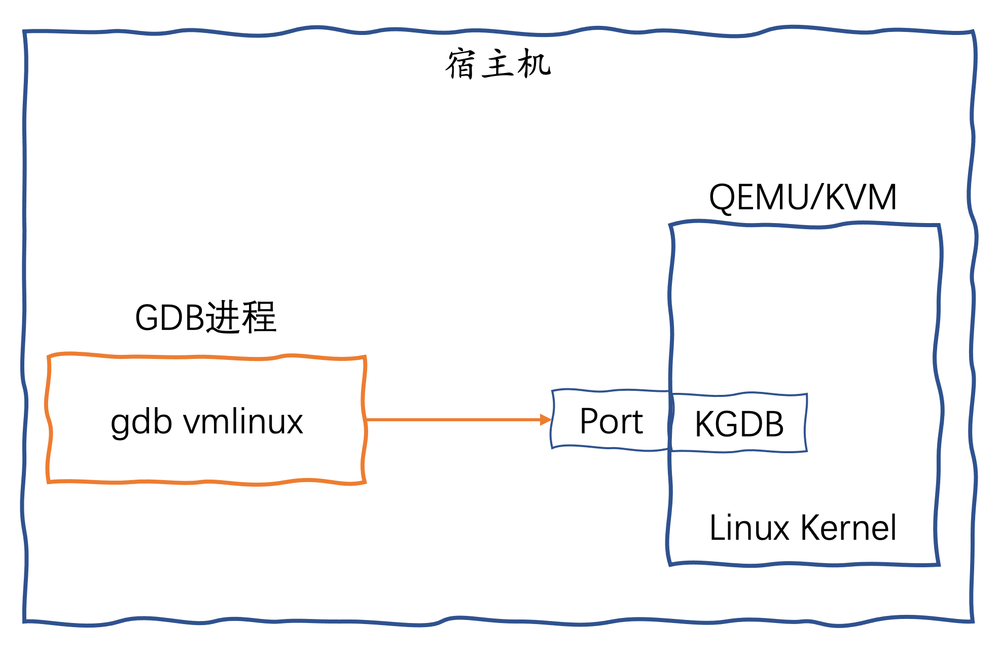
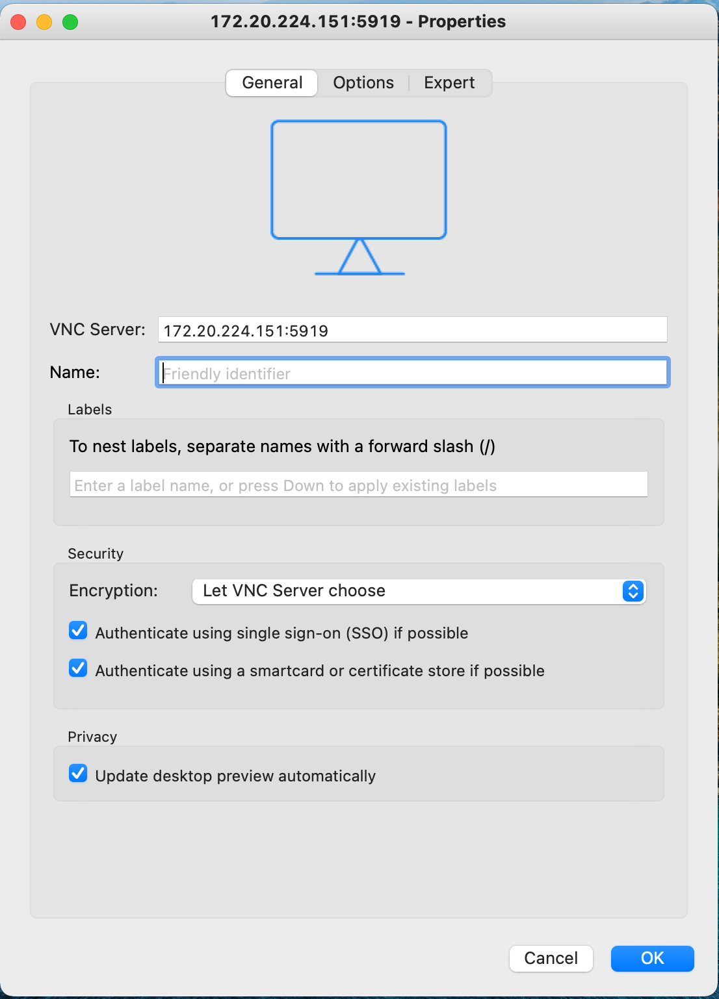
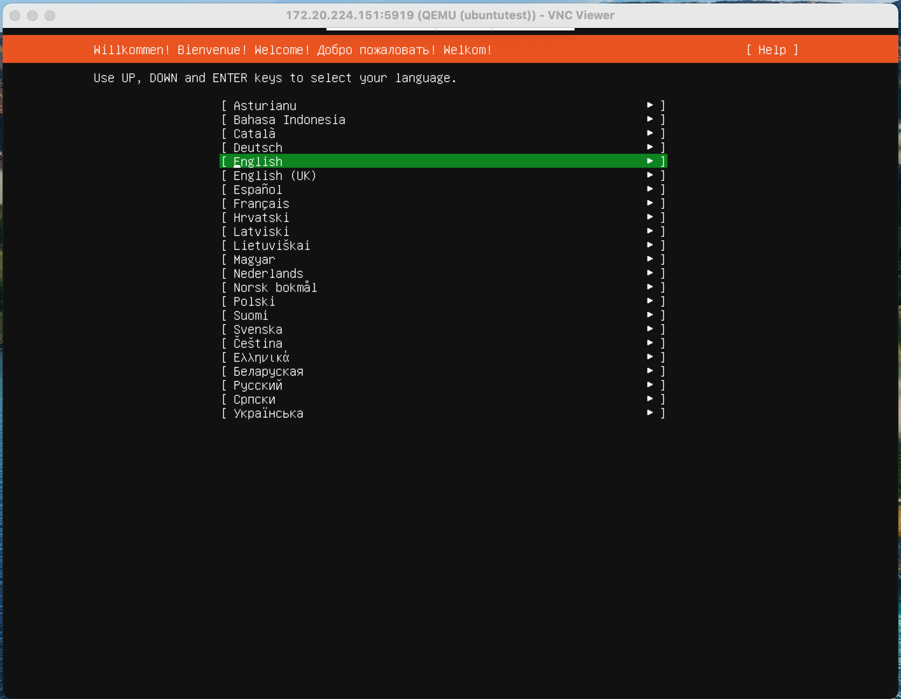
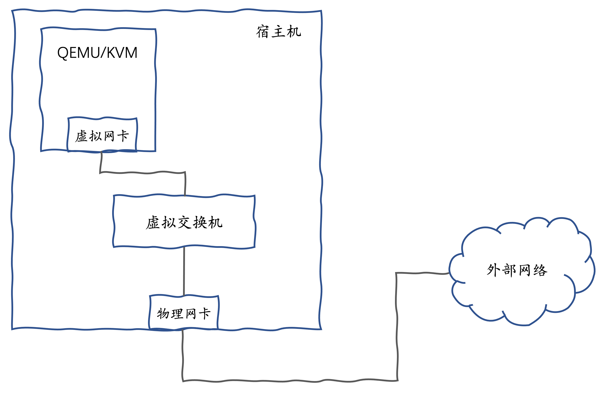
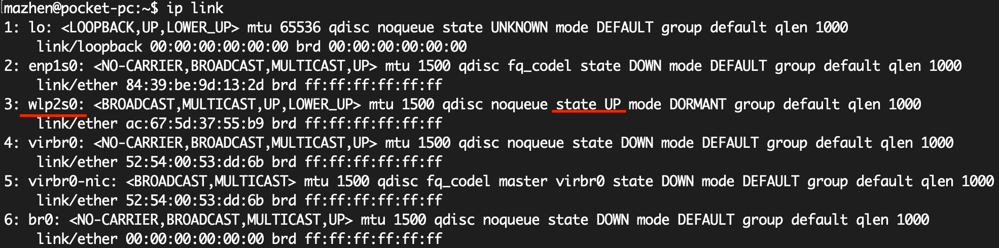
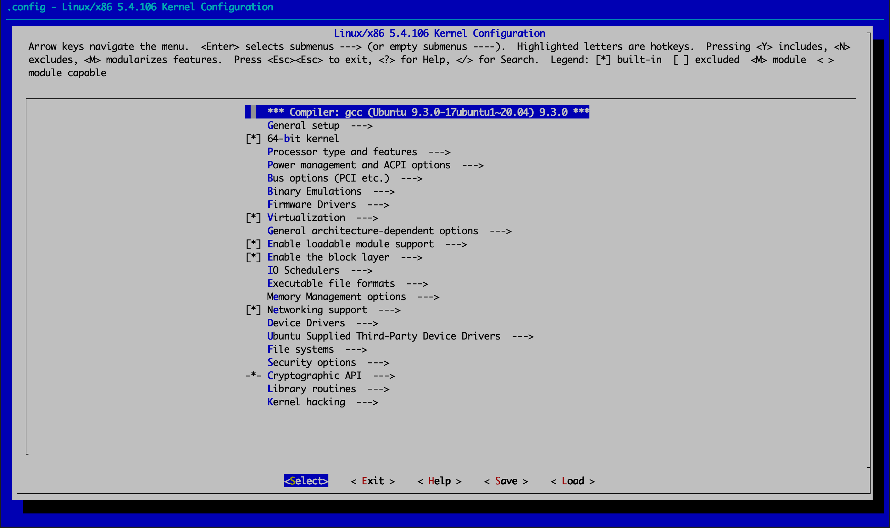

# 使用GDB调试Linux内核

**GDB**（GNU Debugger）是Linux上的调试程序，可用于`C/C++`、`Go`、`Rust`等多种语言。**GDB**可以让你在被调试程序执行时看到它的”内部“情况，观察程序在特定断点上的状态，并逐行运行代码。

**GDB**还提供了“远程”模式，使用**GDB协议**通过网络或串行设备与被调试程序进行通信。程序需要链接**GDB**提供的**stub**，这个**stub**实现了**GDB协议**。或者可以使用`GDBserver`，这时程序不需要进行任何更改。

类似的，Linux内核开发者可以使用**GDB**的远程模式，与调试应用程序几乎相同的方式来调试Linux内核。**KGDB**是Linux内核的源代码级调试器，你可以使用**GDB**作为**KGDB**的前端，在我们熟悉且功能强大的**GDB**调试界面中调试内核。

使用**KGDB**需要两台机器，一台作为开发机，另一台是目标机器，要调试的内核在目标机器上运行。在开发机上使用`gdb`运行包含符号信息的`vmlinux`，然后通过指定网络地址和端口，连接到目标机器的**KGDB**。我们也可以使用[QEMU/KVM](https://www.qemu.org/)虚拟机作为目标机器，让待调试的内核运行在虚拟机中，然后在宿主机上运行`gdb`，连接到虚拟机中的**KGDB**。



本文将介绍如何在本机搭建Linux内核调试环境，步骤比较繁琐，还会涉及到编译内核。作为内核小白，我会尽量写的详细些，毕竟我折腾了很久才成功。

## 本机环境

我使用的`Ubuntu 20.04.2 LTS`，`gdb`版本为9.2。

## 安装QEMU/KVM和Virsh

**Virsh**是`Virtual Shell`的缩写，是一个用于管理虚拟机的命令行工具。你可以使用**Virsh**创建、编辑、启动、停止、关闭和删除**VM**。**Virsh**目前支持`KVM`，`LXC`，`Xen`，`QEMU`，`OpenVZ`，`VirtualBox`和`VMware ESX`。这里我们使用**Virsh**管理**QEMU/KVM**虚拟机。

在安装之前，首先要确认你的`CPU`是否支持虚拟化技术。使用`grep`查看`cpuinfo`是否有"**vmx**"(Intel-VT 技术)或"**svm**"(AMD-V 支持)输出：

```
egrep "(svm|vmx)" /proc/cpuinfo
```

某些`CPU`型号在默认情况下，`BIOS`中可能禁用了`VT`支持。我们需要再检查`BIOS`设置是否启用了`VT`的支持。使用**kvm-ok**命令进行检查：

```
$ sudo apt install cpu-checker
$ kvm-ok
```

如果输出为：

```
INFO: /dev/kvm exists
KVM acceleration can be used
```

证明`CPU`的虚拟化支持已经在`BIOS`中启用。

运行下面的命令安装**QEMU/KVM**和**Virsh**：

```
$ sudo apt install qemu-kvm libvirt-daemon-system libvirt-clients bridge-utils virtinst virt-manager
```

检查`libvirt`守护程序是否已经启动：

```
$ sudo systemctl is-active libvirtd
active
```

如果没有输出**active**，运行下面的命令启动`libvertd`服务：

```
$ sudo systemctl enable libvirtd
$ sudo systemctl start libvirtd
```

## 创建虚拟机镜像

创建一个虚拟机镜像，大小为40G，**qcow2** 格式为动态分配磁盘占用空间。

```
qemu-img create -f qcow2 ubuntutest.img 40G
```

## 创建虚拟机，安装操作系统

使用下面的命令启动虚拟机，**-cdrom**参数为虚拟机挂载了`Ubuntu`的安装光盘：

```
qemu-system-x86_64 -enable-kvm -name ubuntutest  -m 4096 -hda ubuntutest.img -cdrom ubuntu-20.04.2-live-server-amd64.iso -boot d -vnc :19
```

我们使用`VNC`客户端连接进虚拟机，完成`Ubuntu`的安装。注意上面的命令通过`-vnc :19`设置了虚拟机的VNC监听端口为`5919`。




我使用的`VNC`客户端是[VNC Viewer](https://www.realvnc.com/en/connect/download/viewer/)，支持Windows、macOS和Linux等主流平台。按照正常步骤，完成Ubuntu在虚拟机上的安装。

安装完成后，可以用`ctrl+c`退出`qemu-system-x86_64`命令的执行来停止虚拟机。再次启动虚拟机，需要把 **-cdrom** 参数去掉。

```
qemu-system-x86_64 -enable-kvm -name ubuntutest  -m 4096 -hda ubuntutest.img -boot d -vnc :19
```

## 配置虚拟机网络

为了让虚拟机能访问外部网络，我们需要形成下面的结构：



在宿主机上创建网桥**br0**，并设置一个IP地址：

```
$ sudo brctl addbr br0
$ sudo ip link set br0 up
$ sudo ifconfig br0 192.168.57.1/24
```

编辑宿主机的`/etc/sysctl.conf`文件，设置IP转发生效：

```
net.ipv4.ip_forward=1
```

使用**sysctl -p**重新加载`sysctl.conf`配置使其生效。

在宿主机上增加**SNAT**规则。

```
sudo iptables -t nat -A POSTROUTING -o wlp2s0 -j MASQUERADE
```

虚拟机的`IP`地址外部并不认识，如果它要访问外网，需要在数据包离开前将源地址替换为宿主机的IP，这样外部主机才能用宿主机的IP作为目的地址发回响应。

上面的命令的含义是：在`nat`表的`POSTROUTING`链增加规则，出口设备为`wlp2s0`时，就执行`MASQUERADE`动作。`MASQUERADE`是一种源地址转换动作，它会动态选择宿主机的一个`IP`做源地址转换。

注意上面命令中的 **-o** 参数，指定了数据包的出口设备为**wlp2s0**。你需要使用`ip link`命令在你的机器上查看具体设备的名称：



如果想进一步了解**iptables**，可以参见我的另一篇文章[《Docker单机网络模型动手实验》](./docker-network-bridge.md)。

接着我们需要将虚拟机的网卡连接到网桥**br0**。后面我们使用**libvirt**来管理**QEMU/KVM**虚拟机，这样可以把虚拟机的配置参数记录在XML文件中，易于维护。

```
<domain type='kvm' xmlns:qemu='http://libvirt.org/schemas/domain/qemu/1.0'>
  <name>ubuntutest</name>
  <uuid>0f0806ab-531d-6134-5def-c5b4955292aa</uuid>
  <memory unit='GiB'>4</memory>
  <currentMemory unit='GiB'>4</currentMemory>
  <vcpu placement='static'>2</vcpu>
  <os>
    <type arch='x86_64' machine='pc-i440fx-trusty'>hvm</type>
    <boot dev='hd'/>
  </os>
  <features>
    <acpi/>
    <apic/>
    <pae/>
  </features>
  <clock offset='utc'/>
  <on_poweroff>destroy</on_poweroff>
  <on_reboot>restart</on_reboot>
  <on_crash>restart</on_crash>
 <devices>
    <emulator>/usr/bin/kvm</emulator>
    <disk type='file' device='disk'>
      <driver name='qemu' type='qcow2'/>
      <source file='/home/mazhen/works/ubuntutest.img'/>
      <target dev='vda' bus='virtio'/>
    </disk>
    <controller type='pci' index='0' model='pci-root'/>
    <interface type='bridge'>
      <mac address='fa:16:3e:6e:89:ce'/>
      <source bridge='br0'/>
      <target dev='tap1'/>
      <model type='virtio'/>
    </interface>
    <serial type='pty'>
      <target port='0'/>
    </serial>
    <console type='pty'>
      <target type='serial' port='0'/>
    </console>
    <graphics type='vnc' port='5919' autoport='no' listen='0.0.0.0'>
      <listen type='address' address='0.0.0.0'/>
    </graphics>
    <video>
      <model type='cirrus'/>
    </video>
  </devices>
  <qemu:commandline>
    <qemu:arg value='-s'/>
  </qemu:commandline>
</domain>
```

我们可以看到，`source file`指定的文件`/home/mazhen/works/ubuntutest.img`就是虚拟机镜像。`devices`中的`interface`定义了虚拟网卡，`br0`是我们前面创建的网桥，`libvirt`帮我们创建的虚拟网卡会连接到网桥`br0`上。

将`XML`文件保存为`domain.xml`，然后在`libvirt`定义虚拟机：

```
$ virsh define domain.xml
```

接着我们可以使用`virsh list --all`查看虚拟机列表：

```
$ virsh list --all
 Id   Name         State
-----------------------------
 -    ubuntutest   shut off
```

使用命令`virsh start ubuntutest`启动虚拟机：

```
$ virsh start ubuntutest
Domain ubuntutest started

$ virsh list
 Id   Name         State
----------------------------
 1    ubuntutest   running
```

这时我们使用**VNC Viewer**连接进行虚拟机，为虚拟机配置IP地址。虚拟机安装的是`ubuntu-20.04.2`，编辑`/etc/netplan/00-installer-config.yaml`文件配置`IP`地址。

```
network:
  ethernets:
    ens3:
            addresses: [192.168.57.100/24]
            gateway4: 192.168.57.1
            dhcp4: no
            nameservers:
                    addresses: [114.114.114.114]
            optional: true
  version: 2
```

我们可以看到，网关配置的就是**br0**的`IP`地址。然后，使用命令 **netplan apply**让配置生效。这样，虚拟机的网络就配置好了，可以在虚拟机里访问到外网。这时我们就可以在宿主机上使用**ssh**登录虚拟机，这样比使用**VNC Viewer**操作更方便一些。

## 下载Linux内核源码

在虚拟机上下载Linux内核源码：

```
$ sudo apt install linux-source-5.4.0
```

`ubuntu-20.04.2`对应的内核版本是`5.4`。可以使用`uname -srm`查看内核版本。

源码被下载到来`/usr/src/`目录下，使用下面的命令解压缩：

```
sudo tar vjxkf linux-source-5.4.0.tar.bz2 
```

内核源码被解压缩到了`/usr/src/linux-source-5.4.0`目录下。

## 编译Linux内核

首先我们需要安装编译内核用到的依赖包：

```
$ sudo apt install libncurses5-dev libssl-dev bison flex libelf-dev gcc make openssl libc6-dev
```

编译前要定义内核编译选项。进入`/usr/src/linux-source-5.4.0`目录，运行下面的命令，会进入内核参数配置界面：

```
$ sudo make menuconfig
```



为了构建能够调试的内核，我们需要配置以下几个参数。

* **CONFIG_DEBUG_INFO** 在内核和内核模块中包含调试信息，这个选项在幕后为gcc使用的编译器参数增加了`-g`选项。

这个选项的菜单路径为：

```
Kernel hacking  --->
Compile-time checks and compiler options  ---> 
 [*] Compile the kernel with debug info   
```

实际上通过菜单进行设置比较麻烦。我们保存设置退出后，配置会保存在`.config`文件中。直接编辑这个文件会更方便一些。在`.config`中确认`CONFIG_DEBUG_INFO`的设置正确。

```
CONFIG_DEBUG_INFO=y
```

* **CONFIG_FRAME_POINTER** 这个选项会将调用帧信息保存在寄存器或堆栈上的不同位置，使`gdb`在调试内核时可以更准确地构造堆栈回溯跟踪（stack back traces）。

在`.config`中设置：

```
CONFIG_FRAME_POINTER=y
```

* 启用**CONFIG_GDB_SCRIPTS**，但要关闭**CONFIG_DEBUG_INFO_REDUCED**。

```
CONFIG_GDB_SCRIPTS=y
CONFIG_DEBUG_INFO_REDUCED=n
```

* **CONFIG_KGDB** 启用内置的内核调试器，该调试器允许进行远程调试。

```
CONFIG_KGDB=y
```

* 关闭**CONFIG_RANDOMIZE_BASE**设置

```
CONFIG_RANDOMIZE_BASE=n
```

`KASLR`会更改引导时放置内核代码的基地址。如果你在内核配置中启用了`KASLR`（`CONFIG_RANDOMIZE_BASE=y`），则无法从`gdb`设置断点。

设置完必要的内核参数后，我们开始编译内核：

```
sudo make -j8 
sudo make modules_install
sudo make install
```

编译的过程很漫长，可能需要数小时。当编译完毕之后，新内核的选项已经增加到了`grub`的配置中。我们可以查看配置文件`/boot/grub/grub.cfg`确认：

```
submenu 'Advanced options for Ubuntu' $menuentry_id_option 'gnulinux-advanced-5506d28f-c9e7-46d4-a12e-42555d491eec' {
        menuentry 'Ubuntu, with Linux 5.4.106' --class ubuntu --class gnu-linux --class gnu --class os $menuentry_id_option 'gnulinux-5.4.106-advanced-5506d28f-c9e7-46d4-a12e-42555d491eec' {
                recordfail
                load_video
                gfxmode $linux_gfx_mode
                insmod gzio
                if [ x$grub_platform = xxen ]; then insmod xzio; insmod lzopio; fi
                insmod part_gpt
                insmod ext2
                if [ x$feature_platform_search_hint = xy ]; then
                  search --no-floppy --fs-uuid --set=root  5506d28f-c9e7-46d4-a12e-42555d491eec
                else
                  search --no-floppy --fs-uuid --set=root 5506d28f-c9e7-46d4-a12e-42555d491eec
                fi
                echo    'Loading Linux 5.4.106 ...'
                linux   /boot/vmlinuz-5.4.106 root=UUID=5506d28f-c9e7-46d4-a12e-42555d491eec ro maybe-ubiquity
                echo    'Loading initial ramdisk ...'
                initrd  /boot/initrd.img-5.4.106
        }
```

`vmlinuz-5.4.106`就是我们新编译的内核。

重启虚拟机。在`GRUB`界面选择 `Ubuntu 高级选项`，选择第一项进去，就进入了新的内核。

## 启用gdb监听端口

**QEMU**有个命令行参数`-s`，它代表参数`-gdb tcp::1234`，意思是**QEMU**监听 1234端口，这样`gdb` 可以 `attach` 到这个端口上，调试**QEMU**里面的内核。

实际上在前面的`domain.xml`中我们已经为**QEMU**加了`-s`参数。

```
<domain type='kvm' xmlns:qemu='http://libvirt.org/schemas/domain/qemu/1.0'>
...
  <qemu:commandline>
    <qemu:arg value='-s'/>
  </qemu:commandline>
</domain>
```

所以这时运行在虚拟机里的内核已经可以被调试了。

## 调试内核

在宿主机上运行`gdb`需要内核的二进制文件，这个文件就是在虚拟机`GRUB`里配置的`/boot/vmlinuz-5.4.106`。为了方便在调试过程中查看源代码，我们可以将虚拟机的`/usr/src/linux-source-5.4.0`整个目录都拷贝到宿主机上来。

```
$ scp -r mazhen@virtual-node:/usr/src/linux-source-5.4.0 ./
```

在`/usr/src/linux-source-5.4.0`目录下面的**vmlinux**文件也是内核的二进制文件。

为了能让`gdb`在启动时能够加载`Linux helper脚本`，需要在`~/.gdbinit`文件中添加如下内容：

```
add-auto-load-safe-path /path/to/linux-build
```

`/path/to/linux-build`就是上面从虚拟机拷贝过来的Linux源码目录。

必要的配置完成后，就可以启动`gdb`了。

在宿主机的`./linux-source-5.4.0`目录下执行`gdb vmlinux`。

然后在gdb的交互环境下使用`target remote :1234`命令attach到虚拟机的内核。

```
$ gdb vmlinux
...
Reading symbols from vmlinux...
(gdb) target remote :1234
Remote debugging using :1234
0xffffffff81ade35e in native_safe_halt () at ./arch/x86/include/asm/irqflags.h:60
```

如果我们想调试进程`fork`的过程，可以用`b _do_fork`设置断点：

```
(gdb) b _do_fork
Breakpoint 1 at 0xffffffff81098450: file kernel/fork.c, line 2362.
```

我们可以看到，断点设置成功。如果你不确认fork的具体方法名，可以使用`info functions`命令搜索符号表：

```
(gdb) info function do_fork
All functions matching regular expression "do_fork":

File kernel/fork.c:
2361:	long _do_fork(struct kernel_clone_args *);
```

使用命令`c`让内核继续执行：

```
(gdb) c
Continuing.
```

这时在虚拟机里执行任意命令，例如`ls`，断点将被触发：

```
(gdb) c
Continuing.

Thread 1 hit Breakpoint 1, _do_fork (args=0xffffc9000095fee0) at kernel/fork.c:2362
2362	{
(gdb) 
```

我们可以使用`n`执行下一条语句：

```
(gdb) n
2376		if (!(clone_flags & CLONE_UNTRACED)) {
(gdb) n
2377			if (clone_flags & CLONE_VFORK)
(gdb) n
2379			else if (args->exit_signal != SIGCHLD)
(gdb) 
```

`l`显示多行源码：

```
(gdb) l
2374		 * for the type of forking is enabled.
2375		 */
2376		if (!(clone_flags & CLONE_UNTRACED)) {
2377			if (clone_flags & CLONE_VFORK)
2378				trace = PTRACE_EVENT_VFORK;
2379			else if (args->exit_signal != SIGCHLD)
2380				trace = PTRACE_EVENT_CLONE;
2381			else
2382				trace = PTRACE_EVENT_FORK;
2383	
```

`bt`查看函数调用信息：

```
(gdb) bt
#0  _do_fork (args=0xffffc9000095fee0) at kernel/fork.c:2379
#1  0xffffffff810989f4 in __do_sys_clone (tls=<optimized out>, child_tidptr=<optimized out>, parent_tidptr=<optimized out>, newsp=<optimized out>, 
    clone_flags=<optimized out>) at kernel/fork.c:2544
#2  __se_sys_clone (tls=<optimized out>, child_tidptr=<optimized out>, parent_tidptr=<optimized out>, newsp=<optimized out>, clone_flags=<optimized out>)
    at kernel/fork.c:2525
#3  __x64_sys_clone (regs=<optimized out>) at kernel/fork.c:2525
#4  0xffffffff81003fd7 in do_syscall_64 (nr=<optimized out>, regs=0xffffc9000095ff58) at arch/x86/entry/common.c:290
#5  0xffffffff81c0008c in entry_SYSCALL_64 () at arch/x86/entry/entry_64.S:175
#6  0x00005621191e2da0 in ?? ()
#7  0x000056211a7de450 in ?? ()
#8  0x00007ffc9f31a3e0 in ?? ()
#9  0x0000000000000000 in ?? ()
```

`p`用于打印内部变量值：

```
(gdb) p clone_flags
$1 = 18874368
```

你现在可以像调试普通应用程序一样，调试Linux内核了！

## 写在最后

在本机搭建Linux内核调试环境的步骤有点繁杂，但使用`GDB`能调试内核，会成为我们学习内核的利器，进程管理、内存管理、文件系统，对源码有什么困惑就可以debug一下。
Enjoy it!