# <!--fit--> HTTP/2 简介

---
# Outline

##### <!--fit--> 回顾HTTP的发展简史，理解HTTP在设计上的关键转变，以及每次转变的动机

* HTTP简史
* HTTP/1.1的主要特性和问题
* HTTP/2 的核心概念、主要特性
* HTTP/2 的升级与发现
* HTTP/2 的问题及展望

---

### HTTP简史
* `HTTP`(HyperText Transfer Protocol，超文本传输协议)是互联网上最普遍采用的一种应用协议
* 由欧洲核子研究委员会`CERN`的英国工程师[Tim Berners-Lee](https://en.wikipedia.org/wiki/Tim_Berners-Lee)在1991年发明
* [Tim Berners-Lee](https://en.wikipedia.org/wiki/Tim_Berners-Lee)也是WWW的发明者

---
### HTTP简史
* `HTTP/0.9`：只有一行的协议
    * 请求只有一行，包括`GET`方法和要请求的文档的路径
    * 响应是一个超文本文档，没有首部，也没有其他元数据，只有`HTML`
    * 服务器与客户端之间的连接在每次请求之后都会关闭
* `HTTP/0.9`的设计目标传递超文本文档

---
### HTTP简史

* `HTTP/0.9`演示


```
$> telnet apache.org 80

Trying 95.216.24.32...
Connected to apache.org.
Escape character is '^]'.

GET /foundation/

<!DOCTYPE html>
...
Connection closed by foreign host.
```

---
### HTTP简史
* 1996年`HTTP`工作组发布了`RFC 1945`，这就是`HTTP/1.0`
* 提供请求和响应的各种元数据
* 不局限于超文本的传输，响应可以是任何类型：`HTML`文件、图片、音频等
* 支持内容协商、内容编码、字符集、认证、缓存等
* 从**超文本**到**超媒体**传输

--- 
### HTTP简史

* `HTTP/1.0`演示

```
$> telnet apache.org 80
Trying 95.216.24.32...
Connected to apache.org.
GET /foundation/ HTTP/1.0
Accept: */*

HTTP/1.1 200 OK
Server: Apache/2.4.18 (Ubuntu)
Content-Length: 46012
Connection: close
Content-Type: text/html

<!DOCTYPE html>
...
Connection closed by foreign host.
```

---
### HTTP简史

* 1997年1月定义`HTTP/1.1`标准的`RFC 2068`发布
* 1999年6月`RFC 2616`发布，取代了`RFC 2068`
* 性能优化
  * 持久连接
    * 除非明确告知，默认使用持久连接
  * 分块编码传输
  * 请求管道，支持并行请求处理（应用的非常有限）
  * 增强的缓存机制

---
### HTTP简史

* `HTTP/1.1`演示
```
>$ telnet www.baidu.com 80

Trying 14.215.177.38...
Connected to www.a.shifen.com.

GET /s?wd=http2 HTTP/1.1
Accept: text/html,application/xhtml+xml,application/xml
Accept-Language: zh-CN,zh;q=0.9,en-US;q=0.8,en;q=0.7
Connection: keep-alive
Host: www.baidu.com

HTTP/1.1 200 OK
Connection: Keep-Alive
Content-Type: text/html;charset=utf-8
```

---

```
Date: Sun, 06 Oct 2019 12:49:28 GMT
Server: BWS/1.1
Transfer-Encoding: chunked

ffa
<!DOCTYPE html>
...

1be7
...

0

GET /img/bd_logo1.png HTTP/1.1
Accept: text/html,application/xhtml+xml,application/xml
Accept-Language: zh-CN,zh;q=0.9,en-US;q=0.8,en;q=0.7
Connection: close
Host: www.baidu.com

HTTP/1.1 200 OK
```

---

```
Content-Length: 7877
Content-Type: image/png
Date: Sun, 06 Oct 2019 13:05:06 GMT
Etag: "1ec5-502264e2ae4c0"
Expires: Wed, 03 Oct 2029 13:05:06 GMT
Last-Modified: Wed, 03 Sep 2014 10:00:27 GMT
Server: Apache
Set-Cookie: BAIDUID=0D01C3C9C00A6019C16F79CAEB1EFE91:FG=1
Connection: close

.
.
.
.
.
.


Connection closed by foreign host.
```

---
### HTTP简史
* Google在2009年发布了实验性协议`SPDY`，主要目标是解决`HTTP/1.1`的性能限制
* Google工程师在[A 2x Faster Web](https://blog.chromium.org/2009/11/2x-faster-web.html)分享实验结果
> So far we have only tested SPDY in lab conditions. The initial results are very encouraging: when we download the top 25 websites over simulated home network connections, we see a significant improvement in performance - pages loaded up to 55% faster. 
* 2012年，`SPDY`得到Chrome、Firefox和Opera的支持
* HTTP-WG(HTTP Working Group)开始在`SPDY`的基础上制定官方标准


---
### HTTP简史
* 2015年正式发布`HTTP/2`
  * 主要目标：改进传输性能，低延迟和高吞吐量
  * 保持原有的高层协议语义不变
* 根据[W3Techs的报告](https://w3techs.com/technologies/details/ce-http2/all/all)，截止2019年10月，全球已经有 **41.3%** 的网站开启了`HTTP/2`

---
### HTTP简史
* Google在2012年设计开发了[QUIC协议](https://en.wikipedia.org/wiki/QUIC)，让`HTTP`不再基于`TCP`
* 2018年底，`HTTP/3`标准发布
* `HTTP/3`协议业务逻辑变化不大，可以简单理解为 `HTTP/2` + `QUIC`

---
### HTTP/1.1 持久连接
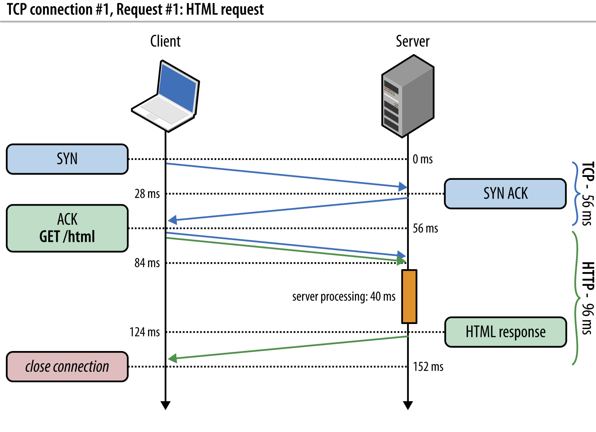

---
### HTTP/1.1 持久连接
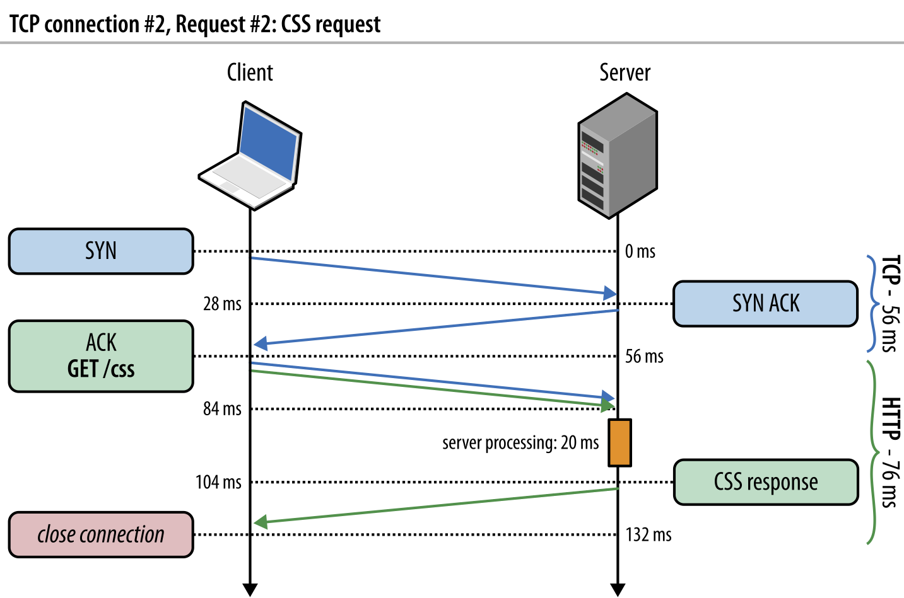

---
### HTTP/1.1 持久连接
* 非持久`HTTP`连接的固定时间成本
  * 至少两次网络往返： 握手、请求和响应
* 服务处理速度越快，固定延迟的影响就越大
* 持久连接避免`TCP`连接时的三次握手，消除`TCP`的慢启动

---
### HTTP/1.1 管道
* 多次请求必须满足**先进先出**(FIFO)的顺序

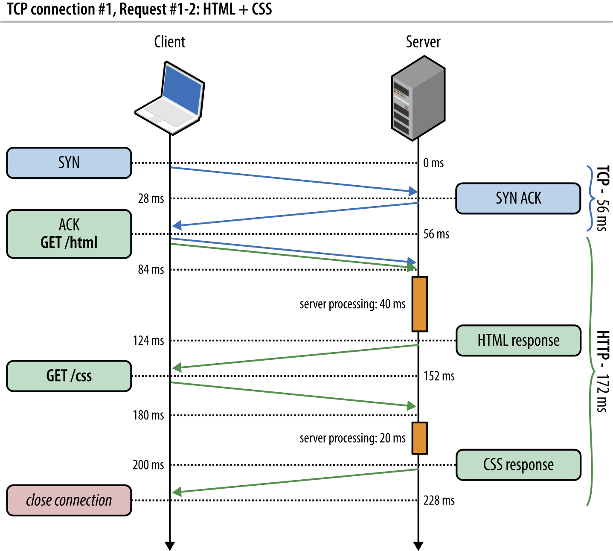

---
### HTTP/1.1 管道
* 尽早发送请求，不被每次响应阻塞

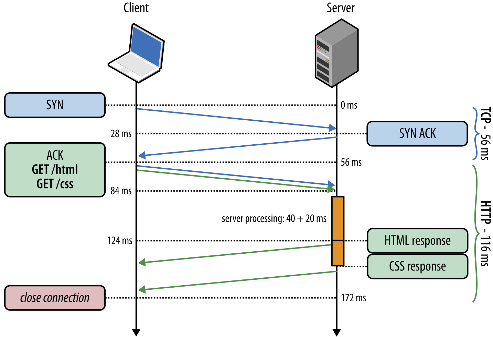

---
### HTTP/1.1 管道

* `HTTP/1.1`的局限性
  * 只能严格串行地返回响应，不允许一个连接上的多个响应交错到达
* 管道的问题
  * 并行处理请求时，服务器必须缓冲管道中的响应，占用服务器资源
  * 由于失败可能导致重复处理，非幂等的方法不能pipeline化
  * 由于中间代理的兼容性，可能会破坏管道
* 管道的应用非常有限

---
### `HTTP/1.1` 的协议开销
* 每个`HTTP`请求都会携带500~800字节的`header`
* 如果使用了`cookie`，每个`HTTP`请求会增加几千字节的协议开销
* `HTTP header`以纯文本形式发送，不会进行任何压缩
* 某些时候`HTTP header`开销会超过实际传输的数据一个数量级
  * 访问`RESTful API`返回`JSON`

---
### 为了解决`HTTP/1.1`性能问题做过的努力
* `HTTP/1.1`不支持多路复用
  * 浏览器支持每个主机打开多个连接（例如Chrome是6个）
  * 浏览器连接限制针对的是主机名，不是`IP`地址
  * 应用使用多域名，将资源分散到多个子域名
* 缺点
  * 消耗客户端和服务器资源
  * 域名分区增加了额外的`DNS`查询
  * 避免不了TCP慢启动

---
### 为了解决`HTTP/1.1`性能问题做过的努力
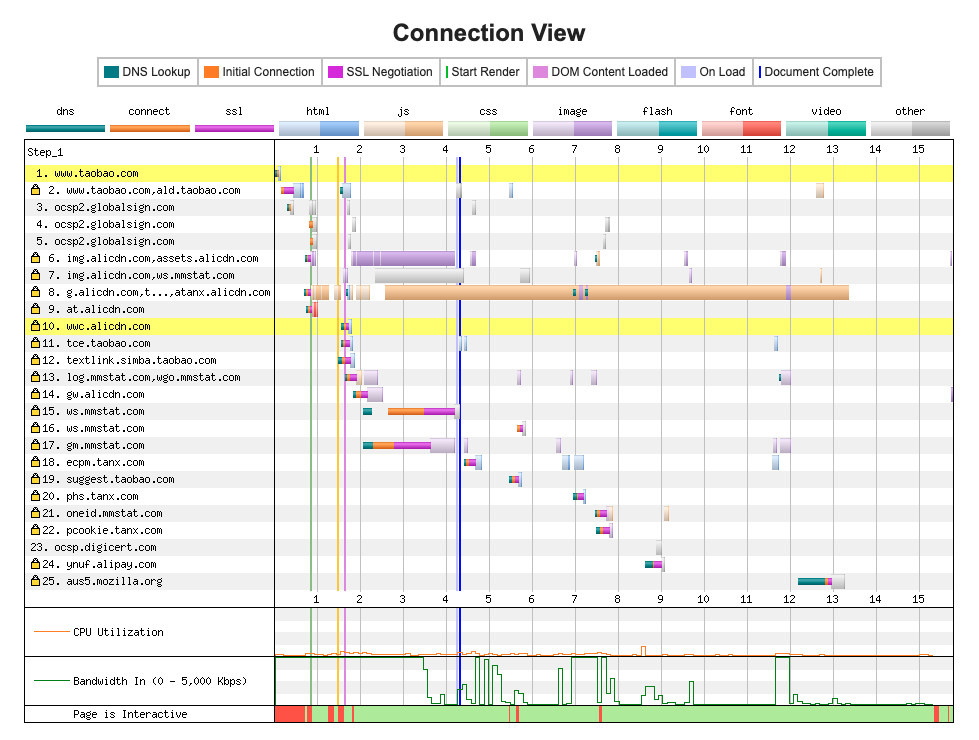

---
### 为了解决`HTTP/1.1`性能问题做过的努力
* 把多个`JavaScript`或`CSS`组合为一个文件
* 把多张图片组合为一个更大的复合的图片
* Inlining内联，将图片嵌入到`CSS`或者`HTML`文件中，减少网络请求次数

*增加应用的复杂度，导致缓存、更新等问题，只是权宜之计*

---
### `HTTP/2` 的目标
* 性能优化
  * 支持请求与响应的多路复用
  * 支持请求优先级和流量控制
  * 支持服务器端推送
  * 压缩`HTTP header`降低协议开销
* HTTP的语义不变
  * `HTTP`方法、`header`、状态码、`URI`

---
### `HTTP/2` 二进制分帧层
* 引入新的二进制分帧数据层
* 将传输的信息分割为消息和帧，并采用二进制格式的编码

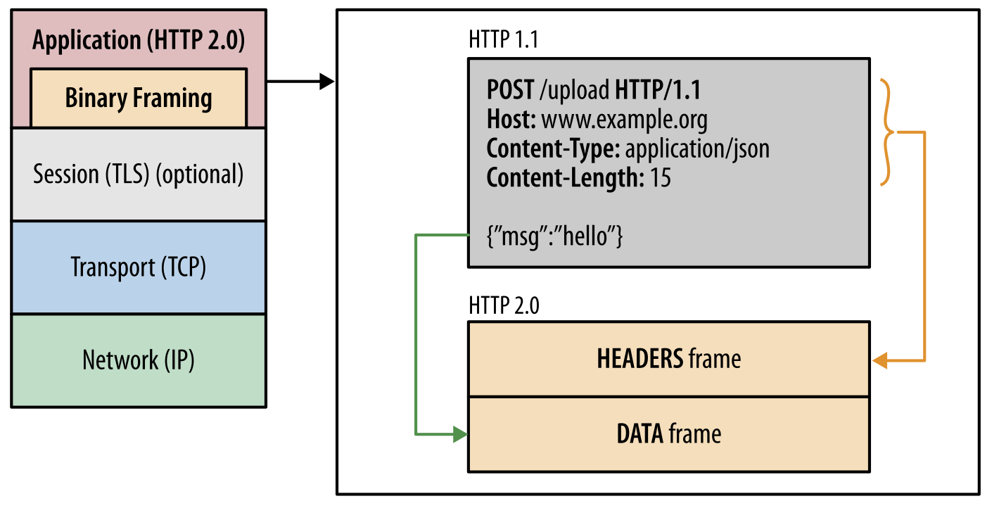

---
### `HTTP/2` 的核心概念
* 流(Stream)
  * 已建立的连接上的双向字节流
  * 该字节流可以携带一个或多个消息
* 消息(Message)
  * 与请求/响应消息对应的一系列完整的数据帧
* 帧(Frame)
  * 通信的最小单位
  * 每个帧包含帧首部，标识出当前帧所属的流

---
### `HTTP/2` 的核心概念

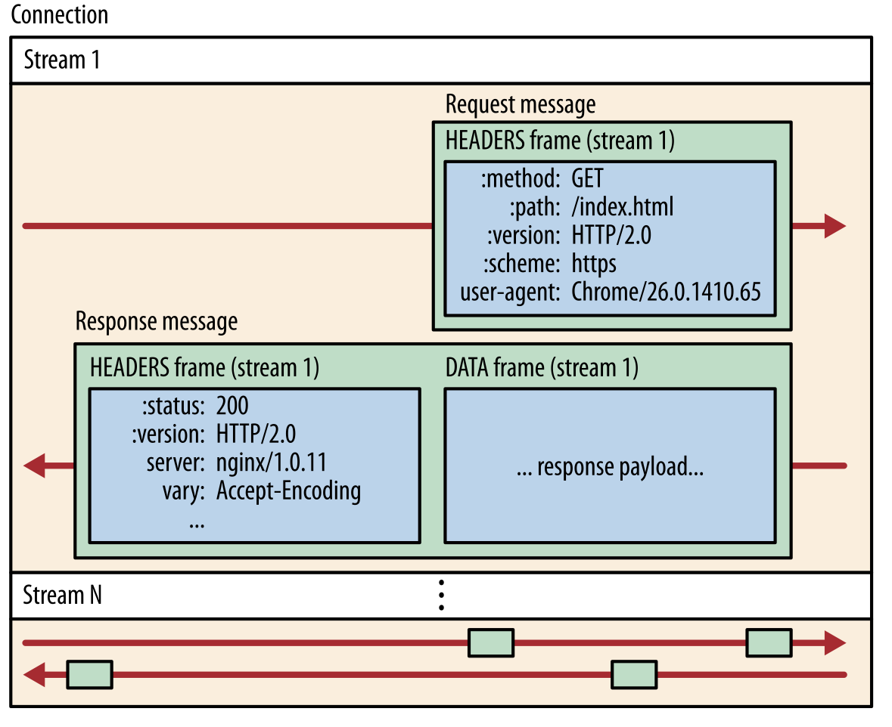

---
### `HTTP/2` 的核心概念
* 所有`HTTP/2`通信都在一个TCP连接上完成
* `流`是连接中的一个虚拟信道，可以承载双向的消息
* 一个连接可以承载任意数量的`流`，每个`流`都有一个唯一的整数标识符(1、2...N)
* `消息`是指逻辑上的`HTTP`消息，比如请求、响应等。每个数据流以消息的形式发送
* `消息`由一或多个`帧`组成，这些帧可以交错发送，然后根据每个帧首部的流标识符重新组装

---
### `HTTP/2` 帧格式
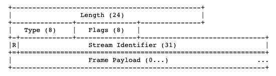

* 详细说明请参考[HTTP/2规范](https://tools.ietf.org/html/rfc7540)

---
### `HTTP/2` 帧类型
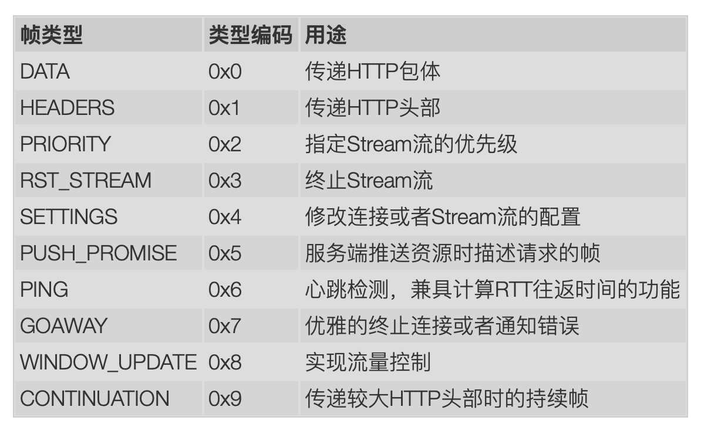


---
### `HTTP/2`请求与响应的多路复用
* `HTTP/1.x`中，如果客户端想发送多个并行的请求，那么必须使用多个`TCP`连接
* `HTTP/2`中，客户端和服务器把`HTTP`消息分解为互不依赖的帧，然后交错发送，最后在另一端把它们重新组合起来

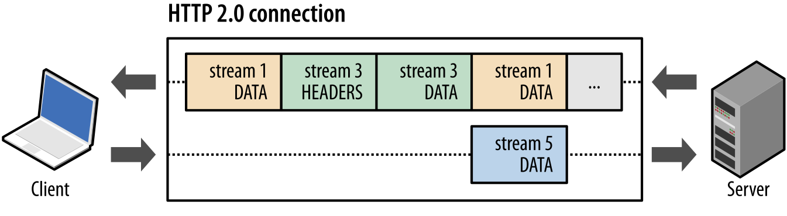

---
### `HTTP/2` 请求优先级
* `HTTP/2`允许每个流关联一个31bit的优先值
  * `0` 最高优先级
  * `2^31 -1` 最低优先级
* 浏览器会基于资源的类型、在页面中的位置等因素，决定请求的优先次序
* 服务器可以根据流的优先级，控制资源分配，优先将高优先级的帧发送给客户端
* `HTTP/2`没有规定具体的优先级算法

---
### `HTTP/2` 流量控制
* 流量控制有方向性，即接收方可能根据自己的情况为每个`流`，乃至整个连接设置任意窗口大小
* 连接建立后，客户端与服务器交换`SETTINGS`帧，设置 双向的流量控制窗口大小
* 流量控制窗口大小通过`WINDOW_UPDATE`帧更新
* `HTTP/2`流量控制和`TCP`流量控制的机制相同，但`TCP`流量控制不能对同一个连接内的多个`流`实施差异化策略

---
### `HTTP/2` 服务器端推送
* 服务器可以对一个客户端请求发送多个响应
* 服务器只能借着对请求的响应推送资源，不能随意发起推送流
* 服务器可以智能分析客户端的需求，自动推送关键资源

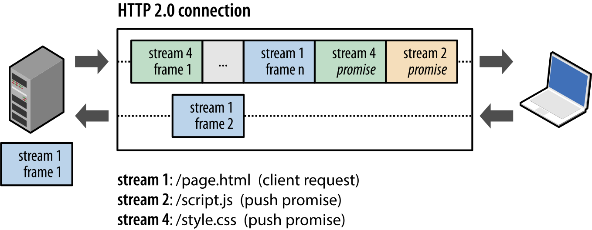

---
### `HTTP header`压缩
* `HTTP/2`使用[HPACK](https://tools.ietf.org/html/rfc7541)压缩格式压缩请求/响应头
  * 通过静态霍夫曼码对发送的`header`字段进行编码，减小了它们的传输大小
  * 客户端和服务器使用`索引表`来维护和更新`header`字段。对于相同的数据，不再重复发送

---
### `HTTP header`压缩
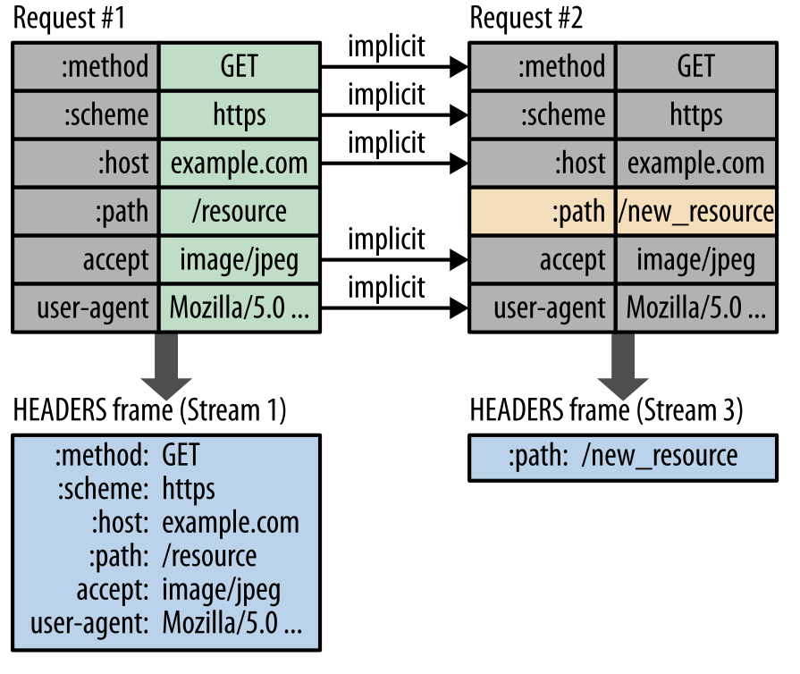

---
### `HTTP/2` vs `HTTP/1.1`
* https://http2.akamai.com/demo
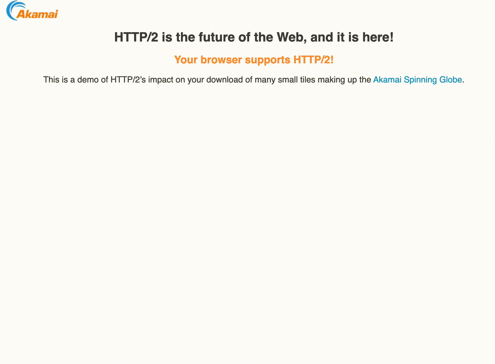

---
### `HTTP/2`的升级与发现
* `HTTP/1.x`还将长期存在，客户端和服务器必须同时支持`1.x`和`2.0`
* 客户端和服务器在开始交换数据前，必须发现和协商使用哪个版本的协议进行通信
* `HTTP/2`定义了两种协商机制
  * 通过安全连接`TLS`和`ALPN`进行协商
  * 基于`TCP`连接的协商机制

---
### `HTTP/2`的升级与发现
* `HTTP/2`标准不要求必须基于`TLS`，但浏览器要求必须基于`TLS`
  * Web上存在大量的代理和中间设备：缓存服务器、安全网关、加速器等等
  * 如果任何中间设备不支持，连接都不会成功
  * 建立`TLS`信道，端到端加密传输，绕过中间代理，实现可靠的部署
  * 新协议一般都要依赖于建立`TLS`信道，例如`WebSocket`、`SPDY`

---
### `h2`和`h2c`协议协商机制
* 基于`TLS`运行的`HTTP/2`被称为`h2`
* 直接在`TCP`之上运行的`HTTP/2`被称为`h2c`

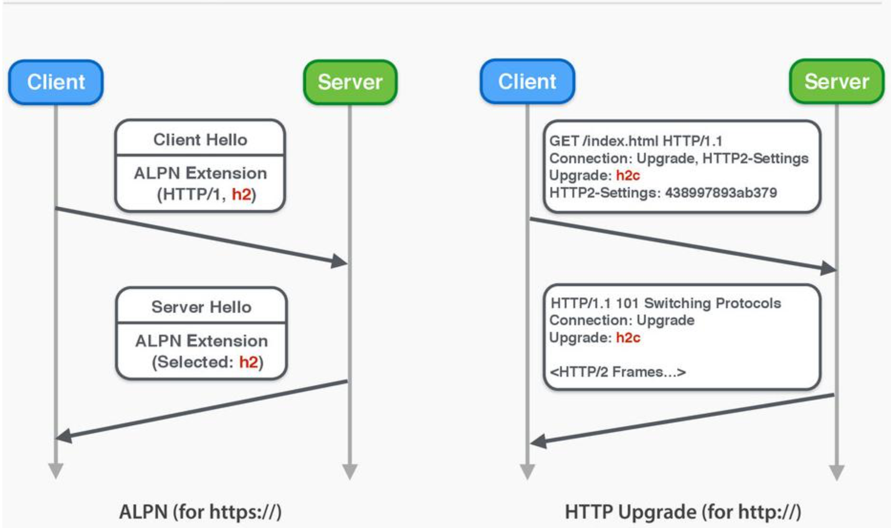

--- 
### `h2c`演示环境
* 客户端测试工具 `curl` (> 7.46.0)
* 服务器端 `Tomcat 9.x`

```
<Connector port="8080" protocol="HTTP/1.1"
           connectionTimeout="20000"
           redirectPort="8443" >
    <UpgradeProtocol 
            className="org.apache.coyote.http2.Http2Protocol"/>
</Connector>
```

---
### `h2c`协议升级
* `curl http://localhost:8080 --http2 -v`

```
> GET / HTTP/1.1
> Host: localhost:8080
> User-Agent: curl/7.64.1
> Accept: */*
> Connection: Upgrade, HTTP2-Settings
> Upgrade: h2c
> HTTP2-Settings: AAMAAABkAARAAAAAAAIAAAAA

< HTTP/1.1 101 
< Connection: Upgrade
< Upgrade: h2c
```

---
### `HTTP/2`连接建立
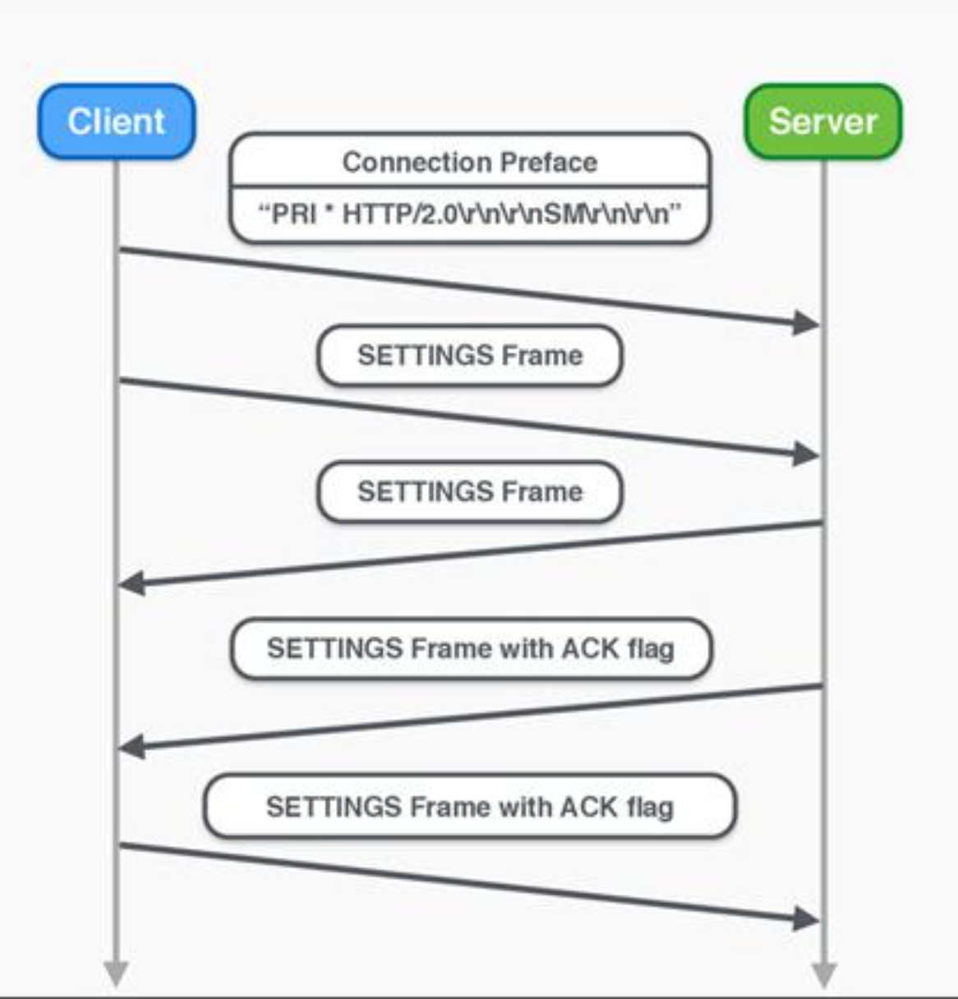

---
### `HTTP/2`连接建立
* Magic帧
  * ASCII 编码，12字节
  * 何时发送?
    * 接收到服务器发送来的 101 Switching Protocols后
    * TLS 握手成功后
  * Preface 内容

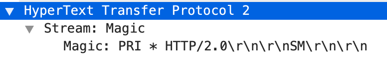

---
### `HTTP/2`连接建立
* 交换`settings`帧(client -> server)

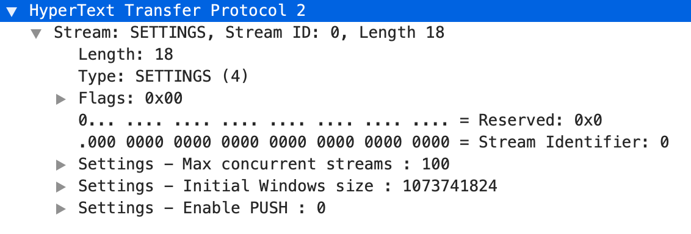

---
### `HTTP/2`连接建立
* 交换`settings`帧(server -> client)

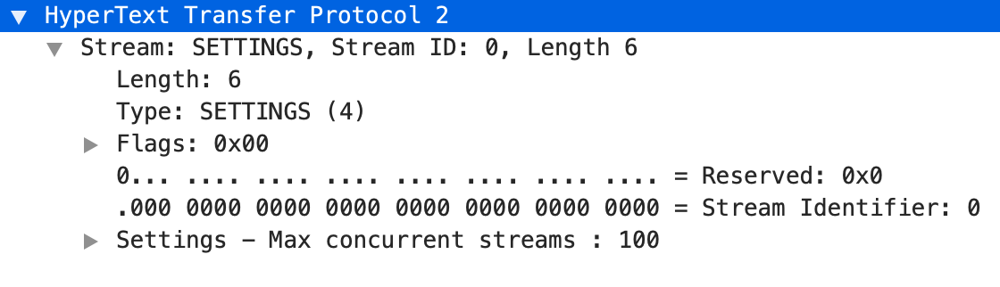

---
### `HTTP/2`连接建立
* `settings` ACK 帧 (client <-> server)

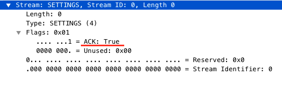

---
### `TLS` 通讯过程
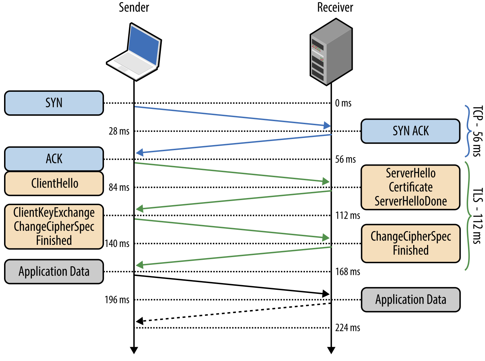
* 验证身份
* 达成安全套件共识
* 传递密钥
* 加密通讯

---
### Application-Layer Protocol Negotiation
* 基于`TLS`运行的`HTTP/2`使用`ALPN`扩展做协议协商
  * 客户端在`ClientHello`消息中增加`ProtocolNameList`字段，包含自己支持的应用协议
  * 服务器检查`ProtocolNameList`字段，在`ServerHello`消息中以`ProtocolName`字段返回选中的协议

* 在`TLS`握手的同时协商应用协议，省掉了`HTTP`的`Upgrade`机制所需的额外往返时间

---
### ALPN

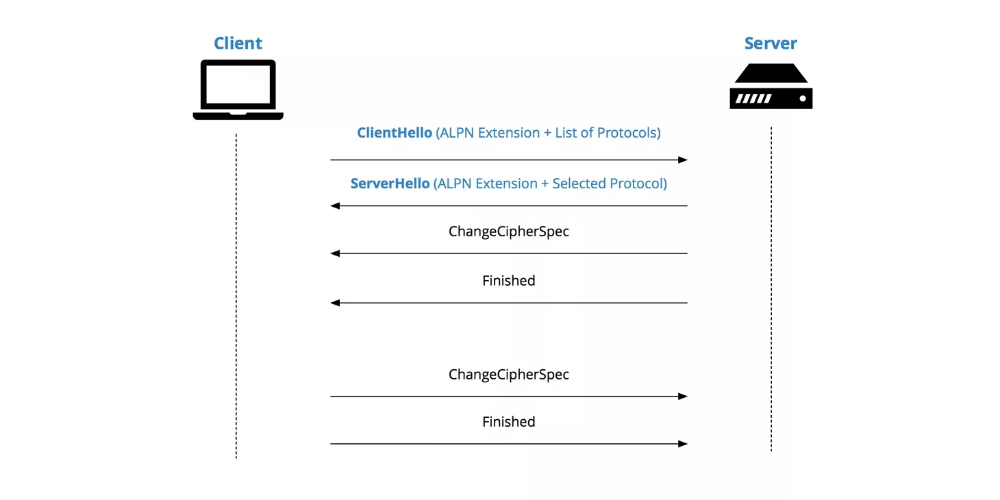

---
### `h2`演示环境
* 客户端：浏览器
* 服务器端：`Tomcat 9.x`
  * `Tomcat`提供了三种不同的`TLS`实现
    * Java运行时提供的`JSSE`实现
    * 使用`OpenSSL`的`JSSE`实现
    * `APR`实现，默认情况下使用`OpenSSL`引擎

---
### `Tomcat`三种`TLS`实现的对比
* JSSE
  * 非常慢
  * [ALPN](https://tools.ietf.org/html/rfc7301)是因为`HTTP/2`才在2014年出现，JDK8不支持`ALPN`
* 使用`OpenSSL`的`JSSE`
  * 只使用了`OpenSSL`的本地代码，没有使用native socket
  * 可以配合 NIO 和 NIO2
* `APR`
  * 大量的native code
  * 同样使用了`OpenSSL`

---
* `OpenSSL`性能比`JSSE`好很多；不再需要`APR`
* `Linux`上`NIO.2`是通过`epoll`来模拟实现的[EPollPort.java](https://github.com/openjdk/jdk/blob/6bab0f539fba8fb441697846347597b4a0ade428/src/java.base/linux/classes/sun/nio/ch/EPollPort.java)

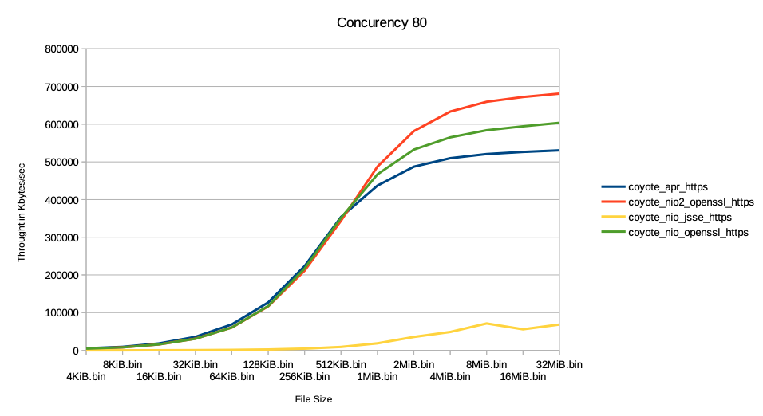

---
### 使用`JSSE`
* 生成private key和自签名证书
  * `keytool -genkey -alias tomcat -keyalg RSA`
* 配置`server.xml`

```
<Connector
  protocol="org.apache.coyote.http11.Http11NioProtocol"
  port="8443" maxThreads="200"
  sslImplementationName=
      "org.apache.tomcat.util.net.jsse.JSSEImplementation"
  scheme="https" secure="true" SSLEnabled="true"
  keystoreFile="${user.home}/.keystore" keystorePass="changeit"
  clientAuth="false" sslProtocol="TLS">
  <UpgradeProtocol 
        className="org.apache.coyote.http2.Http2Protocol" />
</Connector>
```

---
### 使用`JSSE`

* `JDK8`不支持`ALPN`
```
严重 [main]
org.apache.coyote.http11.AbstractHttp11Protocol.configureUpgradeProtocol 
The upgrade handler [org.apache.coyote.http2.Http2Protocol] 
for [h2] only supports upgrade via ALPN but has been configured 
for the ["https-jsse-nio-8443"] connector that does not support ALPN.
```

* `JDK11`

```
信息 [main] 
org.apache.coyote.http11.AbstractHttp11Protocol.configureUpgradeProtocol 
The ["https-jsse-nio-8443"] connector has been configured to 
support negotiation to [h2] via ALPN
```

---
### 使用`OpenSSL`
* 安装`tomcat-native`
  * `brew install tomcat-native`
* 配置`$CATALINA_HOME/bin/setenv.sh`
```
CATALINA_OPTS="$CATALINA_OPTS -Djava.library.path=/usr/local/opt/tomcat-native/lib"
```
* 配置server.xml
```
<Connector
    protocol="org.apache.coyote.http11.Http11NioProtocol"
    sslImplementationName=
        "org.apache.tomcat.util.net.openssl.OpenSSLImplementation"
    ... >
</Connector>
```


---
### 使用`OpenSSL`
* `JDK8` & `JDK11`

```
信息 [main] 
org.apache.coyote.http11.AbstractHttp11Protocol.configureUpgradeProtocol 
The ["https-openssl-nio-8443"] connector has been configured to 
support negotiation to [h2] via ALPN

...

信息 [main] 
org.apache.coyote.AbstractProtocol.start 开始协议处理句柄
["https-openssl-nio-8443"]
```

---
### `ALPN`协议协商
* ClientHello

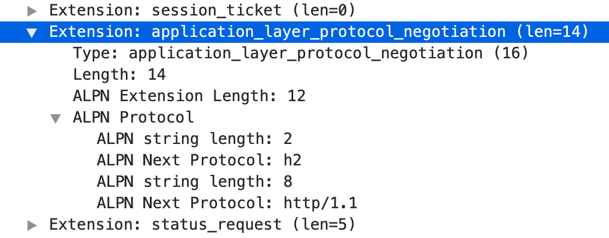

---
### `ALPN`协议协商
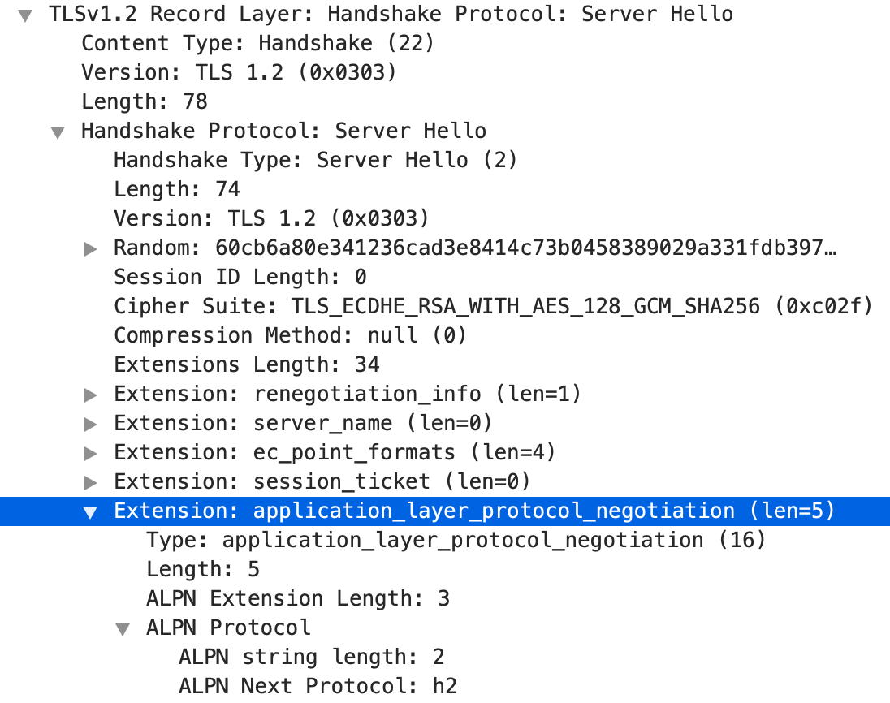

* ServerHello

---
### Chrome开发者工具
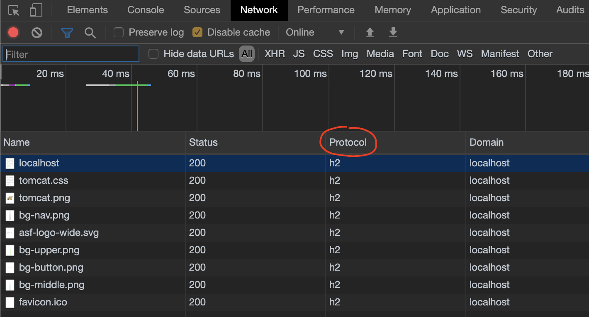

---
### HTTP/2的问题
* `HTTP/2`消除了`HTTP`协议的队首阻塞现象，但`TCP`层面上仍然存在队首阻塞
* `HTTP/2`多请求复用一个`TCP`连接，丢包可能会block住所有的`HTTP`请求


---
### HTTP/2的问题
* `TCP`及`TCP+TLS`建立连接需要多次round trips

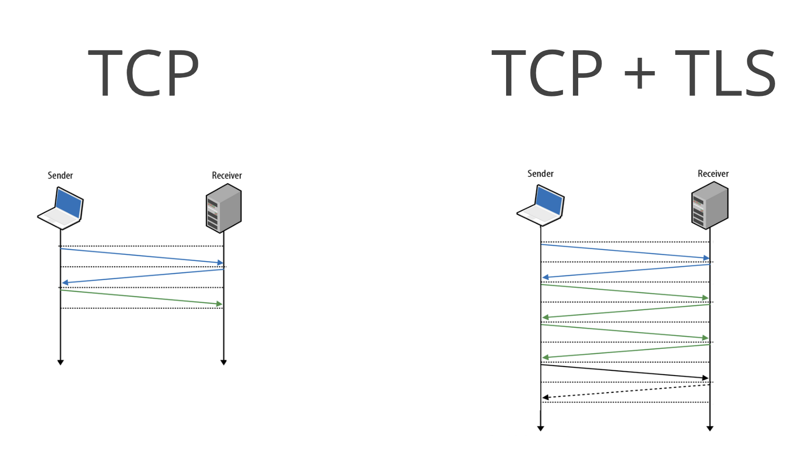

---
### QUIC
* **Q**uick **U**DP **I**nternet **C**onnections
* 由Goolge开发，并已经在Google部署使用

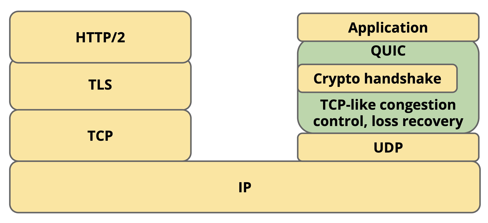

---
### QUIC
[QUIC: next generation multiplexed transport over UDP](https://www.youtube.com/watch?v=hQZ-0mXFmk8)

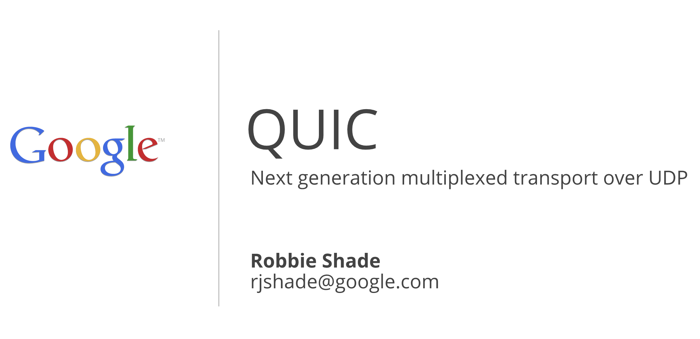

---
### 参考资料
* [High Performance Browser Networking](https://hpbn.co/)
* [HTTP的前世今生](https://coolshell.cn/articles/19840.html)
* [HTTP/3 的过去、现在和未来](https://www.infoq.cn/article/x80uOvcRyxVYw3KVusUm)
* [HTTP/2协议](https://tools.ietf.org/html/rfc7540)

---

# Thank You!

<!-- footer: '[刘美佳 - 职业模特](https://weibo.com/u/5171835974)' -->