# 使用火焰图进行Java性能分析

## 性能分析工具的分类

性能分析的技术和工具可以分为以下几类：

1. **Counters**

内核维护着各种统计信息，被称为`Counters`，用于对事件进行计数。例如，接收的网络数据包数量，发出的磁盘I/O请求，执行的系统调用次数。常见的这类工具有：

* vmstat: 虚拟和物理内存统计
* mpstat: CPU使用率统计
* iostat：磁盘的I/O使用情况
* netstat：网络接口统计信息，TCP/IP协议栈统计信息，连接统计信息

2. **Tracing**

**Tracing**是收集每个事件的数据进行分析。**Tracing**会捕获所有的事件，因此有比较大的CPU开销，并且可能需要大量存储来保存数据。

常见的**Tracing**工具有：

* tcpdump: network packet tracing
* blktrace: block I/O tracing
* perf: Linux Performance Events, 跟踪静态和动态探针
* strace: 系统调用tracing
* gdb: 源代码级调试器

3. **Profiling**

**Profiling** 是通过收集目标行为的样本或快照，来了解目标的特征。**Profiling**可以从多个方面对程序进行动态分析，如`CPU`、`Memory`、`Thread`、`I/O`等，其中对`CPU`进行`Profiling`的应用最为广泛。

`CPU Profiling`原理是基于一定频率对运行的程序进行采样，来分析消耗CPU时间的代码路径。可以基于固定的时间间隔进行采样，例如每10毫秒采样一次。也可以设置固定速率采样，例如每秒采集100个样本。

`CPU Profiling`经常被用于分析代码的热点，比如“哪个方法占用CPU的执行时间最长”、“每个方法占用CPU的比例是多少”等等，然后我们就可以针对热点瓶颈进行分析和性能优化。

Linux上常用的**CPU Profiling**工具有：

* [perf](https://perf.wiki.kernel.org/index.php/Main_Page)的 [record](https://perf.wiki.kernel.org/index.php/Tutorial#Sampling_with_perf_record) 子命令
* [BPF profile](https://github.com/iovisor/bcc/blob/master/tools/profile.py)

4. **Monitoring**

系统性能监控会记录一段时间内的性能统计信息，以便能够基于时间周期进行比较。这对于容量规划，了解高峰期的使用情况都很有帮助。历史值还为我们理解当前的性能指标提供了上下文。

监控单个操作系统最常用工具是**sar**（system activity reporter，系统活动报告）命令。`sar`通过一个定期执行的agent来记录系统计数器的状态，并可以使用`sar`命令查看它们，例如：

```
$ sar
Linux 4.15.0-88-generic (mazhen) 	03/19/2020 	_x86_64_	(4 CPU)

12:53:08 PM       LINUX RESTART

12:55:01 PM     CPU     %user     %nice   %system   %iowait    %steal     %idle
01:05:01 PM     all     14.06      0.00     10.97      0.11      0.00     74.87
01:15:01 PM     all      9.60      0.00      7.49      0.09      0.00     82.83
01:25:01 PM     all      0.04      0.00      0.02      0.02      0.00     99.92
01:35:01 PM     all      0.03      0.00      0.02      0.01      0.00     99.94
```

本文主要讨论如何使用`perf`和`BPF`进行`CPU Profiling`。

## perf

**perf**最初是使用`Linux`性能计数器子系统的工具，因此`perf`开始的名称是`Performance Counters for Linux`(PCL)。`perf`在Linux`2.6.31`合并进内核，位于[tools/perf](https://github.com/torvalds/linux/tree/master/tools/perf)目录下。

随后`perf`进行了各种增强，增加了`tracing`、`profiling`等能力，可用于性能瓶颈的查找和热点代码的定位。

`perf`是一个面向事件（event-oriented）的性能剖析工具，因此它也被称为`Linux perf events (LPE)`，或`perf_events`。

`perf`的整体架构如下：

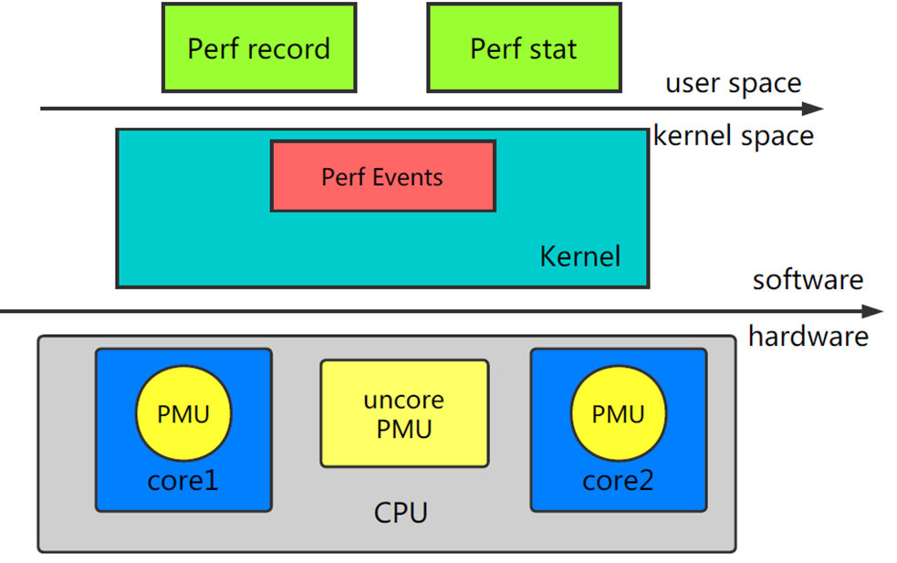

`perf` 由两部分组成：

* **perf Tools**：perf用户态命令，为用户提供了一系列工具集，用于收集、分析性能数据。
* **perf Event Subsystem**：Perf Events是内核的子系统之一，和用户态工具共同完成数据的采集。

内核依赖的硬件，比如说`CPU`，一般会内置一些性能统计方面的寄存器（[Hardware Performance Counter](https://en.wikipedia.org/wiki/Hardware_performance_counter)），通过软件读取这些特殊寄存器里的信息，我们也可以得到很多直接关于硬件的信息。`perf`最初就是用来监测`CPU`的性能监控单元（performance monitoring unit, PMU）的。

### perf Events分类

`perf`支持多种性能事件：


这些性能事件分类为：

* **Hardware Events**: CPU性能监控计数器performance monitoring counters（PMC），也被称为performance monitoring unit（PMU）
* **Software Events**: 基于内核计数器的底层事件。例如，CPU迁移，minor faults，major faults等。
* **Kernel Tracepoint Events**: 内核的静态`Tracepoint`，已经硬编码在内核需要收集信息的位置。
* **User Statically-Defined Tracing (USDT)**: 用户级程序的静态`Tracepoint`。
* **Dynamic Tracing**: 用户自定义事件，可以动态的插入到内核或正在运行中的程序。`Dynamic Tracing`技术分为两类：
  * [kprobes](https://lwn.net/Articles/132196/)：对于kernel的动态追踪技术，可以动态地在指定的内核函数的入口和出口等位置上放置探针，并定义自己的探针处理程序。
  * [uprobes](https://lwn.net/Articles/499190/)：对于用户态软件的动态追踪技术，可以安全地在用户态函数的入口等位置设置动态探针，并执行自己的探针处理程序。

可以使用perf的`list`子命令查看当前可用的事件：

```
$ sudo perf list
List of pre-defined events (to be used in -e):

  branch-instructions OR branches                    [Hardware event]
  branch-misses                                      [Hardware event]
  bus-cycles                                         [Hardware event]
  cache-misses                                       [Hardware event]
  cache-references                                   [Hardware event]
  cpu-cycles OR cycles                               [Hardware event]

...

  alignment-faults                                   [Software event]
  bpf-output                                         [Software event]
  context-switches OR cs                             [Software event]
  cpu-clock                                          [Software event]
  cpu-migrations OR migrations                       [Software event]

...

  alarmtimer:alarmtimer_cancel                       [Tracepoint event]
  alarmtimer:alarmtimer_fired                        [Tracepoint event]
  alarmtimer:alarmtimer_start                        [Tracepoint event]
  alarmtimer:alarmtimer_suspend                      [Tracepoint event]
  block:block_bio_backmerge                          [Tracepoint event]
  block:block_bio_bounce                             [Tracepoint event]
...

```

### perf的使用

如果还没有安装`perf`，可以使用`apt`或`yum`进行安装：

```
sudo apt install linux-tools-$(uname -r) linux-tools-generic
```

`perf`的功能强大，支持硬件计数器统计，定时采样，静态和动态tracing等。本文只介绍几个常用的使用场景，如果想全面的了解`perf`的使用，可以参考[perf.wiki](https://perf.wiki.kernel.org/index.php/Main_Page)。

1. **CPU Statistics**

使用`perf`的`stat`命令可以收集性能计数器统计信息，精确统计一段时间内 CPU 相关硬件计数器数值的变化。例如：

```
-> % sudo perf stat  dd if=/dev/zero of=/dev/null count=10000000
10000000+0 records in
10000000+0 records out
5120000000 bytes (5.1 GB, 4.8 GiB) copied, 12.2795 s, 417 MB/s

 Performance counter stats for 'dd if=/dev/zero of=/dev/null count=10000000':

      12280.299325      task-clock (msec)         #    1.000 CPUs utilized          
                16      context-switches          #    0.001 K/sec                  
                 0      cpu-migrations            #    0.000 K/sec                  
                70      page-faults               #    0.006 K/sec                  
    41,610,802,323      cycles                    #    3.388 GHz                    
    20,195,746,887      instructions              #    0.49  insn per cycle         
     3,972,723,471      branches                  #  323.504 M/sec                  
        90,061,565      branch-misses             #    2.27% of all branches        

      12.280445133 seconds time elapsed
```
2. **CPU Profiling**

可以使用`perf record`以任意频率收集快照。这通常用于CPU使用情况的分析。

* `sudo perf record -F 99 -a -g  sleep 10`

对所有CPU（**-a**）进行`call stacks`（**-g**）采样，采样频率为`99 Hertz`（**-F 99**），即每秒99次，持续10秒（**sleep 10**）。

* `sudo perf record -F 99 -a -g  -p PID sleep 10`

对指定进程（**-p PID**）进行采样。

* `sudo perf record -F 99 -a -g -e context-switches -p PID sleep 10`

`perf`可以和各种`instrumentation points`一起使用，以跟踪内核调度程序（`scheduler`）的活动。其中包括`software events`和`tracepoint event`（静态探针）。

上面的例子对指定进程的上下文切换（**-e context-switches**）进行采样。

3. **report**

`perf record`的运行结果保存在当前目录的`perf.data`文件中，采样结束后，我们使用`perf report`查看结果。

* **交互式查看模式**

```
$ sudo perf report
```

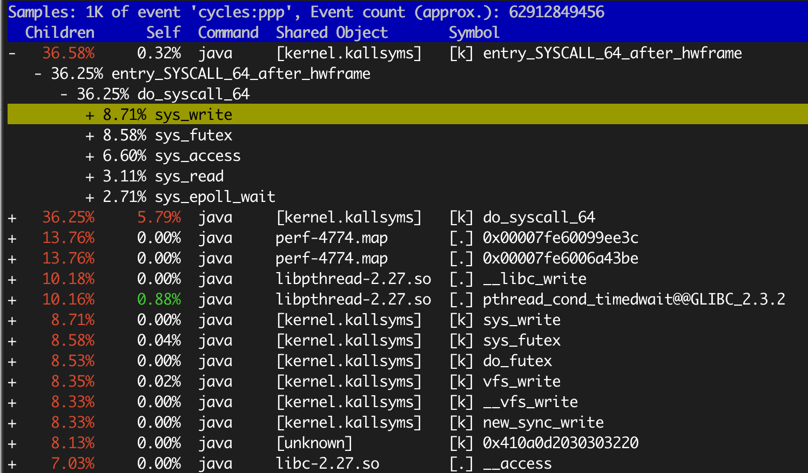

以`+`开头的行可以回车，展开详细信息。

* **使用`--stdio`选项打印所有输出**

```
$ sudo perf report --stdio
```

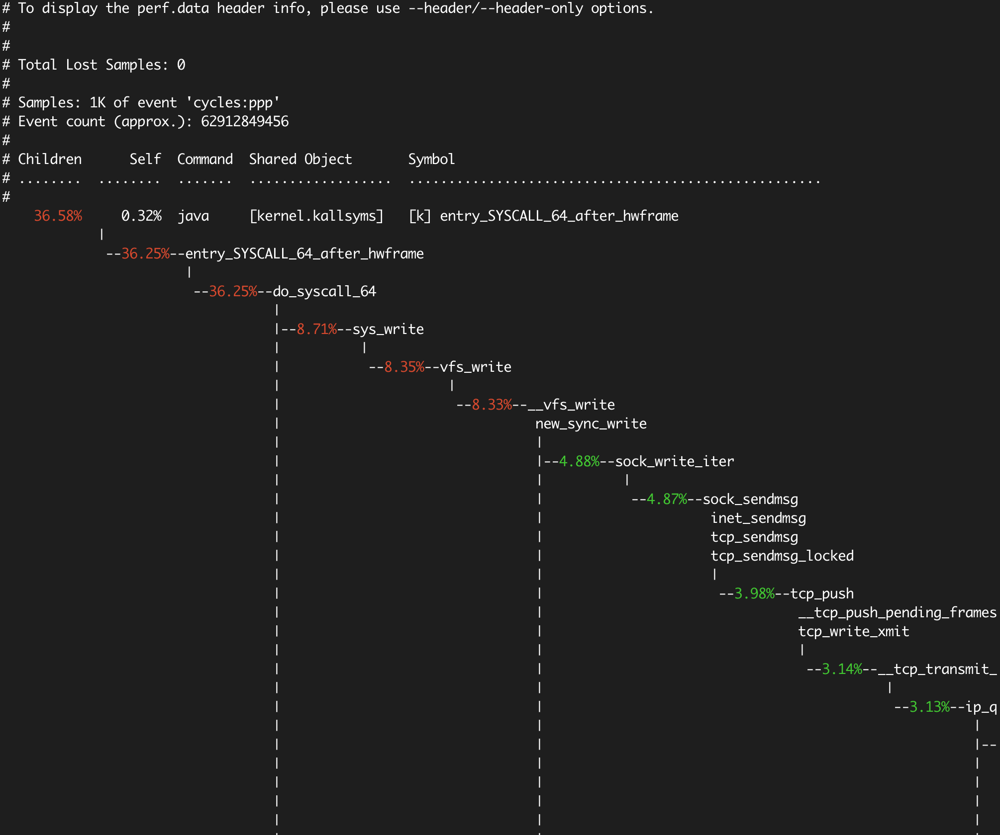

`context-switches`的采样报告：

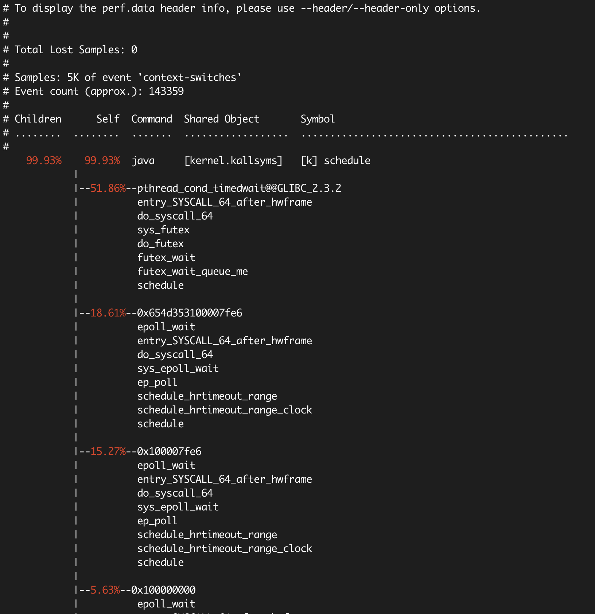

后面我们会介绍**火焰图**，以可视化的方式展示`stack traces`，比`perf report`更加直观。

## BPF

**BPF**是**Berkeley Packet Filter**的缩写，最初是为BSD开发，第一个版本于1992年发布，[用于改进网络数据包捕获的性能](https://www.tcpdump.org/papers/bpf-usenix93.pdf)。`BPF`是在内核级别进行过滤，不必将每个数据包拷贝到用户空间，从而提高了数据包过滤的性能。`tcpdump`使用的就是`BPF`。

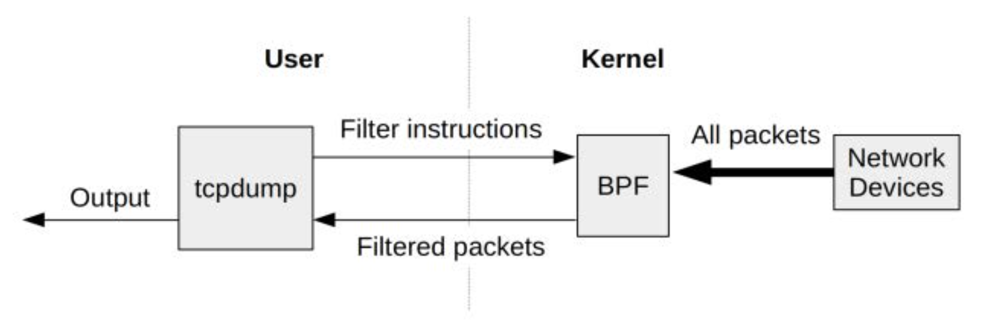

2013年`BPF`被重写，被称为**Extended BPF (eBPF)**，于2014年包含进`Linux`内核中。改进后的`BPF`成为了通用执行引擎，可用于多种用途，包括创建高级性能分析工具。

`BPF`允许在内核中运行`mini programs`，来响应系统和应用程序事件（例如磁盘I/O事件）。这种运作机制和`JavaScript`类似：`JavaScript`是运行在浏览器引擎中的`mini programs`，响应鼠标点击等事件。`BPF`使内核可编程化，使用户（包括非内核开发人员）能够自定义和控制他们的系统，以解决实际问题。

`BPF`可以被认为是一个**虚拟机**，由指令集，存储对象和helper函数三部分组成。`BPF`指令集由位于Linux内核的`BPF runtime`执行，`BPF runtime`包括了**解释器**和**JIT编译器**。`BPF`是一种灵活高效的技术，可以用于`networking`，`tracing`和安全等领域。我们重点关注它作为系统监测工具方面的应用。


和`perf`一样，`BPF`能够监测多种性能事件源，同时可以通过调用`perf_events`，使用`perf`已有的功能：


`BPF`可以在内核运行计算和统计汇总，这样大大减少了复制到用户空间的数据量：

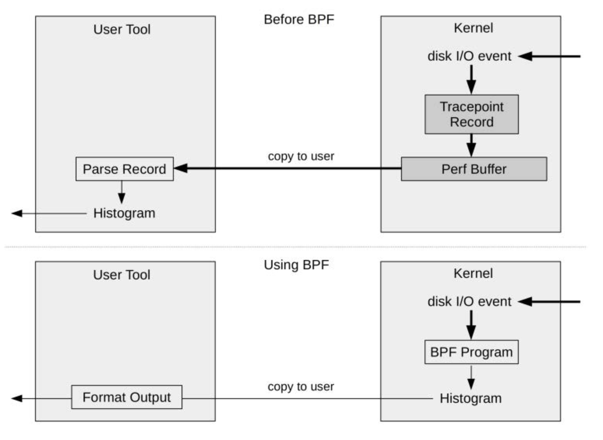

`BPF`已经内置在Linux内核中，因此你无需再安装任何新的内核组件，就可以在生产环境中使用BPF。

## BCC和bpftrace

直接使用`BPF`指令进行编程非常繁琐，因此很有必要提供高级语言前端方便用户使用，于是就出现了`BCC`和`bpftrace`。

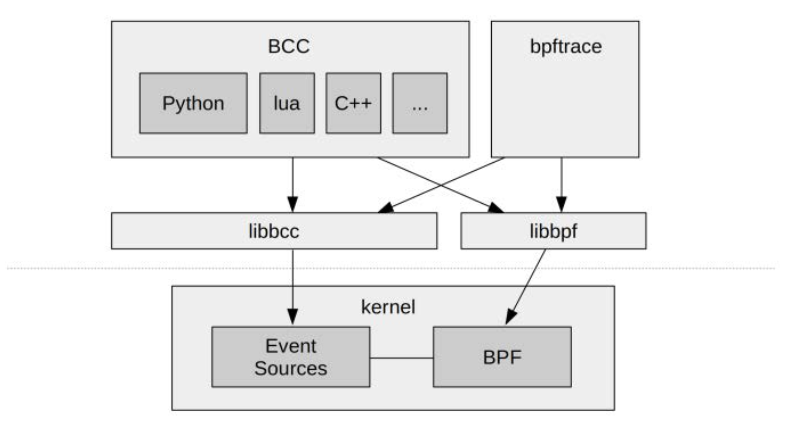

**BCC（BPF Compiler Collection）** 提供了一个C编程环境，使用`LLVM`工具链来把 C 代码编译为`BPF`虚拟机所接受的字节码。此外它还支持`Python`，`Lua`和`C++`作为用户接口。

**bpftrace** 是一个比较新的前端，它为开发`BPF`工具提供了一种专用的高级语言。`bpftrace`适合单行代码和自定义短脚本，而`BCC`更适合复杂的脚本和守护程序。

`BCC`和`bpftrace`没有在内核代码库，它们存放在GitHub上名为[IO Visor](https://github.com/iovisor)的`Linux Foundation`项目中。

* [iovisor/bcc](https://github.com/iovisor/bcc)
* [iovisor/bpftrace](https://github.com/iovisor/bpftrace)


### BCC的安装

`BCC`可以参考官方的[安装文档](https://github.com/iovisor/bcc/blob/master/INSTALL.md)。以`Ubuntu 18.04 LTS`为例，建议从源码build安装：


*  安装build依赖
```
sudo apt-get -y install bison build-essential cmake flex git libedit-dev \
  libllvm6.0 llvm-6.0-dev libclang-6.0-dev python zlib1g-dev libelf-dev

sudo apt-get -y install luajit luajit-5.1-dev
```

* 编译和安装
```
git clone https://github.com/iovisor/bcc.git
mkdir bcc/build; cd bcc/build
cmake ..
make
sudo make install
```

* build python3 binding
```
cmake -DPYTHON_CMD=python3 .. 
pushd src/python/
make
sudo make install
popd
```

`make install`完成后，`BCC`自带的工具都安装在了`/usr/share/bcc/tools`目录下。`BCC`已经包含70多个`BPF`工具，用于性能分析和故障排查。这些工具都可以直接使用，无需编写任何`BCC`代码。


我们试用其中一个工具`biolatency`，跟踪磁盘`I/O`延迟：

```
-> % sudo /usr/share/bcc/tools/biolatency
Tracing block device I/O... Hit Ctrl-C to end.
^C
     usecs               : count     distribution
         0 -> 1          : 0        |                                        |
         2 -> 3          : 0        |                                        |
         4 -> 7          : 0        |                                        |
         8 -> 15         : 0        |                                        |
        16 -> 31         : 2        |***                                     |
        32 -> 63         : 0        |                                        |
        64 -> 127        : 3        |*****                                   |
       128 -> 255        : 7        |***********                             |
       256 -> 511        : 6        |**********                              |
       512 -> 1023       : 11       |******************                      |
      1024 -> 2047       : 16       |**************************              |
      2048 -> 4095       : 24       |****************************************|
      4096 -> 8191       : 1        |*                                       |
      8192 -> 16383      : 6        |**********                              |
     16384 -> 32767      : 3        |*****                                   |
```

`biolatency`展示的直方图比`iostat`的平均值能更好的理解磁盘`I/O`性能。

`BCC`已经自带了`CPU profiling`工具：

> * [tools/profile](https://github.com/iovisor/bcc/blob/master/tools/profile.py): Profile CPU usage by sampling stack traces at a timed interval.

此外，`BCC`还提供了[Off-CPU](http://www.brendangregg.com/offcpuanalysis.html)的分析工具：

> * [tools/offcputime](https://github.com/iovisor/bcc/blob/master/tools/offcputime.py): Summarize off-CPU time by kernel stack trace

一般的`CPU profiling`都是分析`on-CPU`，即CPU时间都花费在了哪些代码路径。`off-CPU`是指进程不在CPU上运行时所花费的时间，进程因为某种原因处于休眠状态，比如说等待锁，或者被进程调度器（scheduler）剥夺了 CPU 的使用。这些情况都会导致这个进程无法运行在 CPU 上，但是仍然花费了时间。

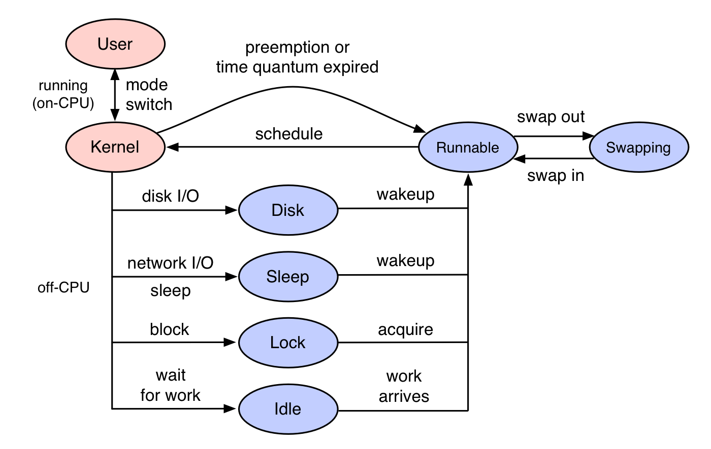

`off-CPU`分析是对`on-CPU`的补充，让我们知道线程所有的时间花费，更全面的了解程序的运行情况。

后面会介绍`profile`，`offcputime`如何生成火焰图进行可视化分析。

### bpftrace的安装

[bpftrace](https://github.com/iovisor/bpftrace) 建议运行在Linux 4.9 kernel或更高版本。根据[安装文档](https://github.com/iovisor/bpftrace/blob/master/INSTALL.md)的说明，是因为`kprobes`、`uprobes`、`tracepoints`等主要特性是在`4.x`以上加入内核的：


> * 4.1 - kprobes
> * 4.3 - uprobes
> * 4.6 - stack traces, count and hist builtins (use PERCPU maps for accuracy and efficiency)
> * 4.7 - tracepoints
> * 4.9 - timers/profiling

可以运行[scripts/check_kernel_features.sh](https://github.com/iovisor/bpftrace/blob/master/scripts/check_kernel_features.sh)脚本进行验证：

```
$ ./scripts/check_kernel_features.sh 
All required features present!
```

`bpftrace`对Linux的版本要求较高，以`Ubuntu`为例，`19.04`及以上才支持`apt`安装：

```
sudo apt-get install -y libbpfcc-dev
```

`18.04`和`18.10`可以从源码build，但需要先build好`BCC`。

* 安装依赖
```
sudo apt-get update
sudo apt-get install -y bison cmake flex g++ git libelf-dev zlib1g-dev libfl-dev systemtap-sdt-dev binutils-dev
sudo apt-get install -y llvm-7-dev llvm-7-runtime libclang-7-dev clang-7
```
* 编译和安装

```
git clone https://github.com/iovisor/bpftrace
mkdir bpftrace/build; cd bpftrace/build;
cmake -DCMAKE_BUILD_TYPE=Release ..
make -j8
sudo make install
```

`make install`完成后，`bpftrace`自带的工具安装在`/usr/local/share/bpftrace/tools`目录下，这些工具的说明文档可以在[项目主页](https://github.com/iovisor/bpftrace)找到。

我们同样试用查看`Block I/O`延迟直方图的工具：

```
-> % sudo bpftrace /usr/local/share/bpftrace/tools/biolatency.bt
Attaching 4 probes...
Tracing block device I/O... Hit Ctrl-C to end.
^C

@usecs: 
[128, 256)             6 |@@@@@@@@@@                                          |
[256, 512)             4 |@@@@@@                                              |
[512, 1K)              8 |@@@@@@@@@@@@@                                       |
[1K, 2K)              20 |@@@@@@@@@@@@@@@@@@@@@@@@@@@@@@@@@@                  |
[2K, 4K)              30 |@@@@@@@@@@@@@@@@@@@@@@@@@@@@@@@@@@@@@@@@@@@@@@@@@@@@|
[4K, 8K)               1 |@                                                   |
[8K, 16K)              3 |@@@@@                                               |
[16K, 32K)             0 |                                                    |
[32K, 64K)             2 |@@@                                                 |
```

关于`bpftrace`脚本编写不在本文的讨论范围，感兴趣的可以参考[reference_guide](https://github.com/iovisor/bpftrace/blob/master/docs/reference_guide.md)。

## 火焰图

[火焰图](http://www.brendangregg.com/flamegraphs.html)是[Brendan Gregg](http://www.brendangregg.com/)发明的将`stack traces`可视化展示的方法。火焰图把时间和空间两个维度上的信息融合在一张图上，将频繁执行的代码路径以可视化的形式，非常直观的展现了出来。

火焰图可以用于可视化来自任何`profiler`工具的记录的`stack traces`信息，除了用来`CPU profiling`，还适用于`off-CPU`，`page faults`等多种场景的分析。本文只讨论 `on-CPU` 和 `off-CPU` 火焰图的生成。

要理解火焰图，先从理解`Stack Trace`开始。

### Stack Trace

`Stack Trace`是程序执行过程中，在特定时间点的函数调用列表。例如，`func_a()`调用`func_b()`，`func_b()`调用`func_c()`，此时的`Stack Trace`可写为：

```
func_c
func_b
func_a
```

### Profiling Stack Traces

我们做`CPU profiling`时，会使用perf或bcc定时采样`Stack Trace`，这样会收集到非常多的`Stack Trace`。前面介绍了`perf report`会将`Stack Trace`样本汇总为调用树，并显示每个路径的百分比。火焰图是怎么展示的呢？

考虑下面的示例，我们用perf定时采样收集了多个`Stack Trace`，然后将相同的`Stack Trace`归纳合并，统计出次数：

```
func_e
func_d
func_b
func_a
1 

func_b
func_a
2

func_c
func_b
func_a
7
```

可以看到，总共收集了10个样本，其中代码路径`func_a->func_b->func_c`有7次，该路径上的`func_c`在CPU上运行。 `func_a->func_b`进行了两次采样，`func_b`在CPU上运行。`func_a->func_b->func_d->func_e`一次采样，`func_e`在CPU上运行。

### 火焰图

根据前面对`Stack Trace`的统计信息，可以绘制出如下的火焰图：

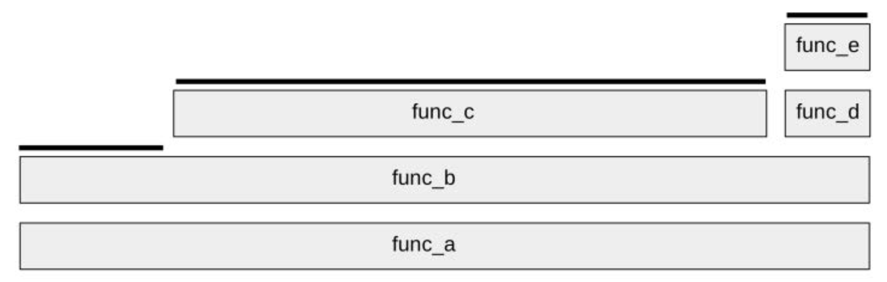

火焰图具有以下特性：

* 每个长方块代表了函数调用栈中的一个函数
* Y 轴显示堆栈的深度（堆栈中的帧数）。调用栈越深，火焰就越高。顶层方块表示 CPU 上正在运行的函数，下面的函数即为它的祖先。
* X 轴的宽度代表被采集的样本数量，越宽表示采集到的越多，即执行的时间长。需要注意的是，X轴从左到右不代表时间，而是所有的调用栈合并后，按字母顺序排列的。

拿到火焰图，寻找最宽的塔并首先了解它们。顶层的哪个函数占据的宽度最大，说明它可能存在性能问题。

可以使用Brendan Gregg开发的开源项目[FlameGraph](https://github.com/brendangregg/FlameGraph)生成交互式的SVG火焰图。该项目提供了脚本，可以将采集的样本归纳合并，统计出`Stack Trace`出现的频率，然后使用[flamegraph.pl](https://github.com/brendangregg/FlameGraph/blob/master/flamegraph.pl)生成SVG火焰图。

我们先把FlameGraph项目clone下来，后面会用到：

```
git clone https://github.com/brendangregg/FlameGraph.git
```

## Java CPU Profiling

虽然有很多Java专用的`profiler`工具，但这些工具一般只能看到Java方法的执行，缺少了`GC`，`JVM`的CPU时间消耗，并且有些工具的`Method tracing`性能损耗比较大。

`perf`和`BCC profile`的优点是它很高效，在内核上下文中对堆栈进行计数，并能完整显示用户态和内核态的CPU使用，能看到native libraries（例如libc），JVM（libjvm），Java方法和内核中花费的时间。

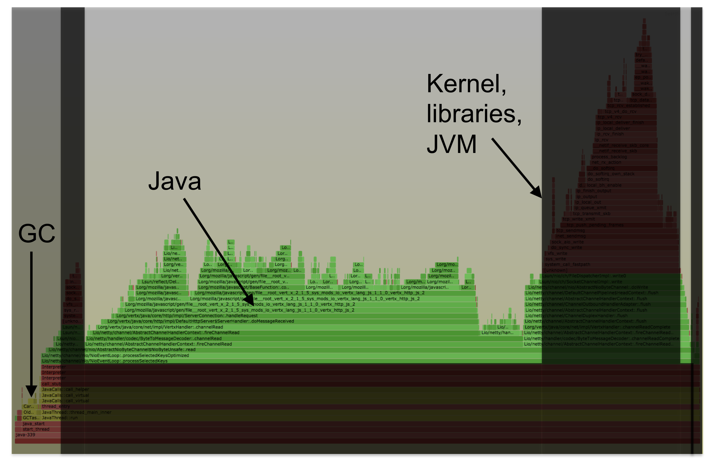

但是，`perf`和`BCC profile`这种系统级的profiler不能很好地与Java配合使用，它们识别不了Java方法和`stack traces`。这是因为：

* JVM的`JIT（just-in-time）`没有给系统级profiler公开符号表
* JVM还使用帧指针寄存器（frame pointer register，x86-64上的RBP）作为通用寄存器，打破了传统的堆栈遍历

为了能生成包含Java栈与Native栈的火焰图，目前有两种解决方式：

* 使用`JVMTI` agent [perf-map-agent](https://github.com/jvm-profiling-tools/perf-map-agent)，生成Java符号表，供`perf`和`bcc`读取（/tmp/perf-PID.map）。同时要加上`-XX:+PreserveFramePointer` JVM 参数，让`perf`可以遍历基于帧指针（frame pointer）的堆栈。
* 使用[async-profiler](https://github.com/jvm-profiling-tools/async-profiler)，该项目将`perf`的堆栈追踪和JDK提供的[AsyncGetCallTrace](http://psy-lob-saw.blogspot.com/2016/06/the-pros-and-cons-of-agct.html)结合了起来，同样能够获得mixed-mode火焰图。同时，此方法不需要启用帧指针，所以不用加上`-XX:+PreserveFramePointer`参数。
  

下面我们就分别演示这两种方式。

### perf-map-agent

`perf`期望能从`/tmp/perf-<pid>.map`中获得在未知内存区域执行的代码的符号表。`perf-map-agent`可以为`JIT`编译的方法生成`/tmp/perf-<pid>.map`文件，以满足`perf`的要求。

首先下载并编译`perf-map-agent`：

```
git clone https://github.com/jvm-profiling-tools/perf-map-agent.git
cd perf-map-agent
cmake .
make
```

#### 配合`perf`使用

`perf-map-agent`提供了[perf-java-flames](https://github.com/jvm-profiling-tools/perf-map-agent/blob/master/bin/perf-java-flames)脚本，可以一步生成火焰图。

`perf-java-flames`接收`perf record`命令参数，它会调用`perf`进行采样，然后使用[FlameGraph](https://github.com/brendangregg/FlameGraph)生成火焰图，一步完成，非常方便。

注意，记得要给被`profiling`的Java进程加上`-XX:+PreserveFramePointer` JVM 参数。

设置必要的环境变量：

```
export FLAMEGRAPH_DIR=[FlameGraph 所在的目录]
export PERF_RECORD_SECONDS=[采样时间]
```

* `./bin/perf-java-flames  [PID] -F 99 -a -g -p [PID]`

对指定进程（**-p PID**），在所有CPU（**-a**）上进行call stacks（**-g**）采样，采样频率为99 Hertz （**-F 99**），持续时间为`PERF_RECORD_SECONDS`秒。命令运行完成后，会在当前目录生成名为`flamegraph-pid.svg`的火焰图。

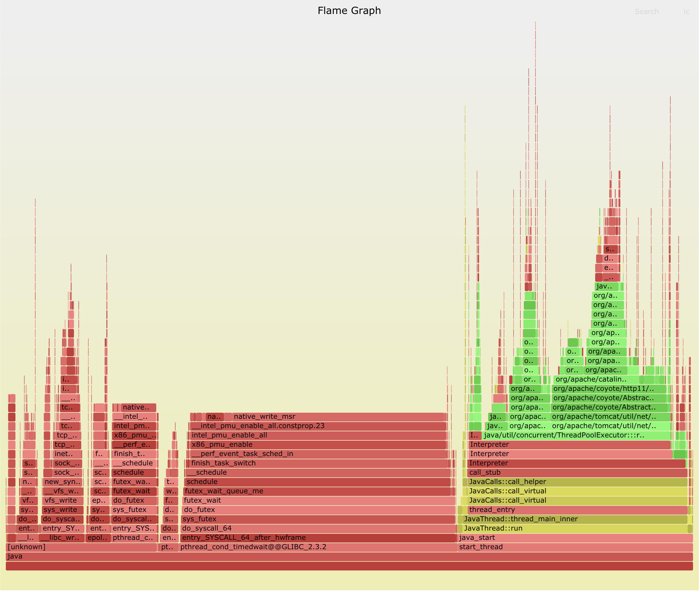

* `./bin/perf-java-flames  [PID] -F 99 -g -a -e context-switches -p [PID]`

对指定进程的上下文切换（**-e context-switches**）进行采样，并生成火焰图。

* 当然也可以只为`perf`生成Java符号表，然后直接使用perf采样

```
./bin/create-java-perf-map.sh [PID]; sudo perf record -F 99 -p [PID] -a -g -- sleep 15

./bin/create-java-perf-map.sh [PID]; sudo perf record -g -a -e context-switches -p [PID] sleep 15

# 查看报告
sudo perf report --stdio
```

#### 配合`bcc profile`使用

`FlameGraph`项目提供了[jmaps](https://github.com/brendangregg/FlameGraph/blob/master/jmaps)脚本，它会调用`perf-map-agent`为当前运行的所有Java进程生成符号表。

首先为`jmaps`脚本设置好`JAVA_HOME`和`perf-map-agent`的正确位置：

```
JAVA_HOME=${JAVA_HOME:-/usr/lib/jvm/java-8-oracle}
AGENT_HOME=${AGENT_HOME:-/usr/lib/jvm/perf-map-agent} # from https://github.com/jvm-profiling-tools/perf-map-agent
```

运行`jmaps`，可以看到它会为当前所有的Java进程生成符号表：

```
$ sudo ./jmaps
Fetching maps for all java processes...
Mapping PID 30711 (user adp):
wc(1):   3486  10896 214413 /tmp/perf-30711.map
```

我们在做任何`profiling`之前，都需要调用`jmaps`，保持符号表是最新的。

* CPU Profiling火焰图

```
# Profiling
sudo ./jmaps ; sudo /usr/share/bcc/tools/profile -dF 99 -afp [PID] 10 > out.profile01.txt

# 生成火焰图
./flamegraph.pl --color=java --hash <out.profile01.txt > flamegraph.svg
```

* off-CPU火焰图

```
# Profiling
sudo ./jmaps ; sudo /usr/share/bcc/tools/offcputime -fp [PID] 10 > out.offcpu01.txt

# 生成火焰图
./flamegraph.pl --color=java --bgcolor=blue --hash --countname=us --width=1024 --title="Off-CPU Time Flame Graph" < out.offcpu01.txt > out.offcpu01.svg
```

* off-CPU，并过滤指定的进程状态

Linux的进程状态有：

| 状态                 | 描述                                                                                                                                      |
| -------------------- | ----------------------------------------------------------------------------------------------------------------------------------------- |
| TASK_RUNNING         | 意味着进程处于可运行状态。这并不意味着已经实际分配了CPU。进程可能会一直等到调度器选中它。该状态确保进程可以立即运行，而无需等待外部事件。 |
| TASK_INTERRUPTIBLE   | 可中断的等待状态，主要为恢复时间无法预测的长时间等待。例如等待来自用户的输入。                                                            |
| TASK_UNINTERRUPTIBLE | 不可中断的等待状态。用于因内核指示而停用的睡眠进程。它们不能由外部信号唤醒，只能由内核亲自唤醒。例如磁盘输入输出等待。                    |
| TASK_STOPPED         | 响应暂停信号而运行中断的状态。直到恢复前都不会被调度                                                                                      |
| TASK_ZOMBIE          | 僵尸状态，子进程已经终止，但父进程尚未执行wait()，因此该进程的资源没有被系统释放。                                                        |

在状态`TASK_RUNNING`（0）会发生非自愿上下文切换，而我们通常感兴趣的阻塞事件是`TASK_INTERRUPTIBLE`（1）或`TASK_UNINTERRUPTIBLE`（2），`offcputime`可以用`--state`过滤指定的进程状态：

```
# Profiling
sudo ./jmaps ; sudo /usr/share/bcc/tools/offcputime -K --state 2 -f 30 > out.offcpu01.txt

# 生成火焰图
./flamegraph.pl --color=io --countname=ms < out.offcpu01.txt > out.offcpu01.svg
```

### async-profiler

[async-profiler](https://github.com/jvm-profiling-tools/async-profiler)将`perf`的堆栈追踪和JDK提供的[AsyncGetCallTrace](http://psy-lob-saw.blogspot.com/2016/06/the-pros-and-cons-of-agct.html)结合了起来，做到同时采样Java栈与Native栈，因此也就可以同时分析Java代码和Native代码中存在的性能热点。

`AsyncGetCallTrace`是JDK内部提供的一个函数，它的原型如下：

```
typedef struct {
  jint lineno;         // BCI in the source file
  jmethodID method_id; // method executed in this frame
} ASGCT_CallFrame;

typedef struct {
  JNIEnv *env_id   //Env where trace was recorded
  jint num_frames; // number of frames in this trace
  ASGCT_CallFrame *frames;
} ASGCT_CallTrace; 

void AsyncGetCallTrace(ASGCT_CallTrace *trace, // pre-allocated trace to fill
                       jint depth,             // max number of frames to walk up the stack
                       void* ucontext)         // signal context
```

可以看出，该函数直接通过`ucontext`就能获取到完整的Java调用栈。

#### async-profiler的使用

下载并解压好`async-profiler`安装包。

从Linux 4.6开始，从`non-root`进程使用`perf`捕获内核的`call stacks`，需要设置如下两个内核参数：

```
# echo 1 > /proc/sys/kernel/perf_event_paranoid
# echo 0 > /proc/sys/kernel/kptr_restrict
```

`async-profiler`的使用非常简单，一步就能生成火焰图。另外，也不需要为被`profiling`的Java进程设置`-XX:+PreserveFramePointer`参数。

```
./profiler.sh -d 30 -f /tmp/flamegraph.svg [PID]
```

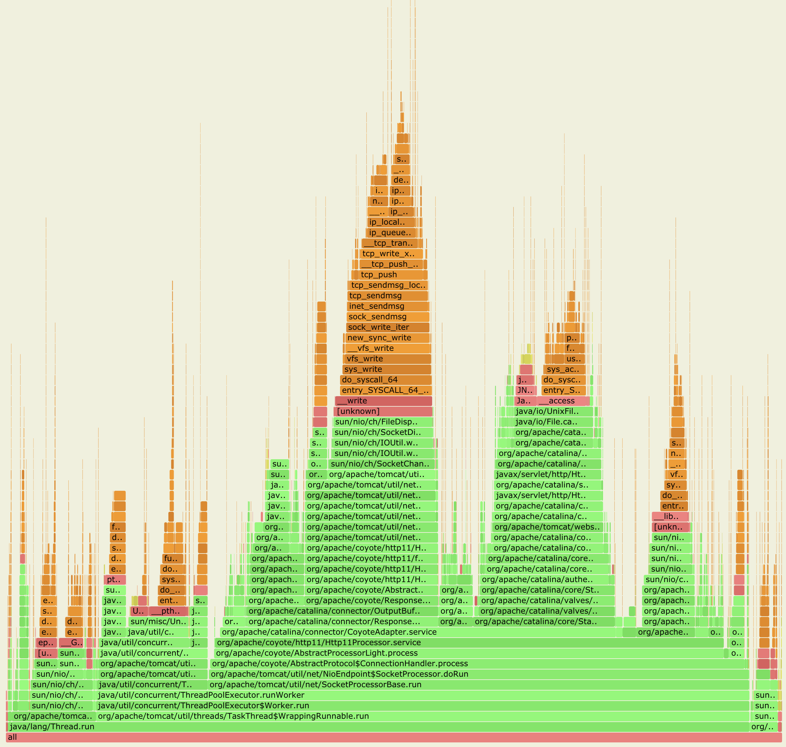

## 总结

为Java生成`CPU profiling`火焰图，基本的流程都是：

1. 使用工具采集样本
2. 使用`FlameGraph`项目提供的脚本，将采集的样本归纳合并，统计出`Stack Trace`出现的频率
3. 最后使用`flamegraph.pl`利用上一步的输出，绘制SVG火焰图

为了能够生成`Java stacks`和`native stacks`完整的火焰图，解决`perf`和`bcc profile`不能识别Java符号和Java `stack traces`的问题，目前有以下两种方式：

1. `perf-map-agent` 加上 `perf`或`bcc profile`
2. `async-profiler`（内部会使用到`perf`）

如果只是对Java进程做`on-CPU`分析，`async-profiler`更加方便好用。如果需要更全面的了解Java进程的运行情况，例如分析系统锁的开销，阻塞的 I/O 操作，以及进程调度器（`scheduler`）的工作，那么还是需要使用功能更强大的`perf`和`bcc`。

## 参考资料

* [perf Examples](http://www.brendangregg.com/perf.html)
* [Linux Extended BPF (eBPF) Tracing Tools](http://www.brendangregg.com/ebpf.html)
* [BPF Performance Tools (book)](http://www.brendangregg.com/bpf-performance-tools-book.html)
* [Off-CPU Analysis](http://www.brendangregg.com/offcpuanalysis.html)
* [Flame Graphs](http://www.brendangregg.com/flamegraphs.html)