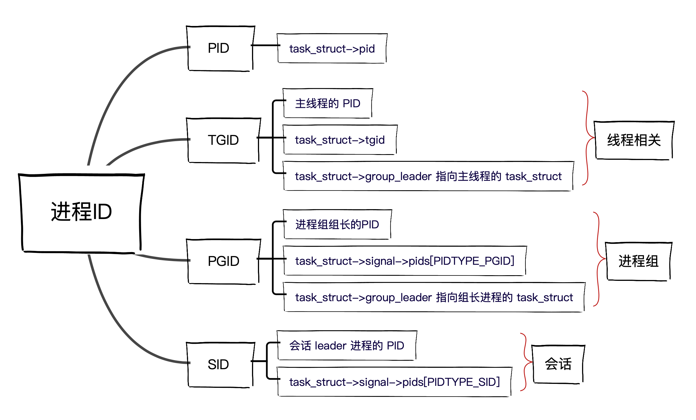
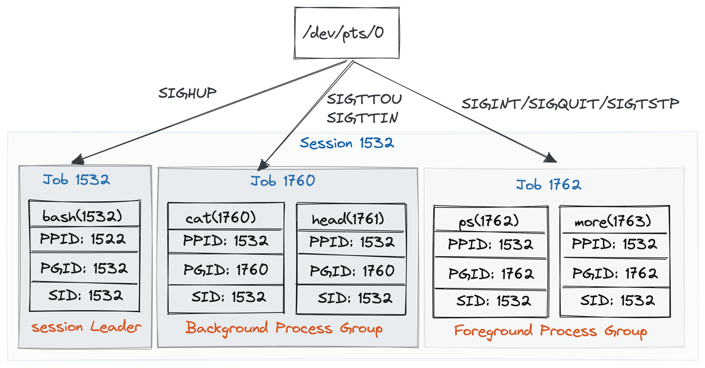

# 进程ID及进程间的关系

## 进程ID

进程相关的 `ID` 有多种，除了进程标识 **PID** 外，还包括：线程组标识 **TGID**，进程组标识 **PGID**，回话标识 **SID**。**TGID/PGID/SID** 分别是相关线程组长/进程组长/回话 leader 进程的 **PID**。

下面分别介绍这几种ID。

### PID

*  进程总是会被分配一个唯一标识它们的进程ID号，简称 **PID**。

*  用 `fork` 或 `clone` 产生的每个进程都由内核自动地分配了一个唯一的 **PID** 。

* **PID** 保存在 [task_struct->pid](https://github.com/torvalds/linux/blob/8bb7eca972ad531c9b149c0a51ab43a417385813/include/linux/sched.h?_pjax=%23js-repo-pjax-container%2C%20div%5Bitemtype%3D%22http%3A%2F%2Fschema.org%2FSoftwareSourceCode%22%5D%20main%2C%20%5Bdata-pjax-container%5D#L943)中。

### TGID

*  进程以 `CLONE_THREAD` 标志调用 `clone` 方法，创建与该进程共享资源的线程。线程有独立的[task_struct](https://github.com/torvalds/linux/blob/8bb7eca972ad531c9b149c0a51ab43a417385813/include/linux/sched.h?_pjax=%23js-repo-pjax-container%2C%20div%5Bitemtype%3D%22http%3A%2F%2Fschema.org%2FSoftwareSourceCode%22%5D%20main%2C%20%5Bdata-pjax-container%5D#L723)，但它 `task_struct`内的 [files_struct](https://github.com/torvalds/linux/blob/8bb7eca972ad531c9b149c0a51ab43a417385813/include/linux/sched.h?_pjax=%23js-repo-pjax-container%2C%20div%5Bitemtype%3D%22http%3A%2F%2Fschema.org%2FSoftwareSourceCode%22%5D%20main%2C%20%5Bdata-pjax-container%5D#L1070)、[fs_struct](https://github.com/torvalds/linux/blob/8bb7eca972ad531c9b149c0a51ab43a417385813/include/linux/sched.h?_pjax=%23js-repo-pjax-container%2C%20div%5Bitemtype%3D%22http%3A%2F%2Fschema.org%2FSoftwareSourceCode%22%5D%20main%2C%20%5Bdata-pjax-container%5D#L1067) 、[sighand_struct](https://github.com/torvalds/linux/blob/8bb7eca972ad531c9b149c0a51ab43a417385813/include/linux/sched.h?_pjax=%23js-repo-pjax-container%2C%20div%5Bitemtype%3D%22http%3A%2F%2Fschema.org%2FSoftwareSourceCode%22%5D%20main%2C%20%5Bdata-pjax-container%5D#L1081)、[signal_struct](https://github.com/torvalds/linux/blob/8bb7eca972ad531c9b149c0a51ab43a417385813/include/linux/sched.h?_pjax=%23js-repo-pjax-container%2C%20div%5Bitemtype%3D%22http%3A%2F%2Fschema.org%2FSoftwareSourceCode%22%5D%20main%2C%20%5Bdata-pjax-container%5D#L1080)和[mm_struct](https://github.com/torvalds/linux/blob/8bb7eca972ad531c9b149c0a51ab43a417385813/include/linux/sched.h?_pjax=%23js-repo-pjax-container%2C%20div%5Bitemtype%3D%22http%3A%2F%2Fschema.org%2FSoftwareSourceCode%22%5D%20main%2C%20%5Bdata-pjax-container%5D#L857) 等数据结构仅仅是对进程相应数据结构的引用。

* 由进程创建的所有线程都有相同的线程组ID(**TGID**)。线程有自己的 **PID**，它的**TGID** 就是进程的主线程的 **PID**。如果进程没有使用线程，则其 **PID** 和 **TGID** 相同。

* 在内核中进程和线程都用 `task_struct`表示，而有了 **TGID**，我们就可以知道 `task_struct` 代表的是一个进程还是一个线程。

* **TGID** 保存在 [task_struct->tgid](https://github.com/torvalds/linux/blob/8bb7eca972ad531c9b149c0a51ab43a417385813/include/linux/sched.h?_pjax=%23js-repo-pjax-container%2C%20div%5Bitemtype%3D%22http%3A%2F%2Fschema.org%2FSoftwareSourceCode%22%5D%20main%2C%20%5Bdata-pjax-container%5D#L944) 中。

* 当 `task_struct` 代表一个线程时，[task_struct->group_leader](https://github.com/torvalds/linux/blob/8bb7eca972ad531c9b149c0a51ab43a417385813/include/linux/sched.h?_pjax=%23js-repo-pjax-container%2C%20div%5Bitemtype%3D%22http%3A%2F%2Fschema.org%2FSoftwareSourceCode%22%5D%20main%2C%20%5Bdata-pjax-container%5D#L967) 指向主线程的 `task_struct`。

### PGID

* 如果 `shell` 具有作业管理能力，则它所创建的相关进程构成一个进程组，同一进程组的进程都有相同的 **PGID**。例如，用管道连接的进程包含在同一个进程组中。

* 进程组简化了向组的所有成员发送信号的操作。进程组提供了一种机制，让信号可以发送给组内的所有进程，这使得作业控制变得简单。

* 当 `task_struct` 代表一个进程，且该进程属于某一个进程组，则 [task_struct->group_leader](https://github.com/torvalds/linux/blob/8bb7eca972ad531c9b149c0a51ab43a417385813/include/linux/sched.h?_pjax=%23js-repo-pjax-container%2C%20div%5Bitemtype%3D%22http%3A%2F%2Fschema.org%2FSoftwareSourceCode%22%5D%20main%2C%20%5Bdata-pjax-container%5D#L967) 指向组长进程的 `task_struct`。

* **PGID** 保存在 [task_struct->signal->pids[PIDTYPE_PGID].pid](https://github.com/torvalds/linux/blob/8bb7eca972ad531c9b149c0a51ab43a417385813/include/linux/sched/signal.h?_pjax=%23js-repo-pjax-container%2C%20div%5Bitemtype%3D%22http%3A%2F%2Fschema.org%2FSoftwareSourceCode%22%5D%20main%2C%20%5Bdata-pjax-container%5D#L153)中。 `pids[]` 的数组下标是枚举类型，在 [include/linux/pid.h](https://github.com/torvalds/linux/blob/v5.15/include/linux/pid.h) 中定义了 `PID` 的类型：

```c
enum pid_type
{
	PIDTYPE_PID,
	PIDTYPE_TGID,
	PIDTYPE_PGID,
	PIDTYPE_SID,
	PIDTYPE_MAX,
};
```

* `task_struce->signal` 是 [signal_struct](https://github.com/torvalds/linux/blob/8bb7eca972ad531c9b149c0a51ab43a417385813/include/linux/sched/signal.h?_pjax=%23js-repo-pjax-container%2C%20div%5Bitemtype%3D%22http%3A%2F%2Fschema.org%2FSoftwareSourceCode%22%5D%20main%2C%20%5Bdata-pjax-container%5D#L82) 类型，维护了进程收到的信号，`task_struce->signal` 被该进程的所有线程共享。从 **PGID** 保存在 `task_struct->signal->pids[PIDTYPE_PGID]`中可以看出进程组和信号处理相关。


### SID

* 用户一次登录所涉及所有活动称为一个会话（**session**），其间产生的所有进程都有相同的会话ID（**SID**），等于会话 leader 进程的  **PID**。

* **SID** 保存在 [task_struct->signal->pids[PIDTYPE_SID].pid](https://github.com/torvalds/linux/blob/8bb7eca972ad531c9b149c0a51ab43a417385813/include/linux/sched/signal.h?_pjax=%23js-repo-pjax-container%2C%20div%5Bitemtype%3D%22http%3A%2F%2Fschema.org%2FSoftwareSourceCode%22%5D%20main%2C%20%5Bdata-pjax-container%5D#L153)中。

### **PID/TGID/PGID/SID**总结

用一幅图来总结 **PID/TGID/PGID/SID** ：



## 进程间关系

内核中所有进程的 `task_struct` 会形成多种组织关系。根据进程的创建过程会有亲属关系，进程间的父子关系组织成一个进程树；根据用户登录活动会有会话和进程组关系。

### 亲属关系

进程通过 `fork()` 创建出一个子进程，就形成来父子关系，如果创建出多个子进程，那么这些子进程间属于兄弟关系。可以用 `pstree` 命令查看当前系统的进程树。

```
$ pstree -p
systemd(1)─┬─ModemManager(759)─┬─{ModemManager}(802)
           │                   └─{ModemManager}(806)
           ├─NetworkManager(685)─┬─{NetworkManager}(743)
           │                     └─{NetworkManager}(750)
           ├─acpid(675)
           ├─agetty(814)
           ├─avahi-daemon(679)───avahi-daemon(712)
           ├─bluetoothd(680)
           ├─canonical-livep(754)─┬─{canonical-livep}(1224)
           │                      ├─{canonical-livep}(1225)
           │                      ├─{canonical-livep}(1226)
...
```

进程描述符 `task_struct` 的 `parent` 指向父进程，`children`指向子进程链表的头部，`sibling` 把当前进程插入到兄弟链表中。

通常情况下，`real_parent` 和 `parent` 是一样的。如果在 `bash` 上使用 `GDB` 来 debug 一个进程，这时候进程的 `parent` 是  `GDB` ，进程的 `real_parent` 是 `bash`。


当一个进程创建了子进程后，它应该通过系统调用 `wait()` 或者 `waitpid()` 等待子进程结束，回收子进程的资源。而子进程在结束时，会向它的父进程发送 `SIGCHLD` 信号。因此父进程还可以注册 `SIGCHLD` 信号的处理函数，异步回收资源。

如果父进程提前结束，那么子进程将把1号进程 `init` 作为父进程。总之，进程都有父进程，负责进程结束后的资源回收。在子进程退出且父进程完成回收前，子进程变成僵尸进程。僵尸进程持续的时间通常比较短，在父进程回收它的资源后就会消亡。如果父进程没有处理子进程的终止，那么子进程就会一直处于僵尸状态。

### 会话、进程组关系

Linux 系统中可以有多个会话（**session**），每个会话可以包含多个进程组，每个进程组可以包含多个进程。

会话是用户登录系统到退出的所有活动，从登录到结束前创建的所有进程都属于这次会话。登录后第一个被创建的进程（通常是 `shell`），被称为 **会话 leader**。

进程组用于作业控制。一个终端上可以启动多个作业，也就是进程组，并能控制哪个作业在前台，前台作业可以访问终端，哪些作业运行在后台，不能读写终端。

我们来看一个会话和进程组的例子。

```
$ cat | head
hello
hello
^Z
[1]+  已停止               cat | head
$ ps j | more
   PPID     PID    PGID     SID TTY        TPGID STAT   UID   TIME COMMAND
   1522    1532    1532    1532 pts/0       1762 Ss    1000   0:00 -bash
   1532    1760    1760    1532 pts/0       1762 T     1000   0:00 cat
   1532    1761    1760    1532 pts/0       1762 T     1000   0:00 head
   1532    1762    1762    1532 pts/0       1762 R+    1000   0:00 ps j
   1532    1763    1762    1532 pts/0       1762 S+    1000   0:00 more
```

上面的命令通过 `cat | head` 创建了第一个进程组，包含 `cat` 和 `head `两个进程。这时这个作业是前台任务，可以控制终端。当我们按下 **Ctrl + z**，会发送信号 **SIGTSTP** 给前台进程组的所有进程，该信号的缺省行为是暂停作业执行。暂停的作业会让出终端，并且进程不会再被调度，直到它们收到 **SIGCONT** 信号恢复执行。

然后我们通过 `ps j | more` 创建了另一个进程组，包含 `ps` 和 `more` 两个进程。`ps` 的参数 `j` 表示用任务格式显示进程。输出中的 **STAT** 列是进程的状态码，前面的大写字母表示进程状态，我们可以从 `ps` 的 [man page](https://man7.org/linux/man-pages/man1/ps.1.html) 查看其含义：

```
D    uninterruptible sleep (usually IO)
I    Idle kernel thread
R    running or runnable (on run queue)
S    interruptible sleep (waiting for an event to complete)
T    stopped by job control signal
t    stopped by debugger during the tracing
W    paging (not valid since the 2.6.xx kernel)
X    dead (should never be seen)
Z    defunct ("zombie") process, terminated but not reaped by its parent
```

某些进程除了大写字母代表的进程状态，还跟着一个附加符号：

* **s** ：进程是会话 leader 进程
* **+** ：进程位于前台进程组中

从输出可以看出，`bash` 是这个会话的 leader 进程，它的 **PID**、**PGID** 和 **SID** 相同，都是`1532` 。这个会话其他所有进程的 **SID** 也都是 `1532`。

`cat | head` 进程组的 **PGID** 是 `1760`，`ps j | more` 进程组的  **PGID** 是 `1762`。用管道连接的进程包含在同一个进程组中，每个进程组内第一个进程成为 Group Leader，并以 Group Leader 的 **PID** 作为组内进程的 **PGID**。

会话有一个前台进程组，还可以有一个或多个后台进程组，只有前台作业可以从终端读写数据。示例的进程组关系如图：



注意到上图中显示，终端设备可以向进程组发送信号。我们可以在终端输入特殊字符向前台进程发送信号：

* **Ctrl + c** 发送 **SIGINT** 信号，默认行为是终止进程；
* **Ctrl + \\** 发送 **SIGQUIT** 信号，默认行为是终止进程，并进行 `core dump`；
* **Ctrl + z** 发送 **SIGTSTP** 信号，暂停进程。

只有前台进程可以从终端接收输入，也只有前台进程才被允许向终端输出。如果一个后台作业中的进程试图进行终端读写操作，终端会向整个作业发送 **SIGTTOU** 或 **SIGTTIN** 信号，默认的行为是暂停进程。

当终端关闭时，会向整个会话发送 **SIGHUP** 信号，通常情况下，这个会话的所有进程都会被终止。如果想让运用在后台的进程不随着 **session** 的结束而退出，可以使用 **nohup** 命令忽略 **SIGHUP** 信号：

```
$ nohup command >cmd.log 2>&1 &
```

即使 `shell` 结束，运行于后台的进程也能无视  **SIGHUP**  信号继续执行。另外一个方法是可以让进程运行在  `screen` 或 `tmux` 这种终端多路复用器（[terminal multiplexer](https://en.wikipedia.org/wiki/Terminal_multiplexer)）中。

