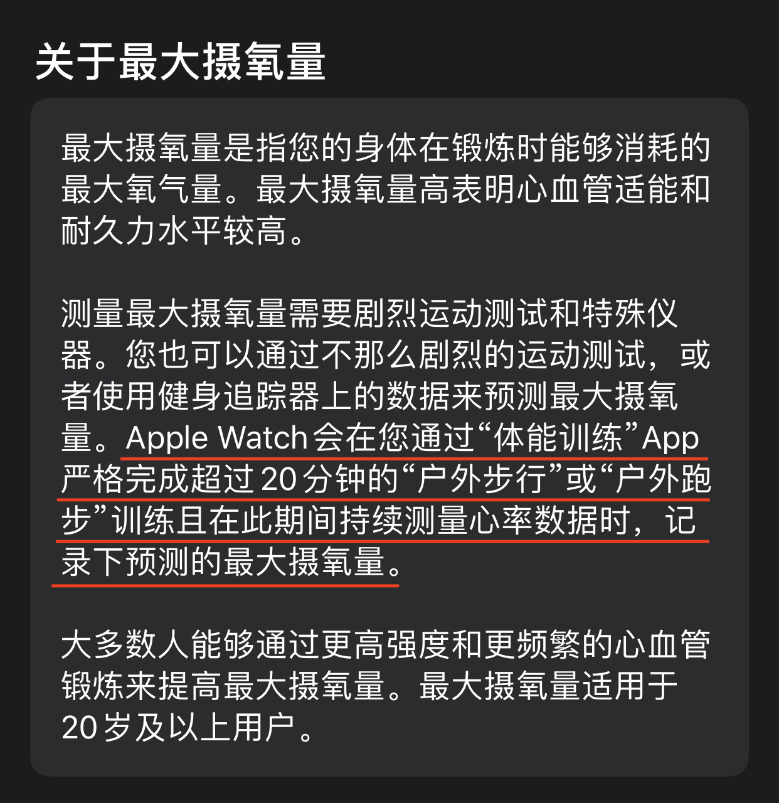

# 给程序员的健身锻炼指南

程序员的工作需要长期坐在电脑前，可能还会经常熬夜，作息时间不规律，所以码农是身体素质比较差的一群人。因此程序员健身锻炼的首要目标，不是为了有好看的身材，而是让你精力充沛，面对高强度工作游刃有余，同时还有精力去享受生活，这才是最关键的。

## 心肺系统的重要性

这一切的基础是你必须要有一个好的**心血管系统**。心脏和全身的血管组成了**心血管系统**。通过持续不间断地跳动，心脏把富含氧气的血液不断输送到人体各个部位，并且将各个部位产生的废物和有害物质带到相应的排泄器官排出体外，这才维持起人体的各项机能。

**心血管系统**就好比汽车的发动机，没了发动机，其他零件再好也没有用，这个发动机是最重要的。

如果通过运动，让心肌得到有效的锻炼，那受益的是整个心血管系统。至于体重的減轻、体型的变化，这些都是随时而来的副产品。

## 自测心肺功能水平

那么如何锻炼才能有效的增强心血管系统呢？

首先我们要知道自己当前心血管系统的水平如何。一个专业的指标叫做**最大摄氧量**(VO<sub>2</sub> max)。这个指标可以看出你现在心血管和心肺功能的水平。简单来说，**最大摄氧量**就是你在运动中能获取的最大氧气量。这个指标越高，说明你的心血管系统、心肺功能越好。

对一个正常成年人，男性这个指标达到`40`，女性达到`36`才算是及格。普通人`54`以上可以算是优秀，而职业长跑运动员，最大摄氧量指标能达到`88`以上。

如何测量自己的最大摄氧量呢？一般专业的心率表都会有这个指标。例如`Apple watch`可以通过你的体能训练，估算出最大摄氧量。



`iOS`系统自带的“健康”App里能查看到这个指标。


## 合适强度的运动改善心肺功能

了解了自己当前的心肺功能水平后，如何提高改善你的心肺功能呢？需要选择合适的运动强度，不能一上来就强度过大。如果平时缺乏锻炼，心肺功能不达标，高强度的训练是比较危险的。

建议使用“卡氏公式”计算一下你合适的运动心率区间。这个心率区间是和你的年龄，以及早上起来的静态心率状况有关。

**适合心肺功能训练的卡氏公式**

```
心肺训练心率 =
(220 - 年龄 − 静态心率)×(55% ~ 65%) + 静态心率
```

如果是刚开始健身，比较推荐你在跑步机上进行走路。因为跑步机的速度是恒定的，把跑步机调成上坡的时候，你会发现很容易达到你想要达到的心率，只要在这个心率范围之内，就是你最合适的运动区间。随着你的心肺能力不断提高，你会逐渐提高坡度和速度。

## 如何有效减脂

健身锻炼除了能充沛精力，另外一个大家关心的问题是，如何通过运动有效的减脂呢？

实际上，**饮食才是最有效的控制体重的方法**。对于想减脂的人来说，最好的办法就是**控制好你糖和脂肪的摄入**，然后多吃一些蛋白质类食物，这样你会有足够的饱腹感。

此外，可以做一些低强度运动，身体会消耗更多的脂肪。

为什么低强度的运动能消耗脂肪呢？因为**脂肪的消耗是需要氧气参与，运动过程中必须有充足的氧气才能消耗脂肪**，因此这个运动强度应该比心肺训练的强度更低。

减脂的运动强度就是卡氏公式的**35%到55%**，在这个强度运动是消耗脂肪最多的。

**适合减脂训练的卡氏公式**

```
减脂训练心率 =
(220 - 年龄 − 静态心率)×(35% ~ 55%) + 静态心率
```

最后，男性的健康体脂率应该是`15%`到`20%`，女性的健康体脂率是`20`%到`25%`。推荐买一个体脂秤测试跟踪自己的体脂率变化。