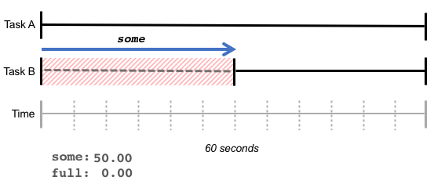
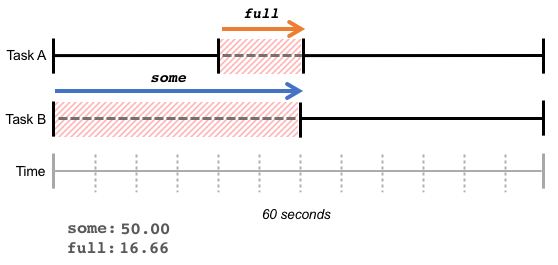
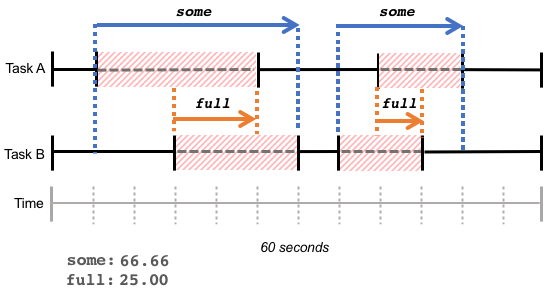

# 使用PSI（Pressure Stall Information）监控服务器资源

我们通常会使用 **load average** 了解服务器的健康状况，检查服务器的负载是否正常。但 `load average` 有几个缺点：

- `load average` 的计算包含了 **TASK_RUNNING** 和 **TASK_UNINTERRUPTIBLE** 两种状态的进程。`TASK_RUNNING` 是进程处于运行、或等待分配 CPU 的准备运行状态。`TASK_UNINTERRUPTIBLE` 是进程处于不可中断的等待，一般是等待磁盘的输入输出。因此 `load average` 值飙高，可能是因为 CPU 资源不够，让很多处于 `TASK_RUNNING` 状态的进程等待 CPU，也可能是由于磁盘 I/O 资源紧张，造成很多进程因为等待 IO 而处于 `TASK_UNINTERRUPTIBLE` 状态。你可以通过 `load average` 发现系统很忙，但没法区分是因为争夺 CPU 还是 IO 引起的。
- `load average` 最短的时间窗口为1分钟，没法观察更短窗口的负载平均值，例如想了解最近10秒的`load average`。
- `load average` 报告的是活跃进程数的原始数据，你还需要知道可用的 CPU 核数，这样 `load average` 的值才有意义。

所以，当用户遇到服务器 `load average` 飙高的时候，还需要继续查看 CPU、I/O 和内存等资源的统计数据，才能进一步分析问题。

于是，Facebook的工程师 Johannes Weiner 发明了一个新的指标 [PSI(Pressure Stall Information)](https://www.kernel.org/doc/html/latest/accounting/psi.html)，并向内核提交了这个[patch](https://lwn.net/Articles/763629/)。


## PSI 概览

当 CPU、内存或 IO 设备争夺激烈的时候，系统会出现负载的延迟峰值、吞吐量下降，并可能触发内核的 `OOM Killer`。**PSI(Pressure Stall Information)** 字面意思就是由于资源（CPU、内存和 IO）压力造成的任务执行停顿。**PSI** 量化了由于硬件资源紧张造成的任务执行中断，统计了系统中任务等待硬件资源的时间。我们可以用 **PSI** 作为指标，来衡量硬件资源的压力情况。停顿的时间越长，说明资源面临的压力越大。

如果持续监控 `PSI` 指标并绘制变化曲线图，可以发现吞吐量下降与资源短缺的关系，让用户在资源变得紧张前，采取更主动的措施，例如将任务迁移到其他服务器，杀死低优先级的任务等。

`PSI` 已经包含在 4.20及以上版本的 Linux 内核中。

## PSI 接口文件

CPU、内存和 IO 的压力信息导出到了 `/proc/pressure/` 目录下对应的文件，你可以使用 `cat` 命令查询资源的压力统计信息：

```
$ cat /proc/pressure/cpu 
some avg10=0.03 avg60=0.07 avg300=0.06 total=8723835

$ cat /proc/pressure/io 
some avg10=0.00 avg60=0.00 avg300=0.00 total=56385169
full avg10=0.00 avg60=0.00 avg300=0.00 total=54915860

$ cat /proc/pressure/memory 
some avg10=0.00 avg60=0.00 avg300=0.00 total=149158
full avg10=0.00 avg60=0.00 avg300=0.00 total=34054
```

内存和 IO 显示了两行指标：**some** 和 **full**，CPU 只有一行指标 **some**。关于 some 和 full 的定义下一节解释。

**avg** 给出了任务由于硬件资源不可用而被停顿的时间百分比。**avg10**、**avg60**和**avg300**分别是最近10秒、60秒和300秒的停顿时间百分比。

例如上面 `/proc/pressure/cpu` 的输出，**avg10=0.03** 意思是任务因为CPU资源的不可用，在最近的10秒内，有0.03%的时间停顿等待 CPU。如果 avg 大于 40 ，也就是有 40% 时间在等待硬件资源，就说明这种资源的压力已经比较大了。

**total** 是任务停顿的总时间，以微秒（microseconds）为单位。通过 total 可以检测出停顿持续太短而无法影响平均值的情况。


## some 和 full 的定义

**some** 指标说明一个或多个任务由于等待资源而被停顿的时间百分比。在下图的例子中，在最近的60秒内，任务A的运行没有停顿，而由于内存紧张，任务B在运行过程中花了30秒等待内存，则 some 的值为50%。



some 表明了由于缺乏资源而造成至少一个任务的停顿。

**full** 指标表示所有的任务由于等待资源而被停顿的时间百分比。在下图的例子中，在最近的60秒内，任务 B 等待了 30 秒的内存，任务 A 等待了 10 秒内存，并且和任务 B 的等待时间重合。在这个重合的时间段10秒内，任务 A 和 任务 B 都在等待内存，结果是 some 指标为 50%，full 指标为 **10/60 = 16.66%**。



**full** 表明了总吞吐量的损失，在这种状态下，所有任务都在等待资源，CPU 周期将被浪费。

请注意，**some** 和 **full** 的计算是用整个时间窗口内累计的等待时间，等待时间可以是连续的，也可能是离散的。



理解了 **some** 和 **full** 的含义，就明白了 CPU 为什么没有 **full** 指标，因为不可能所有的任务都同时饿死在 CPU 上，CPU 总是在执行一个任务。

## PSI 阈值监控

用户可以向 PSI 注册触发器，在资源压力超过自定义的阈值时获得通知。一个触发器定义了特定时间窗口内最大累积停顿时间，例如，在任何 500ms 的窗口内，累计 100ms 的停顿时间会产生一个通知事件。

如何向 PSI 注册触发器呢？打开 `/proc/pressure/` 目录下资源对应的 PSI 接口文件，写入想要的阈值和时间窗口，然后在打开的文件描述符上使用 `select()`、`poll()` 或 `epoll()` 方法等待通知事件。写入 PSI 接口文件的数据格式为：

```
<some|full> <停顿阈值> <时间窗口>
```

阈值和时间窗口的单位都是微秒（us）。内核接受的窗口大小范围为500ms到10秒。

举个例子，向 `/proc/pressure/io` 写入 "some 500000 1000000"，代表着在任何 1 秒的时间窗口内，如果一个或多个进程因为等待 IO 而造成的时间停顿超过了阈值 500ms，将触发通知事件。

当用于定义触发器的 PSI 接口文件描述符被关闭时，触发器将被取消注册。

我们通过一个例子演示触发器的使用：

```c
#include <errno.h>
#include <fcntl.h>
#include <stdio.h>
#include <poll.h>
#include <string.h>
#include <unistd.h>

int main() {
      const char trig[] = "some 500000 1000000";
      struct pollfd fds;
      int n;

      fds.fd = open("/proc/pressure/io", O_RDWR | O_NONBLOCK);
      if (fds.fd < 0) {
              printf("/proc/pressure/io open error: %s\n",
                      strerror(errno));
              return 1;
      }
      fds.events = POLLPRI;

      if (write(fds.fd, trig, strlen(trig) + 1) < 0) {
              printf("/proc/pressure/io write error: %s\n",
                      strerror(errno));
              return 1;
      }

      printf("waiting for events...\n");
      while (1) {
              n = poll(&fds, 1, -1);
              if (n < 0) {
                      printf("poll error: %s\n", strerror(errno));
                      return 1;
              }
              if (fds.revents & POLLERR) {
                      printf("got POLLERR, event source is gone\n");
                      return 0;
              }
              if (fds.revents & POLLPRI) {
                      printf("event triggered!\n");
              } else {
                      printf("unknown event received: 0x%x\n", fds.revents);
                      return 1;
              }
      }

      return 0;
}
```

在服务器上编译并运行该程序，如果当前服务器比较空闲，我们会看到程序一直在等待 IO 压力超过阈值的通知：

```
$ sudo ./monitor 
waiting for events...
```

我们为服务器制造点 IO 压力，生成一个5G大小的文件：

```
$ dd if=/dev/zero of=/home/mazhen/testfile bs=4096 count=1310720
```

再回到示例程序的运行窗口，会发现已经收到事件触发的通知：

```
$ sudo ./monitor 
waiting for events...
event triggered!
event triggered!
event triggered!
event triggered!
event triggered!
...
```

## PSI 应用案例

Facebook 是因为一些实际的需求开发了 PSI。其中一个案例是为了避免内核 OOM(Out-Of-Memory) killer 的触发。

应用在申请内存的时候，如果没有足够的 free 内存，可以通过回收 **Page Cache** 释放内存，如果这时 free 内存还是不够，就会触发内核的 OOM Killer，挑选一个进程 kill 掉释放内存。这个过程是同步的，申请分配内存的进程一直被阻塞等待，而且内核选择 kill 掉哪个进程释放内存，用户不可控。因此，Facebook 开发了用户空间的 OOM Killer 工具 [oomd](https://github.com/facebookincubator/oomd)。

[oomd](https://github.com/facebookincubator/oomd) 使用 PSI 阈值作为触发器，在内存压力增加到一定程度时，执行指定的动作，避免最终 OOM 的发生。oomd 作为第一道防线，确保服务器工作负载的健康，并能自定义复杂的清除策略，这些都是内核做不到的。

[cgroup2](https://www.kernel.org/doc/html/latest/admin-guide/cgroup-v2.html) 也支持 group 内任务的 PSI 指标追踪，这样就可以知道容器内 CPU、内存和 IO 的真实压力情况，进行更精细化的容器调度，在资源利用率最大化的同时保证任务的延迟和吞吐量。