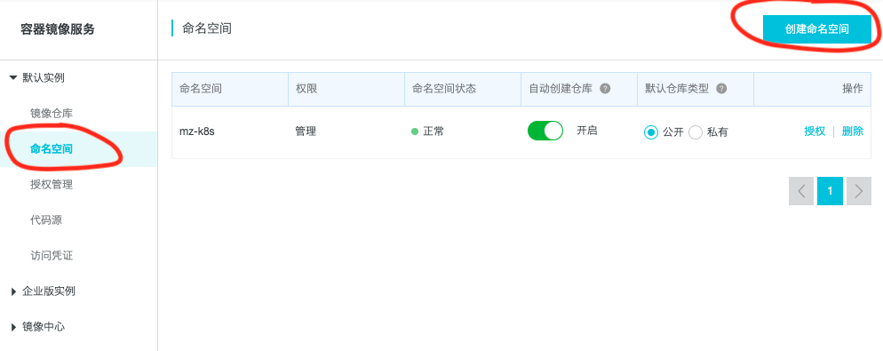

# 自己动手将谷歌k8s镜像同步到阿里云

`Kubernetes` 相关的`docker`镜像存放在Google的镜像仓库 [k8s.gcr.io](https://cloud.google.com/container-registry/)，在强国网络环境内无法访问。有人已经将这些镜像同步到了阿里云，你可以在[阿里云容器镜像服务](https://cr.console.aliyun.com/cn-shenzhen/instances/images)中搜索到它们。几乎所有的k8s镜像都已经同步到了阿里云。[阿里云容器服务](https://www.aliyun.com/product/containerservice)团队甚至还有一个开源项目[sync-repo](https://github.com/AliyunContainerService/sync-repo)，专门做`Docker Registry`之间的同步。但是，如果你不放心别人同步的镜像，或者最新版本的镜像还没人同步过来，你可以按照本文将介绍的步骤，自己将`gcr.io`上的`docker`镜像搬到阿里云。

## 安装配置shadowsocks客户端

先简单介绍下`Shadowsocks`协议，详细的工作原理可以参考[这篇博客](https://www.desgard.com/Shadowsocks-1/)：


当我们启动`shadowsocks client`时，实际上是启动了一个 `ss-local` 进程，左侧绿色的 `Socks5 Client` 可以是浏览器，也可以是`Telegram`等本地应用，它们和`ss-local`之间是使用 `socks` 协议进行通信。也就是说，浏览器像连接普通 `socks` 代理一样，连接到`ss-local`进程。`ss-local` 会将收到的请求，转发给`ss-server`，由`ss-server`完成实际的访问，并将结果通过`ss-local`返回给浏览器。`ss-server`部署在强国网络之外，和`ss-local`之间是加密传输，这样就实现了跨越长城。其实防火长城已经能够识别`Shadowsocks`协议，但发现我们是在努力学习先进技术，就先放我们过关。

好了，我们现在首先要做的是在本机安装配置`shadowsocks`客户端。推荐使用[shadowsocks-libev](https://github.com/shadowsocks/shadowsocks-libev)，纯C实现的`shadowsocks`协议，已经在很多操作系统的官方`repository`中 ，安装非常方便。

* `macOS`

```
brew install shadowsocks-libev
```

* `Ubuntu`

```
sudo apt install shadowsocks-libev
```

接下来填写`shadowsocks client`配置文件，`JSON`格式，简单易懂：

```
{
    "server":"ss服务器IP",
    "server_port":443, // ss服务器port
    "local_port":1080, // 本地监听端口
    "password":"xxxx", // ss服务器密码
    "timeout":600,
    "method":"aes-256-cfb" // ss服务器加密方法
}
```
至于`shadowsocks`服务器端，可以租用强国网络外的云主机自己搭建，也可以购买现成的[机场服务](https://www.emptyus.com/aff.php?uid=16723)，本文就不讨论了。

然后启动`shadowsocks client`：

```
nohup ss-local -c ss-client.conf &
```


## 安装配置HTTP代理

`shadowsocks client`创建的是`socks5`代理，不过一些程序无法使用 `socks5` ，它们需要通过 `http_proxy` 和 `https_proxy` 环境变量，使用 `HTTP` 代理。`polipo` 可以帮助我们将 `socks5` 代理转换为 `HTTP` 代理。

* `macOS`下安装`polipo`

```
brew install polipo
```

* `Ubuntu`下安装`polipo`

```
sudo apt install polipo

# 建议停掉polipo服务，需要的时候自己启动
sudo systemctl stop polipo.service
sudo systemctl disable  polipo.service
```

启动`HTTP`代理

```
sudo polipo socksParentProxy=127.0.0.1:1080 proxyPort=1087
```

`socksParentProxy`配置为`localhost`和`ss-local`监听端口，`proxyPort`是启动的`HTTP`代理端口。

我们可以在命令行终端测试`HTTP`代理的效果：

```
$ export http_proxy=http://localhost:1087
$ export https_proxy=http://localhost:1087
$ curl https://www.google.com
```

应该可以正常访问到Google。

## 设置Docker HTTP代理

如果是在`macOS`上使用`Docker Desctop`，可以在`Preference`中的`Proxies`设置上一步启动的HTTP代理：


如果是`Linux`平台，请参考Docker的[官方文档](https://docs.docker.com/config/daemon/systemd/#httphttps-proxy)进行设置。

## 在阿里云创建容器镜像的命名空间

为了将镜像同步到阿里云，首先需要在阿里云的[容器镜像服务控制台](https://cr.console.aliyun.com/cn-shenzhen/instances/namespaces)创建镜像的命名空间。



建议将仓库类型设置为“公开”，这样其他人也能搜索、下载到镜像。

## 从`gcr.io`下载镜像

在本机从`gcr.io`下载镜像，我们以镜像`pause:3.1`为例：

```
docker pull k8s.gcr.io/pause:3.1
```

## 给镜像标记新的`tag`

根据前面在阿里云创建的命名空间，给镜像标记新的`tag`：

```
docker tag k8s.gcr.io/pause:3.1 registry.cn-shenzhen.aliyuncs.com/mz-k8s/pause:3.1
```

`mz-k8s`是在前面创建的命名空间。 查看tag结果：

```
$ docker images

REPOSITORY                                       TAG                 IMAGE ID            CREATED             SIZE
k8s.gcr.io/pause                                 3.1                 da86e6ba6ca1        17 months ago       742kB
registry.cn-shenzhen.aliyuncs.com/mz-k8s/pause   3.1                 da86e6ba6ca1        17 months ago       742kB
```

通过`IMAGE ID`可以看出，两个镜像为同一个。

## 将镜像上传到阿里云

登录阿里云镜像仓库：

```
$ docker login --username=(阿里云账号) registry.cn-shenzhen.aliyuncs.com
```

根据提示输入password，登录成功后，显示Login Succeeded。

上传镜像：

```
docker push registry.cn-shenzhen.aliyuncs.com/mz-k8s/pause:3.1
```

## 从阿里云下载镜像

现在可以在其他机器上从阿里云下载`pause:3.1`镜像，这时候已经不需要科学上网了：

```
$ docker pull registry.cn-shenzhen.aliyuncs.com/mz-k8s/pause:3.1
```

给镜像打上原来的tag，这样`kubeadm`等工具就可以使用本地仓库中的`pause:3.1`镜像了：

```
$ docker tag registry.cn-shenzhen.aliyuncs.com/mz-k8s/pause:3.1 k8s.gcr.io/pause:3.1
```

至此，我们跨越长城，将一个docker镜像从`gcr.io`搬到了`Aliyun`。

如果是需要批量、定时的从`gcr.io`同步镜像，建议考虑使用阿里开源的[sync-repo](https://github.com/AliyunContainerService/sync-repo)。