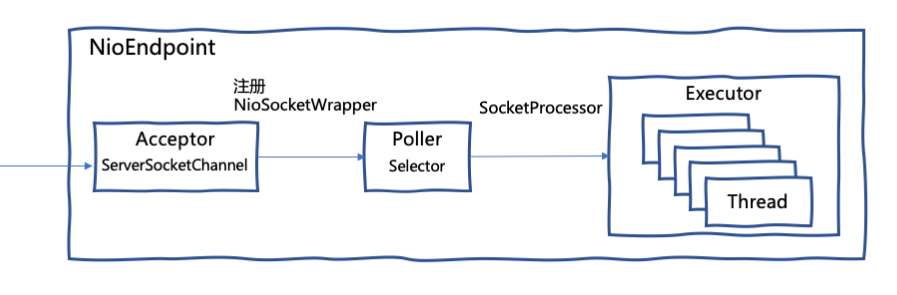
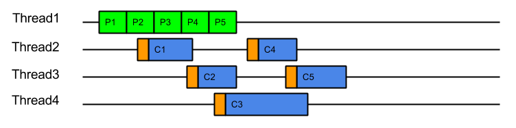
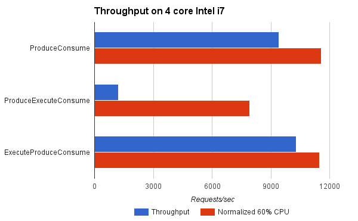
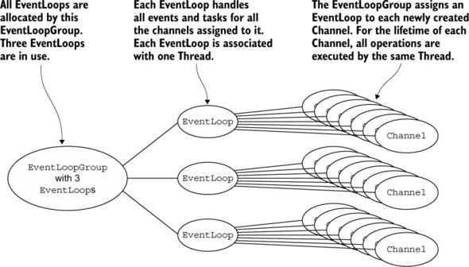

# Tomcat的NioEndpoint实现分析

在上一篇[<Tomcat系统架构>](./tomcat-architecture.md)中提到，Tomcat的网络通信层支持多种 I/O 模型。本文将介绍`NioEndpoint`，它是直接使用`NIO`实现了 I/O 多路复用。

## `NioEndpoint`的处理流程

`NioEndpoint`的处理流程如下：



* `Acceptor`实现了`Runnable`接口，运行在一个独立的线程中。`Acceptor`的`run`方法在循环中调用`ServerSocketChannel.accept()`，将返回的`SocketChannel`包装成`NioSocketWrapper`，然后将`NioSocketWrapper`注册进`Poller`。

* `Poller`同样实现了`Runnable`接口，运行在一个独立的线程中。`Poller`的核心任务是响应I/O事件，它在无限循环中调用`Selector.select()`，会得到准备就绪的`NioSocketWrapper`列表，为每个`NioSocketWrapper`生成一个`SocketProcessor`任务，然后把任务扔进线程池`Executor`去处理。

* `Executor`是可配置的线程池，负责运行`SocketProcessor`任务。`SocketProcessor`实现了`Runnable`接口，在`run`方法中会调用`ConnectionHandler.process(NioSocketWrapper, SocketEvent)`处理当前任务关联的`NioSocketWrapper`。

`ConnectionHandler`内部使用一个`ConcurrentHashMap`建立了`NioSocketWrapper`和`Processor`之间的映射。从上一篇[<Tomcat系统架构>](./tomcat-architecture.md)的介绍我们知道，`Processor`负责应用层协议的解析，那么我们需要为每个`NioSocketWrapper`创建并关联一个`Processor`。

为什么要建立`NioSocketWrapper`和`Processor`之间的关联呢？因为`Processor`在从`NioSocketWrapper`中读取字节流进行协议解析时，数据可能并不完整，这时需要释放工作线程，当`Poller`再次触发I/O读取事件时，可以根据`NioSocketWrapper`找回关联的`Processor`，继续进行未完成的协议解析工作。

`Processor`解析的结果是生成Tomcat的`Request`对象，然后调用`Adapter.service(request, response)`方法。`Adapter`的职责是将Tomcat的`Request`对象转换为标准的`ServletRequest`后，传递给`Servlet`引擎，最终会调用到用户编写的`Servlet.service(ServletRequest, ServletResponse)`。

## `NioEndpoint`的线程模型

我们注意到，在Tomcat 9的实现中，`Acceptor`和`Poller`都只有一个线程，并且不可配置。`Poller`检测到的I/O事件会被扔进`Executor`线程池中处理，最终`Servlet.service`也是在`Executor`中执行。这是一种常见的NIO线程模型，将I/O事件的检测和处理分开在不同的线程。

但这种处理方式也有缺点。当`Selector`检测到数据就绪事件时，运行`Selector`线程的CPU已经在CPU cache中缓存了数据。这时切换到另外一个线程去读，这个读取线程很可能运行在另一个CPU核，此前缓存在CPU cache中的数据就没用了。同时这样频繁的线程切换也增加了系统内核的开销。

同样是基于NIO，Jetty使用了不同的线程模型：线程自己产生的I/O事件，由当前线程处理，"Eat What You Kill"，同时，Jetty可能会新建一个新线程继续检测和处理I/O事件。

[这篇博客](https://webtide.com/eat-what-you-kill/)详细的介绍了Jetty的 "Eat What You Kill" 策略。Jetty也支持类似Tomcat的`ProduceExecuteConsume`策略，即I/O事件的产出和消费用不同的线程处理。



`ExecuteProduceConsume`策略，也就是 "Eat What You Kill"，I/O事件的生产者自己消费任务。


Jetty对比了这两种策略，使用`ExecuteProduceConsume`能达到更高的吞吐量。



其实，Netty也使用了和 "Eat What You Kill" 类似的线程模型。



`Channel`注册到`EventLoop`，一个`EventLoop`能够服务多个`Channel`。`EventLoop`仅在一个线程上运行，因此所有I/O事件均由同一线程处理。

## `blocking` write的实现

当通过`Response`向客户端返回数据时，最终会调用`NioSocketWrapper.write(boolean block, ByteBuffer from)`或`NioSocketWrapper.write(boolean block, byte[] buf, int off, int len)`，将数据写入socket。

我们注意到`write`方法的第一个参数`block`，它决定了write是使用`blocking`还是`non-blocking`方式。比较奇怪，虽然是`NioEndpoint`，但write动作也不全是`non-blocking`。

一般NIO框架在处理write时都是`non-blocking`方式，先尝试`SocketChannel.write(ByteBuffer)`，如果`buffer.remaining() > 0`，将剩余数据以某种方式缓存，然后把`SelectionKey.OP_WRITE`添加到`SelectionKey`的`interest set`，等待被`Selector`触发时再次尝试写出，直到`buffer`中没有剩余数据。

**那是什么因素决定了`NioSocketWrapper.write`是`blocking`还是`non-blocking`呢？**

我们看一下`Http11OutputBuffer.isBlocking`的实现：

```
/**
* Is standard Servlet blocking IO being used for output?
* @return <code>true</code> if this is blocking IO
*/
protected final boolean isBlocking() {
    return response.getWriteListener() == null;
}
```

如果`response.getWriteListener()`不为`null`，说明我们注册了`WriteListener`接收write事件的通知，这时我们肯定是在使用异步Servlet。

也就是说，当我们使用异步Servlet时，才会使用`NioSocketWrapper.write`的`non-blocking`方式，普通的Servlet都是使用`blocking`方式的write。

`NioEndpoint`在实现`non-blocking`的write时和一般的NIO框架类似，**那它是如何实现`blocking`方式的write呢？**

Tomcat的NIO connector有一个配置参数`selectorPool.shared`。`selectorPool.shared`的缺省值为`true`，这时会创建一个运行在独立线程中`BlockPoller`。调用者在发起`blocking` write时，会将`SocketChannel`注册到这个`BlockPoller`中，然后`await`在一个`CountDownLatch`上。当`BlockPoller`检测到准备就绪的`SocketChannel`，会通过关联的`CountDownLatch`唤醒被阻塞的调用者。这时调用者尝试往`SocketChannel`中写入，如果buffer中还有剩余数据，那么会再把`SocketChannel`注册回`BlockPoller`，并继续`await`，重复前面的过程，直到数据完全写出，最后调用者从`blocking`的write方法返回。

当设置`selectorPool.shared`为`false`时，`NioEndpoint`会为每个发起`blocking` write的线程创建一个`Selector`，执行和上面类似的过程。当然`NioEndpoint`会使用`NioSelectorPool`来缓存`Selector`，并不是每次都创建一个新的`Selector`。`NioSelectorPool`中缓存的`Selector`的最大数量由`selectorPool.maxSelectors`参数控制。

至此，相信你对NioEndpoint的内部实现已经有了整体的了解。