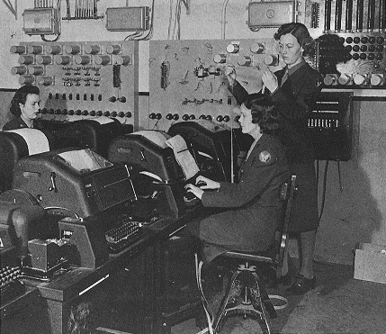
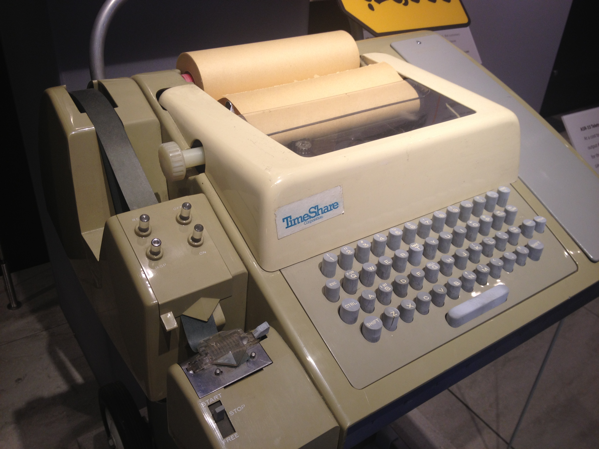
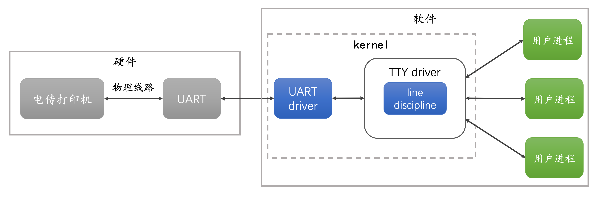
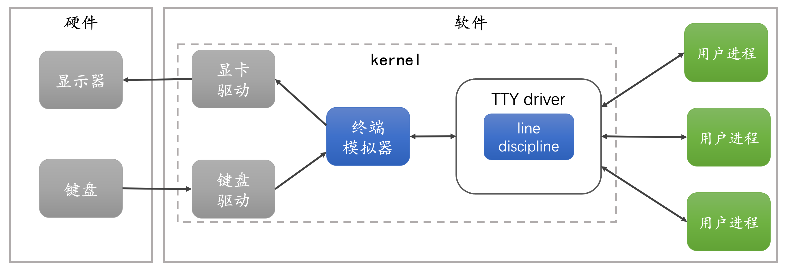

#  理解Linux TTY、PTY 和 Shell

你可能听说过 **TTY** 和 **PTY** 这些缩写，也在 `/dev` 目录下看到过 `/dev/tty[n]` 设备，大概知道它们和 Linux 终端的概念有关。可是你清楚 `TTY`、`PTY` 具体指的是什么，它们有什么区别，以及它们和 `shell` 又是什么关系呢？为了理解这些，我们需要先回顾一下历史。

## 回顾历史

在计算机诞生之前，人们发明了 [Teleprinter(电传打字机)](https://en.wikipedia.org/wiki/Teleprinter)，通过长长的电线点对点连接，发送和接收打印的信息，用于远距离传输电报信息。

`Teleprinter` 也可以写成 `teletypewriter` 或 `teletype`。

后来人们将 `Teleprinter` 连接到早期的大型计算机上，作为输入和输出设备，将输入的数据发送到计算机，并打印出响应。

在今天你很难想象程序的运行结果需要等到打印出来才能看到，`Teleprinter` 设备也进了计算机博物馆。现在我们用 **TTY** 代表计算机终端（**terminal**），是因为沿用了历史习惯，电传打字机（**teletypewriter**）曾经是计算机的终端，它的缩写便是 **TTY**(**T**ele**TY**pewriter)。

为了把不同型号的电传打字机接入计算机，需要在操作系统内核安装驱动，为上层应用屏蔽所有的低层细节。

电传打字机通过两根电缆连接：一根用于向计算机发送指令，一根用于接收计算机的输出。这两根电缆插入 **UART** （Universal Asynchronous Receiver and Transmitter，通用异步接收和发送器）的串行接口连接到计算机。

操作系统包含一个 `UART` 驱动程序，管理字节的物理传输，包括奇偶校验和流量控制。然后输入的字符序列被传递给 `TTY` 驱动，该驱动包含一个 **line discipline**。

**line discipline** 负责转换特殊字符（如退格、擦除字、清空行），并将收到的内容回传给电传打字机，以便用户可以看到输入的内容。**line discipline** 还负责对字符进行缓冲，当按下回车键时，缓冲的数据被传递给与 `TTY` 相关的前台用户进程。用户可以并行的执行几个进程，但每次只与一个进程交互，其他进程在后台工作。

## 终端模拟器

今天电传打字机已经进了博物馆，但 Linux/Unix 仍然保留了当初 TTY驱动和**line discipline**的设计和功能。终端不再是一个需要通过 UART 连接到计算机上物理设备。终端成为内核的一个模块，它可以直接向 TTY 驱动发送字符，并从 TTY 驱动读取响应然后打印到屏幕上。也就是说，用内核模块模拟物理终端设备，因此被称为**终端模拟器**(terminal emulator)。

上图是一个典型的Linux桌面系统。终端模拟器就像过去的物理终端一样，它监听来自键盘的事件将其发送到 TTY 驱动，并从 TTY 驱动读取响应，通过显卡驱动将结果渲染到显示器上。TTY驱动 和 **line discipline**的行为与原先一样，但不再有 UART 和 物理终端参与。

## 伪终端

## xterm

## Shell

## Configuring the TTY device

## 远程终端
