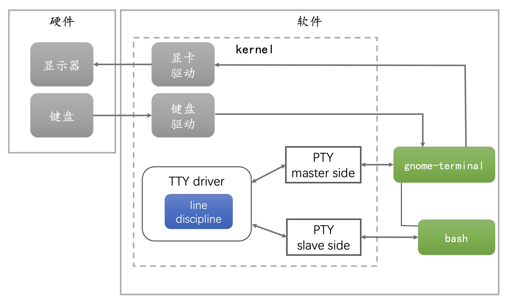
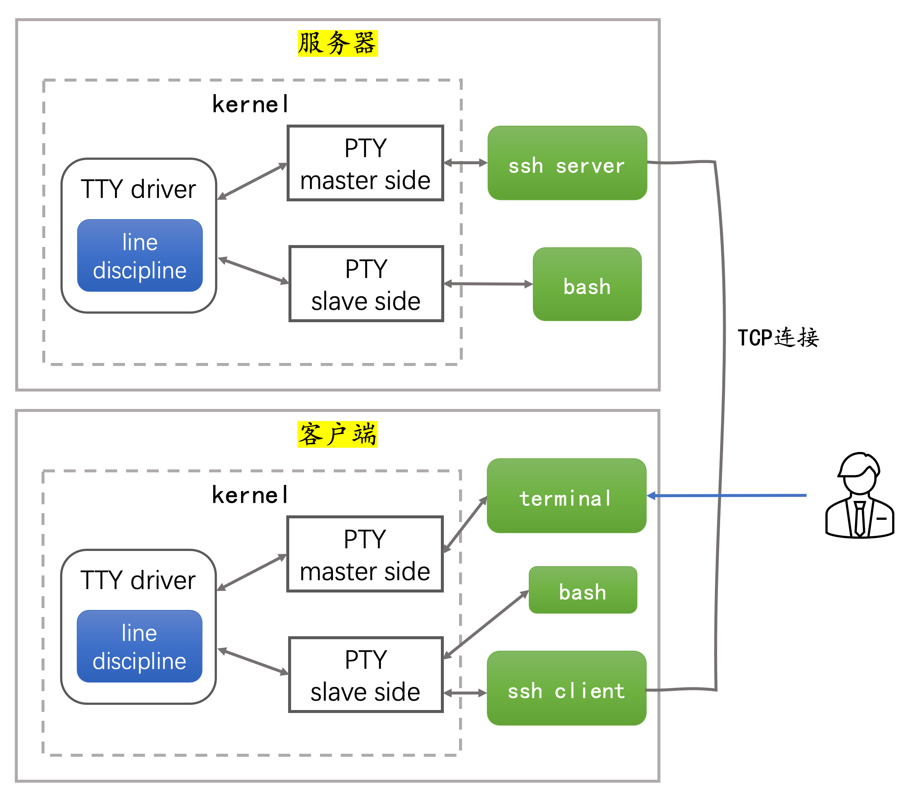

#  理解Linux 终端、终端模拟器和伪终端

你可能听说过 **TTY** 和 **PTY** 这些缩写，也在 `/dev` 目录下看到过 `/dev/tty[n]` 设备，大概知道它们和 Linux 终端的概念有关。可是你清楚 `TTY`、`PTY` 具体指的是什么，它们有什么区别，以及它们和 `shell` 又是什么关系呢？为了理解这些，我们需要先回顾一下历史。

## 回顾历史

在计算机诞生之前，人们发明了 [Teleprinter(电传打字机)](https://en.wikipedia.org/wiki/Teleprinter)，通过长长的电线点对点连接，发送和接收打印的信息，用于远距离传输电报信息。


`Teleprinter` 也可以写成 `teletypewriter` 或 `teletype`。

后来人们将 `Teleprinter` 连接到早期的大型计算机上，作为输入和输出设备，将输入的数据发送到计算机，并打印出响应。


在今天你很难想象程序的运行结果需要等到打印出来才能看到，`Teleprinter` 设备已经进了计算机博物馆。现在我们用 **TTY** 代表计算机终端（**terminal**），只是沿用了历史习惯，电传打字机（**teletypewriter**）曾经是计算机的终端，它的缩写便是 **TTY**(**T**ele**TY**pewriter)。

为了把不同型号的电传打字机接入计算机，需要在操作系统内核安装驱动，为上层应用屏蔽所有的低层细节。


电传打字机通过两根电缆连接：一根用于向计算机发送指令，一根用于接收计算机的输出。这两根电缆插入 **UART** （Universal Asynchronous Receiver and Transmitter，通用异步接收和发送器）的串行接口连接到计算机。

操作系统包含一个 `UART` 驱动程序，管理字节的物理传输，包括奇偶校验和流量控制。然后输入的字符序列被传递给 `TTY` 驱动，该驱动包含一个 **line discipline**。

**line discipline** 负责转换特殊字符（如退格、擦除字、清空行），并将收到的内容回传给电传打字机，以便用户可以看到输入的内容。**line discipline** 还负责对字符进行缓冲，当按下回车键时，缓冲的数据被传递给与 `TTY` 相关的前台用户进程。用户可以并行的执行几个进程，但每次只与一个进程交互，其他进程在后台工作。

## 终端模拟器(terminal emulator)

今天电传打字机已经进了博物馆，但 Linux/Unix 仍然保留了当初 TTY驱动和 **line discipline** 的设计和功能。终端不再是一个需要通过 UART 连接到计算机上物理设备。终端成为内核的一个模块，它可以直接向 TTY 驱动发送字符，并从 TTY 驱动读取响应然后打印到屏幕上。也就是说，用内核模块模拟物理终端设备，因此被称为**终端模拟器**(terminal emulator)。


上图是一个典型的Linux桌面系统。终端模拟器就像过去的物理终端一样，它监听来自键盘的事件将其发送到 TTY 驱动，并从 TTY 驱动读取响应，通过显卡驱动将结果渲染到显示器上。TTY驱动 和 **line discipline**的行为与原先一样，但不再有 UART 和 物理终端参与。

如何看到一个终端模拟器呢？在 `Ubuntu 20` 桌面系统上，按 `Ctrl+Alt+F3` 就会得到一个由内核模拟的 TTY。Linux上这种模拟的文本终端也被称为[虚拟终端（Virtual consoles）](https://en.wikipedia.org/wiki/Terminal_emulator#Virtual_consoles)。每个虚拟终端都由一个特殊的设备文件 `/dev/tty[n]` 所表示，与这个虚拟终端的交互，是通过对这个设备文件的读写操作，以及使用`ioctl`系统调用操作这个设备文件进行的。通过执行 `tty` 命令可以查看代表当前虚拟终端的设备文件：

```
$ tty
/dev/tty3
```

可以看到，当前终端的设备文件是 `/dev/tty3`，也就是通过 `Ctrl+Alt+F3` 得到的虚拟终端。

你可以通过 `Ctrl+Alt+F3` 到 `Ctrl+Alt+F6` 在几个虚拟终端之间切换。按 `Ctrl+Alt+F2` 回到桌面环境。X 系统也是运行在一个终端模拟器上，在 `Ubuntu 20` 上它对应的设备是 `/dev/tty2`，这也是为什么使用 `Ctrl+Alt+F2` 可以切换到 X 系统的原因。

我们可以看看 X 系统打开的文件中是否包含了设备文件 `/dev/tty2`。先查找 X 系统的 PID：

```
# ps aux | grep Xorg
mazhen      1404  0.1  0.6 741884 49996 tty2     Sl+  08:07   0:13 /usr/lib/xorg/Xorg vt2 -displayfd 3 -auth /run/user/1000/gdm/Xauthority -background none -noreset -keeptty -verbose 3
```

再看看这个进程(1404)打开了哪些文件：

```
# ll /proc/1404/fd
总用量 0
dr-x------ 2 mazhen mazhen  0 7月  10 08:07 ./
dr-xr-xr-x 9 mazhen mazhen  0 7月  10 08:07 ../
lrwx------ 1 mazhen mazhen 64 7月  10 08:07 0 -> /dev/tty2
lrwx------ 1 mazhen mazhen 64 7月  10 08:07 1 -> 'socket:[39965]'
lrwx------ 1 mazhen mazhen 64 7月  10 10:09 10 -> 'socket:[34615]'
...
```

可以看到，X 系统确实打开了 `/dev/tty2`。

再做一个有趣的实验，在 tty3 下以 root 用户身份执行 echo 命令：

```
# echo "hello from tty3" > /dev/tty4
```

再按 `Ctrl+Alt+F4` 切换到 tty4，能看到从 tty3 发送来的信息。

## 伪终端（pseudo terminal, PTY）

**终端模拟器(terminal emulator)** 是运行在内核的模块，我们也可以让终端模拟程序运行在用户区。运行在用户区的终端模拟程序，就被称为**伪终端（pseudo terminal, PTY）**。

PTY 运行在用户区，更加安全和灵活，同时仍然保留了 TTY 驱动和 **line discipline** 的功能。常用的伪终端有 xterm，gnome-terminal，以及远程终端 ssh。我们以 Ubuntu 桌面版提供的 gnome-terminal 为例，介绍伪终端如何与 TTY 驱动交互。



PTY 是通过打开特殊的设备文件 `/dev/ptmx` 创建，由一对双向的字符设备构成，称为 `PTY master` 和 `PYT slave`。

gnome-terminal 持有 `PTY master` 的文件描述符 `/dev/ptmx`。
gnome-terminal 负责监听键盘事件，通过`PTY master`接收或发送字符到 `PYT slave`，还会在屏幕上绘制来自`PTY master`的字符输出。

gnome-terminal 会 fork 一个 shell 子进程，并让 shell 持有 `PYT slave` 的设备文件 `/dev/pts/[n]`，shell 通过 `PYT slave` 接收字符，并输出处理结果。

`PTY master` 和 `PYT slave` 之间是 TTY 驱动，会在 master 和 slave 之间复制数据，并进行会话管理和提供 **line discipline** 功能。


在 gnome-terminal 中执行 tty 命令，可以看到代表`PYT slave`的设备文件：

```
$ tty
/dev/pts/0
```

执行 `ps -l` 命令，也可以确认 shell 关联的伪终端是 `pts/0`：

```
$ ps -l
F S   UID     PID    PPID  C PRI  NI ADDR SZ WCHAN  TTY          TIME CMD
0 S  1000    1842    1832  0  80   0 -  3423 do_wai pts/0    00:00:00 bash
0 R  1000    1897    1842  0  80   0 -  3626 -      pts/0    00:00:00 ps
```

注意到 TTY 这一列指出了当前进程的终端是 `pts/0`。

我们以实际的例子，看看在 terminal 执行一个命令的全过程。

* 我们在桌面启动终端程序 `gnome-terminal`，它向操作系统请求一个`PTY master`，并把 GUI 绘制在显示器上
* `gnome-terminal` 启动子进程 `bash`
* `bash` 的标准输入、标准输出和标准错误都设置为 `PYT slave`
* `gnome-terminal` 监听键盘事件，并将输入的字符发送到`PTY master`
* **line discipline** 收到字符，进行缓冲。只有当你按下回车键时，它才会把缓冲的字符复制到`PYT slave`。
* **line discipline** 在接收到字符的同时，也会把字符写回给`PTY master`。`gnome-terminal` 只会在屏幕上显示来自 `PTY master` 的东西。因此，**line discipline** 需要回传字符，以便让你看到你刚刚输入的内容。
* 当你按下回车键时，TTY 驱动负责将缓冲的数据复制到`PYT slave`
* bash 从标准输入读取输入的字符（例如 `ls -l` ）。注意，bash 在启动时已经将标准输入被设置为了`PYT slave`
* bash 解释从输入读取的字符，发现需要运行 `ls`
* bash fork 出 ls 进程。bash fork 出的进程拥有和 bash 相同的标准输入、标准输出和标准错误，也就是`PYT slave`
* ls 运行，结果打印到标准输出，也就是`PYT slave`
* TTY 驱动将字符复制到`PTY master`
* `gnome-terminal` 循环从 `PTY master` 读取字节，绘制到用户界面上。

## Shell

我们经常不去区分 terminal 和 Shell，会说打开一个 terminal，或打开一个 Shell。从前面介绍的命令执行过程可以看出，Shell 不处理键盘事件，也不负责字符的显示，这是 terminal 要为它处理好的。

Shell是用户空间的应用程序，通常由 terminal fork出来，是 terminal 的子进程。Shell用来提示用户输入，解释用户输入的字符，然后处理来自底层操作系统的输出。

通常我们使用较多的 shell 有 Bash、Zsh 和 sh。

## 配置 TTY 设备

内核将使用 TTY 驱动来处理 terminal 和 Shell 之间的通信。**line discipline** 是 TTY 驱动的一个逻辑组件。**line discipline** 主要有以下功能：

* 当用户输入时，字符会被回传到`PTY master`
* **line discipline** 会在内存中缓冲这些字符。当用户按回车键时，它才将这些字符发送到`PYT slave`
* **line discipline** 可以拦截处理一些特殊的功能键，例如：
  * 当用户按 `CTRL+c` 时，它向连接到 `PYT slave` 的进程发送 `kill -2（SIGINT）` 信号
  * 当用户按 `CTRL+w` 时，它删除用户输入的最后一个字
  * 当用户按 `CTRL+z` 时，它向连接到 `PYT slave` 的进程发送 `kill -STOP`信号
  * 当用户按退格键时，它从缓冲区中删除该字符，并向`PTY master`发送删除最后一个字符的指令

我们可以使用命令行工具 `stty` 查询和配置 TTY，包括 **line discipline** 规则。在 terminal 执行 `stty -a` 命令：

```
$ stty -a
speed 38400 baud; rows 40; columns 80; line = 0;
intr = ^C; quit = ^\; erase = ^?; kill = ^U; eof = ^D; eol = <undef>;
eol2 = <undef>; swtch = <undef>; start = ^Q; stop = ^S; susp = ^Z; rprnt = ^R;
werase = ^W; lnext = ^V; discard = ^O; min = 1; time = 0;
-parenb -parodd -cmspar cs8 -hupcl -cstopb cread -clocal -crtscts
-ignbrk -brkint -ignpar -parmrk -inpck -istrip -inlcr -igncr icrnl ixon -ixoff
-iuclc -ixany -imaxbel iutf8
opost -olcuc -ocrnl onlcr -onocr -onlret -ofill -ofdel nl0 cr0 tab0 bs0 vt0 ff0
isig icanon iexten echo echoe echok -echonl -noflsh -xcase -tostop -echoprt
echoctl echoke -flusho -extproc
```

`-a` 标志告诉 `stty` 返回所有的设置，包括TTY 的特征和 **line discipline** 规则。

让我们看一下第一行：
* **speed** 表示波特率。当 terminal 和计算机通过物理线路连接时，speed 后的数字表示物理线路的波特率。波特率对 PTY 来说是没有意义。
* **rows, columns** 表示 terminal 的行数和列数，以字符为单位。
* **line** 表示**line discipline** 的类型。0 是 `N_TTY`。

`stty` 能够对 terminal 进行设置，让我们做个简单的测试验证一下。在第一个 terminal 中使用 vi 编辑一个文件。vi 在启动时会查询当前 terminal 的大小，以便 vi 能填满整个窗口。这时候我们在另一个 terminal 中输入：

```
# stty -F /dev/pts/0 rows 20
```

这个命令将终端 `pts/0` 的行数设置为原来的一半，这将更新内核中 TTY 的数据结构，并向 vi 发送一个 `SIGWINCH` 信号，vi 接收到该信号后将根据 TTY 新的行列数重新绘制自己，这时 vi 就只使用了可用窗口区域的上半部分。

`stty -a` 输出的第二行给出了 **line discipline** 能处理的所有特殊字符，包含了键的绑定。例如 `intr = ^C` 是指将 `CTRL+c` 映射到 `kill -2 (SIGINT)` 信号。你也可以更改这个绑定，例如执行 `stty intr o` 命令，将发送 `SIGINT` 信号的键从 `CTRL+c` 换成了字符 `o`。

最后，`stty -a` 列出了一系列 **line discipline** 规则的开关。`-` 表示开关是关闭的，否则开关就是打开的。所有的开关在 `man stty`中都有解释。我举其中一个简单的例子，`echo` 是指示 **line discipline** 将字符回传的规则，我们可以执行命令关闭 `echo` 规则：

```
$ stty -echo
```

这时候你再输入一些东西，屏幕上什么也不会出现。**line discipline** 不会将字符回传给 `PTY master`，因此 terminal 不会再显示我们输入的内容。然而其他一切都照常进行。例如你输入 `ls`，在输入时看不到字符 `ls`，然后你输入回车后，仍然会看到 `ls` 的输出。执行命令恢复 `echo` 规则：

```
$ stty echo
```

可以通过 `stty raw` 命令来禁用所有的 **line discipline** 规则，这样的终端被称为 `raw terminal`。像 vi 这样的编辑器会将终端设置为 raw ，因为它需要自己处理字符。后面介绍的远程终端也是需要一个 `raw terminal`，同样会禁用所有的 **line discipline** 规则。

## 远程终端

我们经常通过 ssh 连接到一个远程主机，这时候远程主机上的 `ssh server` 就是一个伪终端 PTY，它同样持有 `PTY master`，但 `ssh server` 不再监听键盘事件，以及在屏幕上绘制输出结果，而是通过 TCP 连接，向 `ssh client` 发送或接收字符。



我们简单梳理一下远程终端是如何执行命令的。

1. 用户在客户端的 terminal 中输入 ssh 命令，经过 `PTY master`、TTY 驱动，到达 `PTY slave`。bash 的标准输入已经设置为了 `PTY slave`，它从标准输入读取字符序列并解释执行，发现需要启动 ssh 客户端，并请求和远程服务器建 TCP 连接。

2. 服务器端接收客户端的 TCP 连接请求，向内核申请创建 PTY，获得一对设备文件描述符。让 `ssh server` 持有 `PTY master`，`ssh server` fork 出的子进程 bash 持有 `PTY slave`。bash 的标准输入、标准输出和标准错误都设置为了`PTY slave`。

3. 当用户在客户端的 terminal 中输入命令 `ls -l` 和回车键，这些字符经过 `PTY master` 到达 TTY 驱动。我们需要禁用客户端 **line discipline** 的所有规则，也就是说客户端的 **line discipline** 不会对特殊字符回车键做处理，而是让命令 `ls -l` 和回车键一起到达 `PTY slave`。`ssh client` 从 `PTY slave` 读取字符序列，通过网络，发送给 `ssh server`。

4. `ssh server` 将从 TCP 连接上接收到的字节写入`PTY master`。TTY 驱动对字节进行缓冲，直到收到特殊字符回车键。

5. 由于服务器端的 **line discipline** 没有禁用 `echo` 规则，所以 TTY 驱动还会将收到的字符写回`PTY master`，`ssh server` 从 `PTY master` 读取字符，将这些字符通过 TCP 连接发回客户端。注意，这是发回的字符不是 `ls -l` 命令的执行结果，而是 `ls -l` 本身的回显，让客户端能看到自己的输入。

6. 在服务器端 TTY 驱动将字符序列传送给 `PTY slave`，bash 从 `PTY slave`读取字符，解释并执行命令 `ls -l`。bash fork 出 `ls` 子进程，该子进程的标准输入、标准输出和标准错误同样设置为了 `PTY slave`。`ls -l` 命令的执行结果写入标准输出 `PTY slave`，然后执行结果通过 TTY 驱动到达 `PTY master`，再由 `ssh server` 通过 TCP 连接发送给 `ssh client`。

注意在客户端，我们在屏幕上看到的所有字符都来自于远程服务器。包括我们输入的内容，也是远程服务器上的 **line discipline** 应用 `echo` 规则的结果，将这些字符回显了回来。表面看似简单的在远程终端上执行了一条命令，实际上底下确是波涛汹涌。

## 写在最后

简单回顾总结一下本文的主要内容：

* 电传打字机（TTY）是物理设备，最初是为电报设计的，后来被连接到计算机上，发送输入和获取输出。
* 电传打字机（TTY）现在被运行在内核中的模块所模拟，被称为**终端模拟器(terminal emulator)**。
* **伪终端（pseudo terminal, PTY）** 是运行在用户区的终端模拟程序。
* `Shell` 由 `terminal` fork 出来，是 `terminal` 的子进程。`Shell` 不处理键盘事件，也不负责字符的显示，这些是由 `terminal` 处理。`Shell` 负责解释执行用户输入的字符。
* 可以使用 `stty` 命令对 TTY 设备进行配置。
* 远程终端 `ssh` 也是一种**伪终端 PTY**。

相信通过这篇文章，你已经能够理解终端、终端模拟器和伪终端的区别和联系。如果想进一步探究低层实现，可以阅读 TTY 驱动的源码 [drivers/tty/tty_io.c](https://github.com/torvalds/linux/blob/master/drivers/tty/tty_io.c)和 `line discipline` 的源码 [drivers/tty/n_tty.c](https://github.com/torvalds/linux/blob/master/drivers/tty/n_tty.c)。


